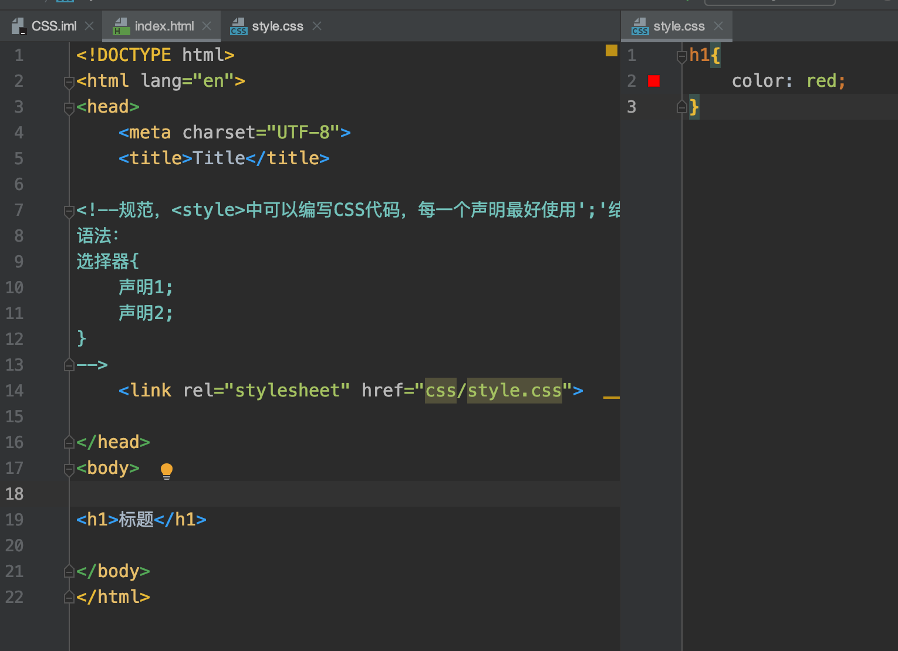

## CSS

CSS选择器（重点）、美化网页、盒子模型、浮动、定位、网页动画

菜鸟教程、W2CSchool

### CSS介绍

Cascading Style Sheet：层叠级样式表

CSS：表现（美化网页：字体、颜色、边距、高度、宽度、背景图片、网页定位、网页浮动...）

CSS2.0：DIV块+CSS，HTML与CSS结构分离的思想，网页变得简单，SEO
CSS2.1：浮动，定位
CSS3.0：圆角，阴影，动画... 浏览器兼容性

### 简单的样式

```html
<!DOCTYPE html>
<html lang="en">
<head>
    <meta charset="UTF-8">
    <title>Title</title>
<!--规范，<style>中可以编写CSS代码，每一个声明最好使用';'结尾
选择器{
    声明1;
    声明2;
}-->
  	<!--内部样式表-->
    <style> 
        h1{
            color: red;
        }
    </style>
</head>
<body>
<h1>标题</h1>
</body>
</html>
```



注：建议使用以上的外部样式表

### css优势

1、内容的表现分离
2、网页结构表现统一
3、样式丰富
4、建议使用独立于HTML的出售商文件
5、利用SEO，容易被搜索引擎收录！

行内元素

```html
<body>
<!--行内样式：在标签元素中，编写一个style属性，编写样式即可-->
<h1 style="color: red">AAA</h1>
</body>
```

优先级：就近原则（行内样式 > 内部样式 <==> 外部样式）

外部样式的两种写法：

- 链接式：

```html
<link rel="stylesheet" href="css/style.css">
```

- 导入式：

```html
<style><!--CSS2.0使用，先显示框架，再渲染-->
  	@import url("CSS/style.css");
</style>
```


### 选择器

作用：选择页面上的某一个后者某一类元素

#### 标签选择器

 选择一类标签
 格式： 标签 { }

```html
<head>
  <meta charset="UTF-8">
  <title>Title</title>
  <style>
    h1{
      color: orange;
      background: blue;
      border-radius: 10px;
    }
    h3{
      color: orange;
      background: blue;
      border-radius: 10px;
    }
    p{
      font-size: 80px;
    }
</style>
</head>
	<body>
	<h1>标签选择器</h1>
	<p>我爱学习</p>
	<h3>学习JAVA</h3>
</body>
```


#### 类选择器class

 选择所有class一致的标签，跨标签

 格式： .类名{}

```html
<head>
    <meta charset="UTF-8">
    <title>Title</title>
    <style>
        /*类选择器的格式 .class的名称{}
            好处：可以多个标签归类，是同一个class，可以复用*/
        .demo1{
            color: blue;
        }
        .demo2{
            color: red;
        }
        .demo3{
            color: aqua;
        }
    </style>
</head>

<body>
  <h1 class = "demo1">类选择器：demo1</h1>
	<h1 class="demo2">类选择器：demo2</h1>
	<h1 class="demo3">类选择器：demo3</h1>
	<p class="demo3">p标签</p>
</body>
```


#### id 选择器

全局唯一

格式： #id名{}

```html
<head>
    <meta charset="UTF-8">
    <title>Title</title>
    <style>
        /*id选择器：id必须保证全局唯一
            #id名称{}
            不遵循就近原则，优先级是固定的
            id选择器 > class类选择器  >  标签选择器
        */
        #demo1{
            color: red;
        }
        .demo2{
            color: green;
        }
        #demo2{
            color: orange;
        }
        h1{
            color: blue;
        }
    </style>
</head>
<body>
    <h1 id="demo1" class="demo2">id选择器：demo1</h1>
    <h1 class="demo2" id = "demo2">id选择器：demo2</h1>
    <h1 class="demo2">id选择器：demo3</h1>
    <h1 >id选择器：demo4</h1>
    <h1>id选择器：demo5</h1>
</body>
```

优先级：id > class > 标签


