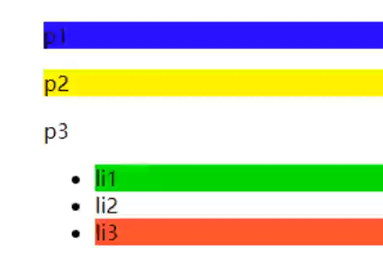
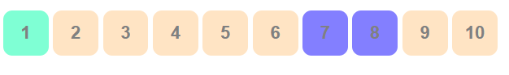

# HTML

HTML：Hyper Text Markup Language（超文本标记语言）

HTML 5 + CSS 3

W3C：World Wide Web Consortium（万维网联盟）

W3C标准包括：结构化标准语言（HTML、XML配置文件）、表现语言标准（CSS）、行为标准（DOM文档对象模型、ECMAScript）

### 标签

##### 基础标签

```html
<!--告诉浏览器，要使用什么规范-->
<!DOCTYPE html>
<html lang="en">

<!--网页头部-->
<head>
    <!--描述标签，用来描述网站的一些信息。（一般用来做SEO：Search Engine Optimization 搜索引擎优化）-->
    <meta charset="UTF-8">
    <meta name="keywords" content="关键词">
    <meta name="description" content="内容描述">
    <!--网页标签-->
    <title>Title</title>
</head>

<!--网页主体-->
<body>

    <!--标题标签-->
    <h1>一级标签</h1>
    <h2>二级标签</h2>
    <h3>三级标签</h3>
    <h4>四级标签</h4>
    <h5>五级标签</h5>
    <h6>六级标签</h6>

    <!--段落标签-->
    <p>1. 负责公司MES系统开发，系统维护等工作；</p>
    <p>2. 负责与业务部门沟通，讨论业务需求，编写设计文档；</p>

    <!--水平线标签-->
    <hr/>

    <!--换行标签-->
    1. 负责公司MES系统开发，系统维护等工作；<br/>
    2. 负责与业务部门沟通，讨论业务需求，编写设计文档；<br/>

    <!--粗体、斜体-->
    粗体：<strong>i love *</strong><br/>
    斜体：<em>i love *</em>

    <!--特殊符号（&+首字母 / 百度转义字符）-->
    空        格
    空&nbsp;&nbsp;&nbsp;格<br/>
    大于号&gt;<br/>
    小于号&lt;<br/>
    版权符号&copy;<br/>

</body>
</html>
```


##### 图片标签

常见图片格式：JPG、GIF、PNG、BMP...

```html
<body>
    <!--
    src：图片地址（相对路径、绝对路径）（../  --上一级目录）
    alt:图片未加载出显示的文字（必填）
    width 和 height 会等比缩放
    -->
    
</body>
```


##### 链接标签

页面间链接

```html
<body>
    <!--a标签
    herf：跳转到的页面（必填）
    target：表示窗口在哪里打开
        _blank：在新页面打开
        _self：在自己页面打开
    -->
    <a href="1.第一个html.html" target="_blank">第一个页面</a>
    <a href="https://baidu.com" target="_self">百度</a>
    <br/>

    <a href="https://baidu.com" title="图像超链接">
        
    </a>
</body>
```

锚链接

```html
<!--2.图像链接.html-->
<body>
    <a href="3.链接标签.html#down">跳转到3.链接标签.html页面底部</a>
</body>

<!--3.链接标签.html-->
<body>
    <!--使用name作为标记，实现锚链接（name：弃用的HTML属性）-->
    <a name="top">顶部</a>

    <p><a href="https://baidu.com" title="图像超链接">
        
    </a></p>
    <p><a href="https://baidu.com" title="图像超链接">
        
    </a></p>

    <!--锚链接
    1、需要一个锚标记
    2、跳转到标记
    -->
    <a href="#top">回到顶部</a>
    <a name="down">底部</a>
</body>
```

功能性链接

```html
<a href="mailto:1093876434@qq.com">邮箱链接：malito</a>
```


##### 块元素和行内元素

块元素：无论内容多少，独占一行（p、h1-h6 ...）

行内元素：内容撑开宽度，左右都是行内元素可以排在一行（a、strong、em ...）


##### 列表标签

```html
<!--有序列表-->
<ol>
    <li>java</li>
    <li>qw</li>
    <li>qwea</li>
</ol><hr>
<!--无序列表，用于导航、侧边栏等-->
<ul>
    <li>xzc</li>
    <li>dasd</li>
    <li>asd</li>
</ul>
<!--自定义列表，用于网页底部等-->
<dl><!--标签-->
    <dt>数字</dt><!--列表名称-->
        <dd>1</dd><!--列表内容-->
        <dd>2</dd>
    <dt>字母</dt>
        <dd>a</dd>
        <dd>b</dd>
</dl>
```


##### 表格标签

```html
<table border="20px"><!--表格标签-->
    <tr><!--行-->
        <!--colspan 跨列-->
        <td colspan="2">1-1</td><!--列-->
        <td rowspan="2">1-2</td>
    </tr>
    <tr>
        <td rowspan="2">2-1</td>
        <td>2-2</td>
    </tr>
    <tr>
        <td colspan="2">3-1</td>
    </tr>
</table>
```


##### 媒体元素

```html
<!--视频
src：资源路径
controls：控制条
autoplay：自动播放（Chrome浏览器取消了自动播放）
-->
<video src="../resource/video/视频1.mp4" controls autoplay></video>

<!--音频-->
<audio src="../resource/audio/猴叫.mp3" controls></audio>
```

### 其他内容

##### 页面结构

header：标题头部区域的内容(用于页面或页面中的一块区域)

footer：标记脚部区域的内容(用于整个页面或页面的一块区域)

section：Web页面中的一块独立区域

article：独立的文章内容

aside：相关内容或应用（常用于侧边栏)

nav：导航类辅助内容

##### 内联框架

```html
<!--iframe 内联框架
src：地址
frameborder：帧边缘
w-h：宽度高度
-->
<iframe src="https://baidu.com" frameborder="0" height="500" width="700"></iframe>

<iframe src="" name="hello" height="500" width="700"></iframe>
<a href="4.列表.html" target="hello">内联框架</a>
```

##### 表单post、get提交

```html
<h1>注册</h1>
<!--form标签
action：表单提交位置，可以是网站，也可以是一个请求处理地址
method：提交方式（get/post）
    get中可在url地址中看到提交的信息，不安全，但高效
    post比较安全，可传输大文件
-->
<form action="1.第一个html.html" method="post">
    <!--文本输入框：input type="text"-->
    <p>名字：<input type="text" name="username"></p>
    <!--密码框：input type="password"-->
    <p>密码：<input type="password" name="password"></p>

    <input type="submit">
    <input type="reset">
</form>
```

##### 表单

```html
<h1>注册</h1>
<!--form标签
action：表单提交位置，可以是网站，也可以是一个请求处理地址
method：提交方式（get/post）
    get中可在url地址中看到提交的信息，不安全，但高效
    post比较安全，可传输大文件get
-->
<form action="1.第一个html.html" method="get">
    <!--文本输入框（input中的name属性必须要加，提交起到键值对的键的作用）
    value="默认值"       默认值
    maxlength="8"       做多输入的字符
    size="30"           文本框长度
    -->
    <p>名字：<input type="text" name="username" value="admin" maxlength="8" size="30" readonly disable></p>
    <!--密码框：input type="password"-->
    <p>密码：<input type="password" name="password"/></p>

    <!--单选框标签
    value：单选框的值
    name：表示组-->
    <p>性别：
        <input type="radio" value="boy" name="sex"/>男
        <input type="radio" value="girl" name="sex"/>女
    </p>

    <!--多选框
    checked：默认勾选内容-->
    <p>爱好：
        <input type="checkbox" value="sleep" name="hobby">睡觉
        <input type="checkbox" value="code" name="hobby">代码
        <input type="checkbox" value="chat" name="hobby" checked>聊天
        <input type="checkbox" value="game" name="hobby">游戏
    </p>

    <!--按钮
    input type="button"     普通按钮
    input type="image"      图像按钮
    input type="submit"     提交按钮
    input type="reset"      重置-->
    <p>按钮：
        <input type="button" name="btn1" value="普通按钮">
        <input type="image" src="../resource/image/2.jpg">
    </p>
    <input type="submit">
    <input type="reset">

    <!--下拉框、列表框-->
    <p>下拉框：
        <select name="列表名称" id="city">
            <option value="sh">上海</option>
            <option value="sz">苏州</option>
            <option value="tj">天津</option>
            <option value="gz" selected>广州</option>
            <option value="zh">珠海</option>
            <option value="bj">北京</option>
        </select>
    </p>
    
    <!--文本框
    cols：初始列
    rows：初始行-->
    <p>文本框：
        <textarea name="textarea" cols="30" rows="10">默认文本内容</textarea><!--文本框的大小可通过右下角的标记拖拽-->
    </p>

    <!--文件域-->
    <p>文件提交：
        <input type="file" name="files">
    </p>

    <!--邮箱验证-->
    <p>邮箱：
        <input type="email" name="email"><!--有简单的验证，xxx@xx格式即可提交-->
    </p>

    <!--URL-->
    <p>URL：
        <input type="url" name="url">
    </p>

    <!--数字
    step：加减步长-->
    <p>商品数量：
        <input type="number" name="num" max="100" min="0" step="1">
    </p>

    <!--滑块-->
    <p>滑块：
        <input type="range" name="range" max="100" min="0" step="10">
    </p>

    <!--搜索-->
    <p>搜索：
        <input type="search" name="search">
    </p>

    <!--增强鼠标可用性-->
    <p>
        <label for="mark">点击文字选中搜索框</label>
        <input type="text" id="mark">
    </p>

</form>
```

##### 表单应用

```html
<!--hidden：隐藏-->
<p>密码：<input type="password" name="password" value="123456" hidden/></p>

<!--readonly：只读-->
    <p>名字：<input type="text" name="username" value="admin" readonly></p>

<!--disabled：不可用-->
    <p>名字：<input type="text" name="username" disable></p>
```

##### 表单初级验证

```html
<!--placeholder：用户提示
	required：非空判断-->
    <p>提示消息：<input type="text" name="reminder" placeholder="请输入姓名" required></p>

<!--pattern：正则验证-->
<p>邮箱2：
    <input type="email" name="email" pattern="^\w+([-+.]\w+)*@\w+([-.]\w+)*\.\w+([-.]\w+)*$">
</p>
```


### 总结

```html
<!DOCTYPE html>
<html lang="en">

<head>
    <meta charset="UTF-8">
    <meta name="keywords" content="">
    <meta name="description" content="">
    <title>?</title>
</head>

<body>
    <h1>一级标签</h1>
    <p>1. 负责公司MES系统开发，系统维护等工作；</p>
    <p>2. 负责与业务部门沟通，讨论业务需求，编写设计文档；</p>
    <hr/>
    1. 负责公司MES系统开发，系统维护等工作；<br/>
    <strong>i love *</strong>
    <em>i love *</em>
    A&nbsp;&nbsp;&nbsp;B<br/>
    &gt;<br/>
    &lt;<br/>
    &copy;<br/>
	
    
    <a href="1.第一个html.html" target="_blank">第一个页面</a>
    <a href="https://baidu.com" target="_self">百度</a>
    <br/>

    <a href="https://baidu.com" title="">
        
    </a>
    
    <a href="666.html#down">3</a>
</body>
</html>

<!--666.html-->
<body>
    <a name="top">1</a>

    <p><a href="https://baidu.com" title="">
        
    </a></p>
    <p><a href="https://baidu.com" title="">
        
    </a></p>

    <a href="#top">2</a>
    <a name="down">2</a>
</body>

<a href="mailto:1093876434@qq.com">邮箱链接：malito</a>

<ol>
    <li>java</li>
    <li>qw</li>
</ol>
<ul>
    <li>xzc</li>
    <li>dasd</li>
</ul>
<dl>
    <dt>A</dt>
        <dd>1</dd>
        <dd>2</dd>
    <dt>B</dt>
        <dd>a</dd>
        <dd>b</dd>
</dl>

<table border="xx">
    <tr>
        <td colspan="2">1-1</td>
        <td rowspan="2">1-2</td>
    </tr>
    <tr>
        <td rowspan="2">2-1</td>
        <td>2-2</td>
    </tr>
    <tr>
        <td colspan="2">3-1</td>
    </tr>
</table>
<video src="../resource/video/视频1.mp4" controls autoplay></video>
<audio src="../resource/audio/猴叫.mp3" controls></audio>

header、footer、ection、article、aside、nav标签

<iframe src="https://baidu.com" frameborder="0" height="500" width="700"></iframe>
<iframe src="" name="hello" height="500" width="700"></iframe>
<a href="4.列表.html" target="hello">内联框架</a>

<form action="1.第一个html.html" method="get">
    <p>xx：<input type="text" name="username" value="admin" maxlength="8" size="30" readonly disable></p>
    <p>xx：<input type="password" name="password"/></p>
    <p>xx：<input type="radio" value="boy" name="sex"/>x
        <input type="radio" value="girl" name="sex"/>x</p>
    <p>xx：<input type="checkbox" value="sleep" name="hobby">睡觉
        <input type="checkbox" value="code" name="hobby">代码
        <input type="checkbox" value="chat" name="hobby" checked>聊天
        <input type="checkbox" value="game" name="hobby">游戏</p>
    <p>xx：<input type="button" name="btn1" value="x">
        <input type="image" src="../resource/image/2.jpg"></p>
    <input type="submit">
    <input type="reset">
    <p>xx：<select name="xx" id="city">
            <option value="sh">上海</option>
            <option value="sz">苏州</option>
            <option value="tj">天津</option>
            <option value="gz" selected>广州</option>
            <option value="zh">珠海</option>
            <option value="bj">北京</option>
        </select></p>
    <p>xx：<textarea name="textarea" cols="xx" rows="xx">xx</textarea></p>
    <p>xx：<input type="file" name="files"></p>
    <p>xx：<input type="email" name="email"></p>
    <p>xx：<input type="url" name="url"></p>
    <p>xx：<input type="number" name="num" max="100" min="0" step="  "></p>
    <p>xx：<input type="range" name="range" max="100" min="0" step="xx"></p>
    <p>xx：<input type="search" name="search"></p>
    <p><label for="mark">xx</label>
        <input type="text" id="mark"></p>
    <p>xx：<input type="password" name="password" value="xx" hidden/></p>
    <p>xx：<input type="text" name="username" value="xx" readonly></p>
    <p>xx：<input type="text" name="username" disable></p>
    <p>xx：<input type="text" name="reminder" placeholder="xx" required></p>
    <p>xx：<input type="email" name="email" pattern="^\w+([-+.]\w+)*@\w+([-.]\w+)*\.\w+([-.]\w+)*$"></p>
```


# CSS

CSS选择器（重点）、美化网页、盒子模型、浮动、定位、网页动画

菜鸟教程、W2CSchool

### CSS介绍

Cascading Style Sheet：层叠级样式表

CSS：表现（美化网页：字体、颜色、边距、高度、宽度、背景图片、网页定位、网页浮动...）

CSS2.0：DIV块+CSS，HTML与CSS结构分离的思想，网页变得简单，SEO
CSS2.1：浮动，定位
CSS3.0：圆角，阴影，动画... 浏览器兼容性

### 简单的样式

```html
<!DOCTYPE html>
<html lang="en">
<head>
    <meta charset="UTF-8">
    <title>Title</title>
<!--规范，<style>中可以编写CSS代码，每一个声明最好使用';'结尾
选择器{
    声明1;
    声明2;
}-->
  	<!--内部样式表-->
    <style> 
        h1{
            color: red;
        }
    </style>
</head>
<body>
<h1>标题</h1>
</body>
</html>
```


注：建议使用以上的外部样式表

### css优势

1、内容的表现分离
2、网页结构表现统一
3、样式丰富
4、建议使用独立于HTML的出售商文件
5、利用SEO，容易被搜索引擎收录！

行内元素

```html
<body>
<!--行内样式：在标签元素中，编写一个style属性，编写样式即可-->
<h1 style="color: red">AAA</h1>
</body>
```

优先级：就近原则（行内样式 > 内部样式 <==> 外部样式）

外部样式的两种写法：

- 链接式：

```html
<link rel="stylesheet" href="css/style.css">
```

- 导入式：

```html
<style><!--CSS2.0使用，先显示框架，再渲染-->
  	@import url("CSS/style.css");
</style>
```


### 选择器

作用：选择页面上的某一个后者某一类元素

##### 标签选择器

 选择一类标签
 格式： 标签 { }

```html
<head>
  <meta charset="UTF-8">
  <title>Title</title>
  <style>
    h1{
      color: orange;
      background: blue;
      border-radius: 10px;
    }
    h3{
      color: orange;
      background: blue;
      border-radius: 10px;
    }
    p{
      font-size: 80px;
    }
</style>
</head>
	<body>
	<h1>标签选择器</h1>
	<p>我爱学习</p>
	<h3>学习JAVA</h3>
</body>
```


##### 类选择器

 选择所有class一致的标签，跨标签

 格式： .类名{}

```html
<head>
    <meta charset="UTF-8">
    <title>Title</title>
    <style>
        /*类选择器的格式 .class的名称{}
            好处：可以多个标签归类，是同一个class，可以复用*/
        .demo1{
            color: blue;
        }
        .demo2{
            color: red;
        }
        .demo3{
            color: aqua;
        }
    </style>
</head>

<body>
  <h1 class = "demo1">类选择器：demo1</h1>
	<h1 class="demo2">类选择器：demo2</h1>
	<h1 class="demo3">类选择器：demo3</h1>
	<p class="demo3">p标签</p>
</body>
```


##### id 选择器

全局唯一

格式： #id名{}

```html
<head>
    <meta charset="UTF-8">
    <title>Title</title>
    <style>
        /*id选择器：id必须保证全局唯一
            #id名称{}
            不遵循就近原则，优先级是固定的
            id选择器 > class类选择器  >  标签选择器
        */
        #demo1{
            color: red;
        }
        .demo2{
            color: green;
        }
        #demo2{
            color: orange;
        }
        h1{
            color: blue;
        }
    </style>
</head>
<body>
    <h1 id="demo1" class="demo2">id选择器：demo1</h1>
    <h1 class="demo2" id = "demo2">id选择器：demo2</h1>
    <h1 class="demo2">id选择器：demo3</h1>
    <h1 >id选择器：demo4</h1>
    <h1>id选择器：demo5</h1>
</body>
```

优先级：id > class > 标签


##### 层次选择器

- 后代选择器：在某个元素的后面

```html
/*后代选择器*/
<style>
body p{
	background:red;
}
</style>
```

- 子选择器，一代

```html
/*子选择器*/
<style>
body>p{
	background:orange;
}
</style>

```

- 相邻的兄弟选择器 同辈

```html
/*相邻兄弟选择器：只选择一个，相邻（向下）*/
<style>
.active+p{
background: red
}
</style>
<body>
	<p class="active">p1<p>
	<p>p2</p>
</body>

```

- 通用选择器

```html
<style>
/*通用兄弟选择器，当前选中元素的向下的所有兄弟元素*/
	.active~p{
	background:red;
}
</style>
<body>
	<p class="active">p1<p>
	<p>p2</p>
</body>

```


##### 结构伪类选择器

```html
<head>
    <meta charset="UTF-8">
    <title>Title</title>

    <style>
        ul li:first-child{/*ul的第一个子元素*/
            background: aqua;
        }
        ul li:last-child{/*ul的最后一个子元素*/
            background: blue;
        }
        /*选中p1：定位到父元素，选择当前的第一个元素*/
        p:nth-child(1){     /*注：若当前p元素是其父级元素的第一个元素，才会生效！！（按顺序选择）*/
            background: #badb27;
        }
        p:nth-of-type(2){/*选中父元素下的，第2个p元素（按类型选择）*/
            background: red;
        }
        a:hover{/* hover:鼠标移动到该区域才显示的属性 */
            background: green;
        }
    </style>
</head>
<body>
<!--<a href="">123</a>-->
    <p>p1</p>
    <p>p2</p>
    <p>p3</p>
    <h3>h3</h3>
    <ul>
        <li>1li1</li>
        <li>1li2</li>
        <li>1li3</li>
    </ul>
    <a href="www.baidu.com">百度</a>
</body>

```




##### 属性选择器（常用）

 id + class结合 

```html
<head>
    <meta charset="UTF-8">
    <title>Title</title>

    <style>
        .demo a{
            float: left;
            display: block;
            height: 50px;
            width: 50px;
            border-radius: 10px;
            background: aquamarine;
            text-align: center;
            color: gray;
            text-decoration: none;
            margin-right: 5px;
            /*line-height:50px;*/
            font: bold 20px/50px Arial;
        }
        /*属性名，属性名=属性值（正则）
         = 表示绝对等于
         *= 表示包含
         ^= 表示以...开头
         $= 表示以...结尾
         存在id属性的元素
            a[]{}
         */
        a[id]{/* a标签中存在id属性的元素 */
            background: yellow;
        }
        a[id=first]{/*id=first的元素*/
            background: green;
        }

        a[class*="links"]{/*class 中有links的元素*/
            background: bisque;
        }

        a[href^=http]{/*选中href中以http开头的元素*/
            background: aquamarine;
        }
        a[href$=pdf]{/*选中href中以pdf结尾的元素*/
            background: #837fff;
        }
    </style>
</head>
<body>
    <p class="demo">
        <a href="http:www.baidu.com" class="links item first" id="first">1</a>
        <a href="" class="links item active" target="_blank " title="test">2</a>
        <a href="images/123.html" class="links item">3</a>
        <a href="images/1.png" class="links item">4</a>
        <a href="images/1.jpg" class="links item">5</a>
        <a href="abc" class="links item">6</a>
        <a href="/a.pdf" class="links item">7</a>
        <a href="/abc.pdf" class="links item">8</a>
        <a href="abc.doc" class="links item">9</a>
        <a href="abcd.doc" class="links item last">10</a>
    </p>
</body>
```


## 


### 美化网页元素

##### 为什么要美化网页

1. 有效的传递页面信息
2. 美化网页，页面漂亮才能吸引客户
3. 凸显页面的主题
4. 提高用户的体验

**span标签**：重点要突出的字，使用span标签套起来

```html
<head>
    <meta charset="UTF-8">
    <title>Title</title>
    <style>
        #title1{
            font-size: 50px;
        }
    </style>
</head>
<body>
学习语言<span id="title1">JAVA</span>
</body>
```


##### 字体样式

- font-family：字体
- font-size：字体大小
- font-weight：字体粗细
- color：字体颜色

```html
<head>
    <meta charset="UTF-8">
    <title>Title</title>
    <style>
        body{
            font-family:"Arial Black",楷体;
            color: red;
        }
        h1{
            font-size: 50px;
        }
        .p1{
            font-weight: 600;
            color: gray;
        }
    </style>
</head>
<body>
<h1>标题</h1>
<p>正文11111</p>
<p class="p1">正文2222222</p>
<p>i love study java</p>
</body>
```

常用写法：

```html
<style>
    p{
        font-weight:bolder;/*也可以填px，但不能超过900,相当于bloder*/
        /*常用写法：*/
        font:oblique bolder 30px "楷体" ;
    }
</style>
```


##### 文本样式

1. 颜色–>color:rgb / rgba()
2. **文本对齐方式–>text-align：center**
3. **首行缩进–>text-indent：2em**
4. **行高–>line-height：300px；**
5. 下划线–>text-decoration

```html
text-decoration:underline/*下划线*/
text-decoration:line-through/*中划线*/
text-decoration:overline/*上划线*/
text-decoration:none/*超链接去下划线*/
```

图片、文字水平对齐

```html
<style>
    img, span{/*前者为后者参照物 a, b*/
        vertical-align: middle;
    }
</style>
------------------------------------------
<p>
    
    <span>人潮汹涌</span>
</p>
```


##### 文本，阴影和超链接伪类

```html
<style>
	a{/*超链接有默认的颜色*/
		text-decoration:none;
		color:#000000;
	}
	a:hover{/*鼠标悬浮的状态*/
		color:orange;
	}
	a:active{/*鼠标按住未释放的状态*/
		color:green
	}
	a:visited{/*点击之后的状态*/
		color:red
	}
	a:link{/*链接自未点击上去时候*/
        background: bisque;
    }
</style>
```


阴影

```html
/*	第一个参数：表示水平偏移
	第二个参数：表示垂直偏移
	第三个参数：表示模糊半径
	第四个参数：表示颜色
*/
text-shadow:5px 5px 5px 颜色
```


##### 列表

css

```css
#nav{
    width: 300px;
    background: antiquewhite;
}
.title{
    font-size: 18px;
    font-weight: bold;
    text-indent: 1em;/*缩进*/
    line-height: 35px;
    background: red;
}
/*ul li*/
/*
list-style:
    non 去掉实心圆
    circle 空心圆
    square 正方形
*/
/*ul{!*nav替换效果*!
    background: antiquewhite;
}*/
ul li{
    height: 30px;
    list-style: none;
    text-indent: 1em;
}
a{
    text-decoration: none;
    font-size: 14px;
    color: black;
}
a:hover{
    color: burlywood;
    text-decoration: underline;
}
```

html

```html
<!DOCTYPE html>
<html lang="en">
<head>
    <meta charset="UTF-8">
    <title>Title</title>
    <link href="CSS/style.css" rel="stylesheet" type="text/css">
</head>
<body>
<div id="nav">
    <h2 class="title">全部商品分类</h2>
    <ul>
        <li>
            <a href="#">图书</a>
            <a href="#">音像</a>
            <a href="#">数字商品</a>
        </li>
        <li>
            <a href="#">服饰鞋帽</a>
            <a href="#">个性化妆</a>
        </li>
    </ul>
</div>
</body>
</html>
```


##### 背景

1. 背景颜色：background
2. 背景图片

```html
background-image:url("");/*默认是全部平铺的*/
background-repeat:repeat-x/*水平平铺*/
background-repeat:repeat-y/*垂直平铺*/
background-repeat:no-repeat/*不平铺*/
```


 div标签：相当于一个容器，只是把单独的逻辑给放在div中，这样看起来更加的清晰， div要独占一行 。 

##### 渐变

 渐变背景网址：https://www.grabient.com
径向渐变、圆形渐变 

```html
body{
	background-color: #4158D0;
	background-image: linear-gradient(43deg, #4158D0 0%, #C850C0 46%, #FFCC70 100%);
}
```


### 盒子模型

  

margin：外边距
padding：内边距
border：边框


##### 边框

border：粗细 样式 颜色

边框的粗细
边框的样式
边框的颜色


##### 外边距

妙用：居中
margin-left/right/top/bottom–>表示四边，可分别设置，也可以同时设置如下

```java
margin:0 0 0 0/*分别表示上、右、下、左；从上开始顺时针*/
/*例1：居中*/
margin:0 auto /*auto表示左右自动*/
/*例2：*/
margin:4px/*表示上、右、下、左都为4px*/
/*例3*/
margin:10px 20px 30px/*表示上为10px，左右为20px，下为30px*/
```

盒子的计算方式：
margin+border+padding+内容的大小

总结：
body总有一个默认的外边距 margin:0
常见操作：初始化

