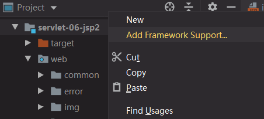
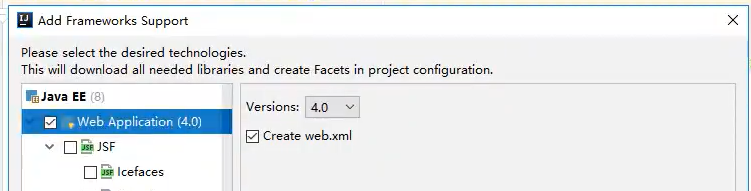
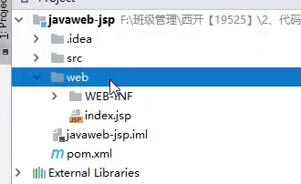
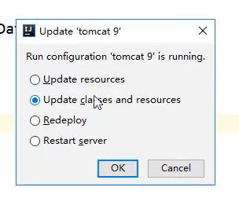
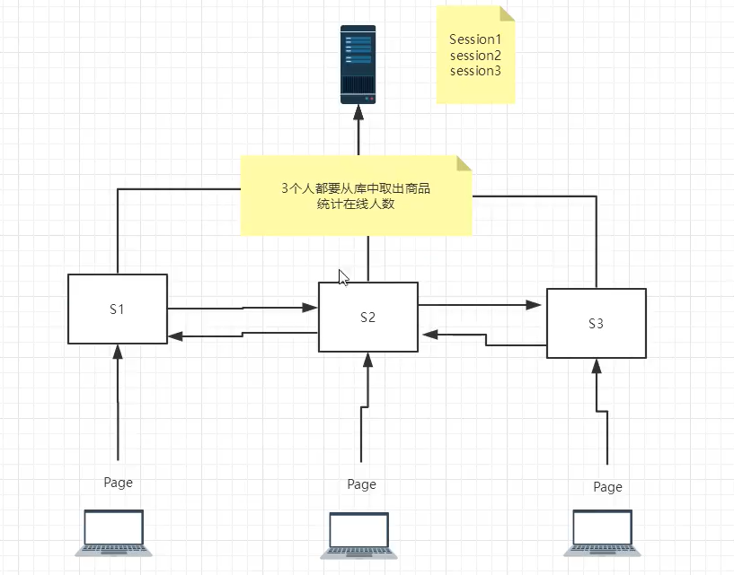
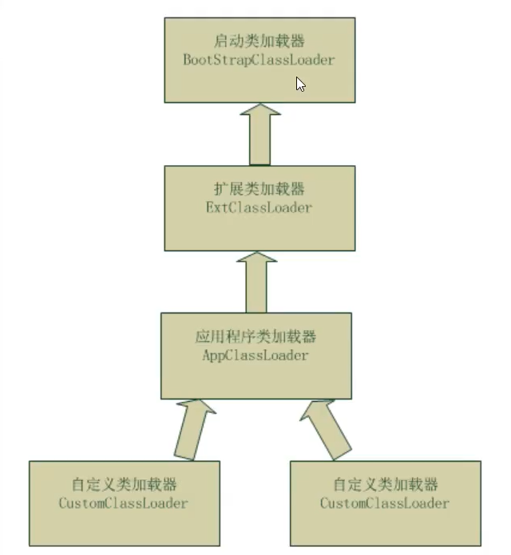
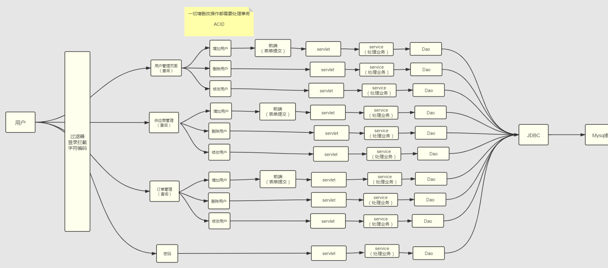

# Java Web

### 基本概念

- 一个web应用由多部分组成 （静态web，动态web）

B/S：浏览器和服务器

C/S：客户端和服务器

可以配置启动的端口号

1. tomcat的默认端口号为：8080
2. mysql：3306
3. http：80
4. https：443

 DNS服务器：存放全世界域名的地方

 HTTP（超文本传输协议）是一个简单的请求-响应协议，它通常运行在TCP之上。 

-  HTTP/1.0：客户端可以与web服务器连接后，只能获得一个web资源，断开连接
-  HTTP/1.1：客户端可以与web服务器连接后，可以获得多个web资源。

服务器 -- 响应 -- 客户端

```properties
百度
Cache-control : private		缓存控制
Connection : Keep-Alive		连接
Content-Encoding : gzip		编码
Content-Type : text/html	类型
```

响应体

```properties
Accept : 数据类型
Accept-Encoding : 编码格式GBK UTF-8 GB2312 IS08859-1(Java默认编码)
Accept-Language : 语言环境
Cache-control : 缓存控制
Connection : 请求完成是断开还是保持连接
HOST : 主机..../ .
Refresh : 多久刷新一次
Location : 网页重新定位
```

HTTP的响应状态码由5段组成： 

```properties
1xx 消息，一般是告诉客户端，请求已经收到了，正在处理。
2xx 处理成功，一般表示：请求收悉、我明白你要的、请求已受理、已经处理完成等信息。
3xx 重定向到其它地方。它让客户端再发起一个请求以完成整个处理。
4xx 处理发生错误，责任在客户端，如客户端的请求一个不存在的资源，客户端未被授权，禁止访问等。
5xx 处理发生错误，责任在服务端，如服务端抛出异常，路由出错，HTTP版本不支持等。
```


### 创建部署

Maven：项目架构管理工具

核心思想：约定大于配置

web.xml中配置URL地址时，首位“/”必须加，否则会启动组件失败

**重点**：IEDA 的项目配置和 Web 部署，https://www.cnblogs.com/deng-cc/p/6416332.html

servlet：请求+响应，是一个服务

Session、Cookie：会话和缓存机制

JSP：html+java

IDEA中的Artifact，属于一种工具包


**创建一个Maven项目**


不勾选自动创建，创建基础的maven项目后







这样创建出来的web在项目下，而不是在src/main下面



这样创建项目的好处是，会出现第一行和第二行，能够实现项目的热更新，更新JSP不用重启项目

（ * - 更新项目及资源 - 项目重新发布 - 重启项目）


## Servlet

开发两步骤： 编写一个类，实现Servlet接口，把开发好的Java类部署到web服务器中。 

把实现了Servlet接口的Java程序叫做，Servlet 

Maven环境优化：① 修改web.xml为最新的；② 将maven的结构搭建完整

Servlet 类 -->  GenericServlet 类 -->  HttpServlet 类 --> 自己实现的类


### Mapping

```xml
<!--一个映射路径-->
<servlet>
    <servlet-name>error</servlet-name>
    <servlet-class>com.harry.servlet.ErrorServlet</servlet-class>
</servlet>
<servlet-mapping>
    <servlet-name>error</servlet-name>
    <url-pattern>/error</url-pattern>
</servlet-mapping>

<!--指定多个映射路径-->
	<url-pattern>/hello1</url-pattern>
	<url-pattern>/hello2</url-pattern>
	<url-pattern>/hello3</url-pattern>
<!--指定通用映射路径-->
	<url-pattern>/hello/*</url-pattern>
<!--默认请求路径-->
<!--优先级问题 指定了固有的映射路径优先级最高，如果找不到就会走默认的处理请求-->
	<url-pattern>/*</url-pattern>
<!--可以自定义映射后缀实现请求映射，但 * 前面不能加项目映射的路径(/hello/*.harry)-->
	<url-pattern>*.harry</url-pattern>
```


配置项目**默认进入的页面**

```xml
<!--web.xml文件-->
    <welcome-file-list>
        <welcome-file>index.jsp</welcome-file>
    </welcome-file-list>
```


### ServletContext对象

web容器启动的时候，它会为每个web程序都创建一个对应的ServletContext对象，它代表了 当前的web应用，整个服务中，ServletContext有且仅有一个，相当于单例模式

```java
//	      this.getInitParameter(0)      初始化参数
//        this.getServletConfig()       Servlet配置
//        this.getServletContext()      Servlet上下文
```

#### 1、数据共享

在servlet 1中保存的数据，可以在servlet 2中取到。（先运行servlet 2 取到的值为null）

```java
// this.getInitParameter(0)      初始化参数
// this.getServletConfig()       Servlet配置
// this.getServletContext()      Servlet上下文
// 整个服务中，ServletContext有且仅有一个，相当于单例模式

//Servlet 1
ServletContext context = this.getServletContext();
String userName = "Harry";
context.setAttribute("userName",userName);//将一个数据保存在ServletContext中

//Servlet 2
ServletContext context = this.getServletContext();
String name = (String)context.getAttribute("userName");
```

#### 2、获取初始化参数

```xml
<!--web.xml中配置一些web应用初始化参数-->
<context-param><!--环境参数-->
    <param-name>url</param-name>
    <param-value>jdbc:mysql://localhost:3306/</param-value>
</context-param>
```

```java
@Override
protected void doGet(HttpServletRequest req, HttpServletResponse resp) throws ServletException, IOException {
    ServletContext context = this.getServletContext();
    String url = context.getInitParameter("url");//获取初始化参数
    resp.getWriter().print(url);
}
```

#### 3、请求转发

```java
@Override
protected void doGet(HttpServletRequest req, HttpServletResponse resp) throws ServletException, IOException {
    ServletContext context = this.getServletContext();
    System.out.println("运行了demo04");
  	//请求调度程序
    RequestDispatcher requestDispatcher = context.getRequestDispatcher("/demo03");//转发的请求路径
    requestDispatcher.forward(req,resp);//调用forward实现请求转发
}
```

转发路径不会变化，状态为200

#### 4、读取资源文件

Peoperties

- 在java目录下新建properties
- 在resources目录下新建properties

发现：都被打包到了同一个路径下: classes，这个路径俗称为classpath

首先需要一个文件流

```properties
username=harry
password=123456
```

```java
@Override
    protected void doGet(HttpServletRequest req, HttpServletResponse resp) throws ServletException, IOException {
        //.getResourceAsStream 把资源变成一个流
        // 第一个/代表当前项目
        InputStream is = this.getServletContext().getResourceAsStream("/WEB-INF/classes/db.properties");
        Properties prop = new Properties();
        prop.load(is);
        String user = prop.getProperty("username");
        String pwd = prop.getProperty("password");

        resp.getWriter().print(user + ":" + pwd);
    }
```

```xml
<!--在pom.xml的build中配置resources，来防止资源导出失败的问题-->
<build>
    <resources>
        <resource>
            <directory>src/main/resources</directory>
            <includes>
                <include>**/*.properties</include>
                <include>**/*.xml</include>
            </includes>
        </resource>
        <resource><!--主要是java目录下的文件-->
            <directory>src/main/java</directory>
            <includes>
                <include>**/*.properties</include>
                <include>**/*.xml</include>
            </includes>
        </resource>
    </resources>
</build>
```


### HttpServletResponse

web服务器接收到客户端的http请求，会针对这个请求分别创建一个代表请求的Request对象，和一个代表响应的Response对象；

- 如果要获取客户端请求过来的参数：找HttpServletRequest
- 如果要给客户端响应一些信息：找HttpServletResponse

#### 1、简单分类

发送数据

```java
public ServletOutputStream getOutputStream() throws IOException;//多用于一般的
public PrintWriter getWriter() throws IOException;//多用于写中文，其他易造成字符丢失
```

发送响应头

```java
void setCharacterEncoding(String var1);
void setContentLength(int var1);
void setContentLengthLong(long var1);
void setContentType(String var1);
void setDateHeader(String var1, 1ong var2);
void addDateHeader(String var1, 1ong var2);
void setHeader(String var1, String var2);
void addHeader(String var1, String var2);
void setIntHeader(String var1, int var2);
void addIntHeader(String var1, int var2);
```

响应状态码

```java
public static final int SC_OK = 200;
public static final int SC_MULTIPLE_CHOICES = 300;
public static final int SC_BAD_REQUEST = 400;
public static final int SC_NOT_FOUND = 404;
public static final int SC_INTERNAL_SERVER_ERROR = 500;//等
```

#### 2、常见应用

1. 向浏览器输出消息
2. 下载文件

```java
@Override
protected void doGet(HttpServletRequest req, HttpServletResponse resp) throws ServletException, IOException {
    //1. 要获取下载文件的路径
    String realPath = "D:\\bc\\JavaWeb\\Kuang\\javaweb-02-servlet\\servlet-03-response\\src\\main\\resources\\图片2.jpg";
    System.out.println("下载文件的路径：" + realPath);
    //2. 下载的文件名是啥？
    String fileName = realPath.substring(realPath.lastIndexOf("\\") + 1);
    //3. 设置让浏览器能支持(Content-Disposition)下载所需的东西，中文文件名使用 URLEncoder.encode 编码，否则可能乱码
    resp.setHeader("Content-Disposition","attachment;filename=" + URLEncoder.encode(fileName,"UTF-8"));
    //4. 获取下载文件的输入流
    FileInputStream in = new FileInputStream(realPath);
    //5. 创建缓冲区
    int len = 0;
    byte[] buffer = new byte[1024];
    //6. 获取OutputStream对象
    ServletOutputStream out = resp.getOutputStream();
    //7. 将FileOutputStream流写入到buffer缓冲区，使用OutputStream将缓冲区中的数据输出到客户端
    while((len = in.read(buffer)) > 0){
        out.write(buffer,0,len);
    }

    in.close();
    out.close();
}
```

#### 3、验证码功能

- 前端实现
- 后端实现，需要用到Java的图片类，生成一个图片

```java
@Override
protected void doGet(HttpServletRequest req, HttpServletResponse resp) throws ServletException, IOException {
    //让浏览器3秒自动刷新一次
    resp.setHeader("refresh","0.5");

    //在内存中创建一个图片
    BufferedImage image = new BufferedImage(100, 20, BufferedImage.TYPE_INT_BGR);
    //得到图片
    Graphics2D g = (Graphics2D) image.getGraphics();//笔
    //设置图片的背景颜色
    g.setColor(Color.white);
    g.fillRect(0,0,100,30);
    //给图片写数据
    g.setColor(Color.BLUE);
    g.setFont(new Font(null,Font.BOLD,20));
    g.drawString(makeNum(),0,20);

    //告诉浏览器，该请求用浏览器的方式打开
    resp.setContentType("image/jpeg");
    //网站存在缓存，不让浏览器缓存
    resp.setDateHeader("expires",-1);
    resp.setHeader("Cache-Control","no-cache");
    resp.setHeader("Pragma","no-cache");

    //把图片写给浏览器
    ImageIO.write(image, "jpg", resp.getOutputStream());
}

//生成随机数
private String makeNum(){
    Random r = new Random();
    String num = r.nextInt(99999999) + "";
    StringBuilder sb = new StringBuilder();
    for (int i = 0; i < 8 - num.length(); i++) {//保证能够输出8位数字
        sb.append("0");
    }
    num = sb.toString() + num;
    return num;
}
```


#### 4、重定向

一个Web资源 B 收到客户端 A 的请求后，通知 A 去访问Web资源 C，该过程称为重定向。


常见场景：

- 用户登录

```java
void sendRedirect(String var1) throws IOException
```

测试：

```java
@Override
protected void doGet(HttpServletRequest req, HttpServletResponse resp) throws ServletException, IOException {
    //resp.setHeader("Location","./img");
    //resp.setStatus(HttpServletResponse.SC_MOVED_TEMPORARILY); <-- 常量值为302

    resp.sendRedirect("./img");//重定向
}
```


重定向和转发的区别?

相同点：页面都会实现跳转
不同点：请求转发的时候，url不会产生变化；307
			   重定向时候，url地址栏会发生变化；302

实践：

```jsp
<%--Jsp页面--%>
<%@ page language="java" contentType="text/html; charset=utf-8" pageEncoding="utf-8"%><%--该段代码，定义了web端的编码，避免乱码--%>
<html>
<body>
<%--这里提交的路径，需要寻找到项目的路径--%>
<%--${pageContext.request.contextPath} 代表当前的项目--%>
<form action="${pageContext.request.contextPath}/login" method="get">
    用户名：<input type="text" name="username"><br>
    密码：<input type="password" name="password"><br>
    <input type="submit">
</form>
</body>
</html>
```

```xml
<servlet>
  <servlet-name>RequestServlet</servlet-name>
  <servlet-class>com.harry.servlet.RequestServlet</servlet-class>
</servlet>
<servlet-mapping>
  <servlet-name>RequestServlet</servlet-name>
  <url-pattern>/login</url-pattern>
</servlet-mapping>
```

```java
@Override
protected void doGet(HttpServletRequest req, HttpServletResponse resp) throws ServletException, IOException {
  String userName = req.getParameter("username");
  String password = req.getParameter("password");
  System.out.println(userName+" : "+password);

  resp.sendRedirect("Success.jsp");
}
```


### HttpServletRequest

HttpServletRequest代表客户端的请求，用户通过Http协议访问服务器，Http请求中的所有信息会被封装到HttpServletRequest，通过这个HTTPServletRequest的方法，获取客户端的所有信息。

#### 1、获取前端传递的参数

```pro
req.getParameter()									//String
req.getParameterValues(String s)		//String[]
```

#### 2、请求转发

```jsp
<div>
    <%--以post的方式提交表单，提交到login请求--%>
    <form action="${pageContext.request.contextPath}/login" method="post">
        用户名：<input type="text" name="name"><br>
        密码：<input type="password" name="password"><br>
        爱好：
        <input type="checkbox" name="hobbies" value="女孩">女孩
        <input type="checkbox" name="hobbies" value="代码">代码
        <input type="checkbox" name="hobbies" value="吃">吃
        <input type="checkbox" name="hobbies" value="喝">喝
        <br>
        <input type="submit">
    </form>
</div>
```


```java
@Override
protected void doGet(HttpServletRequest req, HttpServletResponse resp) throws ServletException, IOException {
    req.setCharacterEncoding("utf-8");//处理接收到内容的编码格式
    resp.setCharacterEncoding("utf-8");

    String name = req.getParameter("name");
    String password = req.getParameter("password");
    String[] hobbies = req.getParameterValues("hobbies");

    System.out.println("=============================");
    System.out.println(name+" : "+password);
    System.out.println(Arrays.toString(hobbies));
    System.out.println("=============================");

    System.out.println(req.getContextPath());
    //通过请求转发
    //这里的'/'代表的是当前的Web应用
    req.getRequestDispatcher("/success.jsp").forward(req,resp);
}
```


## Cookie、Session

### 会话

会话：用户打开一个浏览器，点击了很多超链接，访问多个web资源，关闭浏览器，这个过程可以称之为会话；

有状态会话：一个同学来过教室，下次再来教室，我们会知道这个同学，曾经来过，称之为有状态会话；

怎么证明是苏大的学生？

- 发票 苏大给你发票
- 学校登记 苏大标记你来过了

一个网站，怎么证明你来过？

- 服务端给客户端一个 信件，客户端下次访问服务端带上信件就可以了； cookie
- 服务器登记你来过了，下次你来的时候我来匹配你； session


### 保存会话的两种技术

**cookie**

- 客户端技术 （响应，请求）

**session**

- 服务器技术，利用这个技术，可以保存用户的会话信息，可以把信息或者数据放在Session中

常见常见：网站登录之后，下次不用再登录了，第二次访问直接就上去了


### Cookie


1. 从请求中拿到cookie信息
2. 服务器响应给客户端cookie

```java
Cookie[] cookies = req.getCookies(); //获得Cookie
cookie.getName(); //获得cookie中的key
cookie.getValue(); //获得cookie中的vlaue
new Cookie("lastLoginTime", System.currentTimeMillis()+""); //新建一个cookie
cookie.setMaxAge(24*60*60); //设置cookie的有效期
resp.addCookie(cookie); //响应给客户端一个cookie
```

cookie：一般会保存在本地的 用户目录下 appdata；

一个网站cookie是否存在上限！聊聊细节问题

- 一个Cookie只能保存一个信息；
- 一个web站点可以给浏览器发送多个cookie，最多存放20个cookie；
- Cookie大小有限制4kb；
- 300个cookie浏览器上限

删除Cookie；

- 不设置有效期，关闭浏览器，自动失效；
- 设置有效期时间为 0 ；

编码解码：

```java
URLEncoder.encode("中文内容","utf-8")
URLDecoder.decode(cookie.getValue(),"UTF-8")
```


### Session（重点）


什么是Session：

- 服务器会给每一个用户（浏览器）创建一个Seesion对象；
- 一个Seesion独占一个浏览器，只要浏览器没有关闭，这个Session就存在；
- 用户登录之后，整个网站它都可以访问！–> 保存用户的信息；保存购物车的信息……
  …

Session和cookie的区别：

- Cookie是把用户的数据写给用户的浏览器，浏览器保存 （可以保存多个）
- Session把用户的数据写到用户独占Session中，服务器端保存 （保存重要的信息，减少服务器资源的浪费）
- Session对象服务器创建；

使用场景：

- 保存一个登录用户的信息；
- 购物车信息；
- 在整个网站中经常会使用的数据，我们将它保存在Session中；

使用Session：

```java
@Override
protected void doGet(HttpServletRequest req, HttpServletResponse resp) throws ServletException, IOException {

  //解决乱码问题
  req.setCharacterEncoding("UTF-8");
  resp.setCharacterEncoding("UTF-8");
  resp.setContentType("text/html;charset=utf-8");

  //得到Session
  HttpSession session = req.getSession();
  //给Session中存东西
  session.setAttribute("name",new Person("秦疆",1));
  //获取Session的ID
  String sessionId = session.getId();

  //判断Session是不是新创建
  if (session.isNew()){
    resp.getWriter().write("session创建成功,ID:"+sessionId);
  }else {
    resp.getWriter().write("session以及在服务器中存在了,ID:"+sessionId);
  }

  //Session创建的时候做了什么事情；
  //        Cookie cookie = new Cookie("JSESSIONID",sessionId);
  //        resp.addCookie(cookie);
}
```

```java
//得到Session
HttpSession session = req.getSession();

Person person = (Person) session.getAttribute("name");

System.out.println(person.toString());

HttpSession session = req.getSession();
session.removeAttribute("name");
//手动注销Session
session.invalidate();
```

**会话自动过期：web.xml配置**

```xml
<!--设置Session默认的失效时间-->
<session-config>
    <!--15分钟后Session自动失效，以分钟为单位-->
    <session-timeout>15</session-timeout>
</session-config>
```


## JSP

**Java Server Pages** ： Java服务器端页面，也和Servlet一样，用于动态Web的技术

最大的特点：

- 写JSP就像在写HTML
- 区别：
  - HTML只给用户提供静态的数据
  - JSP页面中可以嵌入JAVA代码，为用户提供动态数据；

### 原理

思路：JSP到底怎么执行的！

​	代码层面没有任何问题

​	服务器内部工作

​	tomcat中有一个work目录；

​	IDEA中使用Tomcat的会在IDEA的tomcat中生产一个work目录 


 Tomcat编译后的JSP文件（_jsp.class 和 _jsp.java）的存放地点 

```t
（一）一般存放在你安装的Tomcat目录下的work目录下

C:\Program Files\Apache Software Foundation\Tomcat 8.0\apache-tomcat-8.5.32\work\Catalina\localhost

（二）可能没有存放在Tomcat中，那么就是存放在你部署的编译器的workspace中，例如使用IntelliJ IDEA部署

C:\Users\Administrator\.IntelliJIdea2018.2\system\tomcat\_Hello-World-JSP\work\Catalina\localhost\

（三）使用Eclipse部署的Tomcat存放的JSP编译后文件

\.metadata\.plugins\com.genuitec.eclipse.easie.tomcat.myeclipse\ tomcat\work\Catalina\localhost\
```


发现页面转变成了Java程序！


**浏览器向服务器发送请求，不管访问什么资源，其实都是在访问Servlet！**

JSP最终也会被转换成为一个Java类！

```java
生成的Java类index_jsp extends org.apache.jasper.runtime.HttpJspBase

向上追溯 HttpJspBase extends HttpServlet
```

**所以，JSP 本质上就是一个Servlet ! !**

```java
/*index_jsp.java文件中的方法*/

//初始化
public void _jspInit() {}
//销毁
public void _jspDestroy() {}
//JSPService
public void _jspService(HttpServletRequest request,HttpServletResponse response)
```

1. 判断请求
2. 内置一些对象

```java
final javax.servlet.jsp.PageContext pageContext;  //页面上下文
javax.servlet.http.HttpSession session = null;    //session
final javax.servlet.ServletContext application;   //applicationContext
final javax.servlet.ServletConfig config;         //config（配置）
javax.servlet.jsp.JspWriter out = null;           //out
final java.lang.Object page = this;               //page：当前
HttpServletRequest request                        //请求
HttpServletResponse response                      //响应
```

3. 输出页面前增加的代码

```java
response.setContentType("text/html");       //设置响应的页面类型
pageContext = _jspxFactory.getPageContext(this, request, response,null, true, 8192, true);
_jspx_page_context = pageContext;
application = pageContext.getServletContext();
config = pageContext.getServletConfig();
session = pageContext.getSession();
out = pageContext.getOut();
_jspx_out = out;
```

以上的这些个对象我们可以在JSP页面中直接使用！


在JSP页面中；

只要是 JAVA代码就会原封不动的输出；

如果是HTML代码，就会被转换为：

```java
out.write("<html>\r\n");
```

这样的格式，输出到前端

JSP 简化了 servlet 页面的编写

### 基础语法

任何语言都有自己的语法，JAVA中有, JSP 作为java技术的一种应用，它拥有一些自己扩充的语法（了解，知道即可！），Java所有语法都支持！

**JSP表达式**

```jsp
<%= 变量或者表达式%>
作用：将内容原封不动的输出到客户端

<%= new java.util.Date()%>
```

**jsp脚本片段**

```jsp
<%
  int sum = 0;
  for (int i = 1; i <=100 ; i++) {
    sum+=i;
  }
	out.println("<h1>Sum="+sum+"</h1>");
%>
```

**脚本片段的再实现**

```jsp
<%
  int x = 10;
  out.println(x);
%>
<p>这是一个JSP文档</p>
<%
  int y = 2;
  out.println(y);
%>
<hr>
<%--在代码嵌入HTML元素--%>
<%
	for (int i = 0; i < 5; i++) {
%>
	<h1>Hello,World  <%=i%> </h1>
<%
	}
%>
```

**JSP声明**

```jsp
<%!
  static {
  	System.out.println("Loading Servlet!");
  }

  private int globalVar = 0;

  public void kuang(){
    System.out.println("进入了方法Kuang！");
  }
%>
```

JSP声明会被编译到JSP生成的Java类下面，成为全局方法或变量，其他的会被生成到_jspService方法中。

```jsp
<%%>		片段
<%=%>		表达式输出值
<%!%>		定义全局方法
${}			取值（<%=不存在的变量%> 不会报错，会输出Null）

<%--注释--%>
```

JSP的注释，不会在客户端显示，但 HTML 的注释会显示（<!--HTML注释-->）


### 指令

```jsp
<%@page args.... %>
<%@include file="xxx.xxx"%>

<%--@include会将两个页面合二为一--%>
<%@include file="common/header.jsp"%>
<h1>网页主体</h1>
<%@include file="common/footer.jsp"%>

<%--JSP标签
    jsp:include	拼接页面，本质还是三个(能够解决导入页面和当前页面变量重名问题)--%>
<jsp:include page="/common/header.jsp"/>
<h1>网页主体</h1>
<jsp:include page="/common/footer.jsp"/>
```


### 9大内置对象

- PageContext （存东西）
- Request （存东西）
- Response
- Session （存东西）
- Application 【SerlvetContext】 （存东西）
- config 【SerlvetConfig】
- out
- page ，不用了解
- exception

```java
<% 内置对象，脚本片段中的代码，会被原封不动的生成到。JSP.java
pageContext.setAttribute("name1","秦疆1号"); //保存的数据只在一个页面中有效
request.setAttribute("name2","秦疆2号"); //保存的数据只在一次请求中有效，请求转发会携带这个数据
session.setAttribute("name3","秦疆3号"); //保存的数据只在一次会话中有效，从打开浏览器到关闭浏览器
application.setAttribute("name4","秦疆4号");  //保存的数据只在服务器中有效，从打开服务器到关闭服务器

pageContext.setAttribute("key","value",PageContext.SESSION_SCOPE)//第三个未int型，作用等价于上面第三行（一般不使用，仅做了解）
%>
    
<%//  重定向的两种写法
    //request.getRequestDispatcher("/index.jsp").forward(request,response);
    pageContext.forward("/index.jsp");
%>
```




**双亲委派机制**



request：客户端向服务器发送请求，产生的数据，用户看完就没用了，比如：新闻，用户看完没用的！

session：客户端向服务器发送请求，产生的数据，用户用完一会还有用，比如：购物车；（防雪崩，微服务组件Hystrix）

application：客户端向服务器发送请求，产生的数据，一个用户用完了，其他用户还可能使用，比如：聊天数据；


### JSP标签、JSTL标签、EL表达式

```jsp
<!-- JSTL表达式的依赖 -->
<dependency>
    <groupId>javax.servlet.jsp.jstl</groupId>
    <artifactId>jstl-api</artifactId>
    <version>1.2</version>
</dependency>
<!-- standard标签库 -->
<dependency>
    <groupId>taglibs</groupId>
    <artifactId>standard</artifactId>
    <version>1.1.2</version>
</dependency>

<!-- 在项目中使用JSTL和EL表达式，必须要引入jstl.jar和standard.jar文件。MyEclipse中即使没有引入，那其自带的类库会自动倒入。其他工具不会 -->

<!-- /standard/JSTL 1.0 的声明是：
<%@ taglib prefix=“c” uri="http://java.sun.com/jstl/core " %>
JSTL1.1以后 的声明是：
<%@ taglib prefix=“c” uri=http://java.sun.com/jsp/jstl/core %> -->
```

EL表达式： ${ }

- **获取数据**
- **执行运算**
- **获取web开发的常用对象**

**JSP标签**

```jsp
<%--jsp:include--%>
<%--携带参数进行请求转发
http://localhost:8080/jsptag.jsp?name=kuangshen&age=12
--%>
<jsp:forward page="/jsptag2.jsp">
    <jsp:param name="name" value="kuangshen"></jsp:param>
    <jsp:param name="age" value="12"></jsp:param>
</jsp:forward>
```

**JSTL表达式**

JSTL标签库的使用就是为了弥补HTML标签的不足；它自定义许多标签，可以供我们使用，标签的功能和Java代码一样！

**格式化标签**

**SQL标签**

**XML 标签**

**核心标签** （掌握部分）


**JSTL标签库使用步骤**

- 引入对应的 taglib
- 使用其中的方法
- **在Tomcat 也需要引入 jstl的包，否则会报错：JSTL解析错误**

**c：if**

```jsp
<head>
    <title>Title</title>
</head>
<body>


<h4>if测试</h4>

<hr>

<form action="coreif.jsp" method="get">
    <%--
    EL表达式获取表单中的数据
    ${param.参数名}
    --%>
    <input type="text" name="username" value="${param.username}">
    <input type="submit" value="登录">
</form>

<%--判断如果提交的用户名是管理员，则登录成功--%>
<c:if test="${param.username=='admin'}" var="isAdmin">
    <c:out value="管理员欢迎您！"/>
</c:if>

<%--自闭合标签--%>
<c:out value="${isAdmin}"/>

</body>
```

**c:choose c:when**

```jsp
<body>

<%--定义一个变量score，值为85--%>
<c:set var="score" value="55"/>

<c:choose>
    <c:when test="${score>=90}">
        你的成绩为优秀
    </c:when>
    <c:when test="${score>=80}">
        你的成绩为一般
    </c:when>
    <c:when test="${score>=70}">
        你的成绩为良好
    </c:when>
    <c:when test="${score<=60}">
        你的成绩为不及格
    </c:when>
</c:choose>

</body>
```

**c:forEach**

```jsp
<%
    ArrayList<String> people = new ArrayList<>();
    people.add(0,"张三");
    people.add(1,"李四");
    people.add(2,"王五");
    people.add(3,"赵六");
    people.add(4,"田六");
    request.setAttribute("list",people);
%>

<%--
var , 每一次遍历出来的变量
items, 要遍历的对象
begin,   哪里开始
end,     到哪里
step,   步长
--%>
<c:forEach var="people" items="${list}">
    <c:out value="${people}"/> <br>
</c:forEach>

<hr>

<c:forEach var="people" items="${list}" begin="1" end="3" step="1" >
    <c:out value="${people}"/> <br>
</c:forEach>
```


## JavaBean

实体类

JavaBean有特定的写法：

- 必须要有一个无参构造
- 属性必须私有化
- 必须有对应的get/set方法；

一般用来和数据库的字段做映射 ORM；

ORM ：对象关系映射

- 表—>类
- 字段–>属性
- 行记录---->对象

**people表**

| id   | name    | age  | address |
| ---- | ------- | ---- | ------- |
| 1    | 秦疆1号 | 3    | 西安    |
| 2    | 秦疆2号 | 18   | 西安    |
| 3    | 秦疆3号 | 100  | 西安    |

```java
class People{
    private int id;
    private String name;
    private int age;
    private String address;
}

class A{
    new People(1,"秦疆1号",3，"西安");
    new People(2,"秦疆2号",3，"西安");
    new People(3,"秦疆3号",3，"西安");
}
```

- 过滤器
- 文件上传
- 邮件发送
- JDBC 复习 ： 如何使用JDBC , JDBC crud， jdbc 事务


## MVC三层架构

- 什么是MVC： Model View Controller 模型、视图、控制器

### 以前的架构

  

 用户直接访问控制层，控制层就可以直接操作数据库； 

```java
/*servlet--CRUD-->数据库
弊端：程序十分臃肿，不利于维护  
servlet的代码中：处理请求、响应、视图跳转、处理JDBC、处理业务代码、处理逻辑代码

架构：没有什么是加一层解决不了的！
程序猿调用
↑
JDBC （实现该接口）
↑
Mysql Oracle SqlServer ....（不同厂商）*/
```

### MVC三层架构

 ![[(img-BWDJGUCN-1588757845419)(JavaWeb.assets/1568424227281.png)]](https://img-blog.csdnimg.cn/20200508154512751.png?x-oss-process=image/watermark,type_ZmFuZ3poZW5naGVpdGk,shadow_10,text_aHR0cHM6Ly9ibG9nLmNzZG4ubmV0L2JlbGxfbG92ZQ==,size_16,color_FFFFFF,t_70) 

Model

- 业务处理 ：业务逻辑（Service）
- 数据持久层：CRUD （Dao - 数据持久化对象）

View

- 展示数据
- 提供链接发起Servlet请求 （a，form，img…）

Controller （Servlet）

- 接收用户的请求 ：（req：请求参数、Session信息….）

- 交给业务层处理对应的代码

- 控制视图的跳转

```java
//登录--->接收用户的登录请求--->处理用户的请求（获取用户登录的参数，username，password）---->交给业务层处理登录业务（判断用户名密码是否正确：事务）--->Dao层查询用户名和密码是否正确-->数据库
```


## Filter （重点）

比如 Shiro安全框架技术就是用Filter来实现的

Filter：过滤器 ，用来过滤网站的数据；

- 处理中文乱码
- 登录验证….

（比如用来过滤网上骂人的话）

  

Filter开发步骤：

1. 导包
2. 编写过滤器
   1. 导包不要错 **（注意）**

![[(img-HHsC3JBD-1588757845420)(JavaWeb.assets/1568425162525.png)]](https://img-blog.csdnimg.cn/20200508154555952.png?x-oss-process=image/watermark,type_ZmFuZ3poZW5naGVpdGk,shadow_10,text_aHR0cHM6Ly9ibG9nLmNzZG4ubmV0L2JlbGxfbG92ZQ==,size_16,color_FFFFFF,t_70) 

 	2. 实现Filter接口，重写对应的方法即可 

```java
      public class CharacterEncodingFilter implements Filter {
      
          //初始化：web服务器启动，就以及初始化了，随时等待过滤对象出现！
          public void init(FilterConfig filterConfig) throws ServletException {
              System.out.println("CharacterEncodingFilter初始化");
          }
      
          //Chain : 链
          /*
          1. 过滤中的所有代码，在过滤特定请求的时候都会执行
          2. 必须要让过滤器继续同行
              chain.doFilter(request,response);
           */
          public void doFilter(ServletRequest request, ServletResponse response, FilterChain chain) throws IOException, ServletException {
              request.setCharacterEncoding("utf-8");
              response.setCharacterEncoding("utf-8");
              response.setContentType("text/html;charset=UTF-8");
      
              System.out.println("CharacterEncodingFilter执行前....");
              chain.doFilter(request,response); //让我们的请求继续走，如果不写，程序到这里就被拦截停止！
              System.out.println("CharacterEncodingFilter执行后....");
          }
      
          //销毁：web服务器关闭的时候，过滤器会销毁
          public void destroy() {
              System.out.println("CharacterEncodingFilter销毁");
          }
      }
```

3. 在web.xml中配置 Filter

```xml
   <filter>
       <filter-name>CharacterEncodingFilter</filter-name>
       <filter-class>com.kuang.filter.CharacterEncodingFilter</filter-class>
   </filter>
   <filter-mapping>
       <filter-name>CharacterEncodingFilter</filter-name>
       <!--只要是 /servlet的任何请求，会经过这个过滤器-->
       <url-pattern>/servlet/*</url-pattern>
       <!--<url-pattern>/*</url-pattern>-->
       <!-- 别偷懒写个 /* -->
   </filter-mapping>
```


## 监听器

实现一个监听器的接口；（有n种监听器）

1. 编写一个监听器

   实现监听器的接口…

  

 依赖的jar包 

```java
//统计网站在线人数 ： 统计session
public class OnlineCountListener implements HttpSessionListener {

    //创建session监听： 看你的一举一动
    //一旦创建Session就会触发一次这个事件！
    public void sessionCreated(HttpSessionEvent se) {
        ServletContext ctx = se.getSession().getServletContext();

        System.out.println(se.getSession().getId());

        Integer onlineCount = (Integer) ctx.getAttribute("OnlineCount");

        if (onlineCount==null){
            onlineCount = new Integer(1);
        }else {
            int count = onlineCount.intValue();
            onlineCount = new Integer(count+1);
        }

        ctx.setAttribute("OnlineCount",onlineCount);
    }

    //销毁session监听
    //一旦销毁Session就会触发一次这个事件！
    public void sessionDestroyed(HttpSessionEvent se) {
        ServletContext ctx = se.getSession().getServletContext();

        Integer onlineCount = (Integer) ctx.getAttribute("OnlineCount");

        if (onlineCount==null){
            onlineCount = new Integer(0);
        }else {
            int count = onlineCount.intValue();
            onlineCount = new Integer(count-1);
        }

        ctx.setAttribute("OnlineCount",onlineCount);

    }


    /*
    Session销毁：
    1. 手动销毁  getSession().invalidate();
    2. 自动销毁
     */
}
```

2. web.xml中注册监听器 

```jsp
<!--注册监听器-->
<listener>
    <listener-class>com.kuang.listener.OnlineCountListener</listener-class>
</listener>
```

3. 看情况是否使用！


## 过滤器、监听器常见应用

 **监听器：GUI编程中经常使用；** 

```java
public class TestPanel {
    public static void main(String[] args) {
        Frame frame = new Frame("中秋节快乐");  //新建一个窗体
        Panel panel = new Panel(null); //面板
        frame.setLayout(null); //设置窗体的布局

        frame.setBounds(300,300,500,500);
        frame.setBackground(new Color(0,0,255)); //设置背景颜色

        panel.setBounds(50,50,300,300);
        panel.setBackground(new Color(0,255,0)); //设置背景颜色

        frame.add(panel);

        frame.setVisible(true);

        //监听事件，监听关闭事件
        frame.addWindowListener(new WindowAdapter() {
            @Override
            public void windowClosing(WindowEvent e) {
                super.windowClosing(e);
            }
        });

    }
}
```

用户登录之后才能进入主页！用户注销后就不能进入主页了！

1. 用户登录之后，向Sesison中放入用户的数据
2. 进入主页的时候要判断用户是否已经登录；要求：在过滤器中实现！

```java
HttpServletRequest request = (HttpServletRequest) req;
HttpServletResponse response = (HttpServletResponse) resp;

if (request.getSession().getAttribute(Constant.USER_SESSION)==null){
    response.sendRedirect("/error.jsp");
}

chain.doFilter(request,response);
```


## JDBC

 什么是JDBC ： Java连接数据库！ 

 ![[(img-rZzTXmtn-1588757845422)(JavaWeb.assets/1568439601825.png)]](https://img-blog.csdnimg.cn/20200508154620734.png?x-oss-process=image/watermark,type_ZmFuZ3poZW5naGVpdGk,shadow_10,text_aHR0cHM6Ly9ibG9nLmNzZG4ubmV0L2JlbGxfbG92ZQ==,size_16,color_FFFFFF,t_70) 

需要jar包的支持：

- java.sql
- javax.sql
- mysql-conneter-java… 连接驱动（必须要导入）

**实验环境搭建**

```sql
CREATE TABLE users(
    id INT PRIMARY KEY,
    `name` VARCHAR(40),
    `password` VARCHAR(40),
    email VARCHAR(60),
    birthday DATE
);

INSERT INTO users(id,`name`,`password`,email,birthday)
VALUES(1,'张三','123456','zs@qq.com','2000-01-01');
INSERT INTO users(id,`name`,`password`,email,birthday)
VALUES(2,'李四','123456','ls@qq.com','2000-01-01');
INSERT INTO users(id,`name`,`password`,email,birthday)
VALUES(3,'王五','123456','ww@qq.com','2000-01-01');


SELECT	* FROM users;
```

 导入数据库依赖 

```jsp
<!--mysql的驱动-->
<dependency>
    <groupId>mysql</groupId>
    <artifactId>mysql-connector-java</artifactId>
    <version>5.1.47</version>
</dependency>
```

 IDEA中连接数据库： 

 ![[(img-XErw4ElS-1588757845423)(JavaWeb.assets/1568440926845.png)]](https://img-blog.csdnimg.cn/20200508154638633.png?x-oss-process=image/watermark,type_ZmFuZ3poZW5naGVpdGk,shadow_10,text_aHR0cHM6Ly9ibG9nLmNzZG4ubmV0L2JlbGxfbG92ZQ==,size_16,color_FFFFFF,t_70) 

**JDBC 固定步骤：**

1. 加载驱动
2. 连接数据库,代表数据库
3. 向数据库发送SQL的对象Statement : CRUD
4. 编写SQL （根据业务，不同的SQL）
5. 执行SQL
6. 关闭连接（先开的后关）

```java
public class TestJdbc {
    public static void main(String[] args) throws ClassNotFoundException, SQLException {
        //配置信息
        //useUnicode=true&characterEncoding=utf-8 解决中文乱码
        String url="jdbc:mysql://localhost:3306/jdbc?useUnicode=true&characterEncoding=utf-8";
        String username = "root";
        String password = "123456";

        //1.加载驱动
        //mysql 8.0之前使用com.mysql.jdbc，之后使用com.mysql.cj.jdbc
        Class.forName("com.mysql.jdbc.Driver");
        //2.连接数据库,代表数据库
        Connection connection = DriverManager.getConnection(url, username, password);

        //3.向数据库发送SQL的对象Statement,PreparedStatement : CRUD
        Statement statement = connection.createStatement();//不安全
	    //connection.prepareStatement("sql");安全的，需要预编译
        //增删改，返回值为int，表示受到影响的行数
        //statement.executeUpdate("delete from people where user = '123';");
        
        //4.编写SQL
        String sql = "select * from users";

        //5.执行查询SQL，返回一个 ResultSet  ： 结果集
        ResultSet rs = statement.executeQuery(sql);

        while (rs.next()){
            System.out.println("id="+rs.getObject("id"));
            System.out.println("name="+rs.getObject("name"));
            System.out.println("password="+rs.getObject("password"));
            System.out.println("email="+rs.getObject("email"));
            System.out.println("birthday="+rs.getObject("birthday"));
        }

        //6.关闭连接，释放资源（一定要做） 先开后关
        rs.close();
        statement.close();
        connection.close();
    }
}
```

 **预编译SQL** 

```java
public class TestJDBC2 {
    public static void main(String[] args) throws Exception {
        //配置信息
        //useUnicode=true&characterEncoding=utf-8 解决中文乱码
        String url="jdbc:mysql://localhost:3306/jdbc?useUnicode=true&characterEncoding=utf-8";
        String username = "root";
        String password = "123456";

        //1.加载驱动
        Class.forName("com.mysql.jdbc.Driver");
        //2.连接数据库,代表数据库
        Connection connection = DriverManager.getConnection(url, username, password);

        //3.编写SQL
        String sql = "insert into  users(id, name, password, email, birthday) values (?,?,?,?,?);";

        //4.预编译
        PreparedStatement preparedStatement = connection.prepareStatement(sql);

        preparedStatement.setInt(1,2);//给第一个占位符？ 的值赋值为1；
        preparedStatement.setString(2,"狂神说Java");//给第二个占位符？ 的值赋值为狂神说Java；
        preparedStatement.setString(3,"123456");//给第三个占位符？ 的值赋值为123456；
        preparedStatement.setString(4,"24736743@qq.com");//给第四个占位符？ 的值赋值为1；
        preparedStatement.setDate(5,new Date(new java.util.Date().getTime()));//给第五个占位符？ 的值赋值为new Date(new java.util.Date().getTime())；

        //5.执行SQL
        int i = preparedStatement.executeUpdate();

        if (i>0){
            System.out.println("插入成功@");
        }

        //6.关闭连接，释放资源（一定要做） 先开后关
        preparedStatement.close();
        connection.close();
    }
}
```

**事务**

要么都成功，要么都失败！

ACID原则：保证数据的安全。

```java
开启事务
事务提交  commit()
事务回滚  rollback()
关闭事务

转账：
A:1000
B:1000
    
A(900)   --100-->   B(1100) 
```

**Junit单元测试**

依赖

```jsp
<!--单元测试-->
<dependency>
    <groupId>junit</groupId>
    <artifactId>junit</artifactId>
    <version>4.12</version>
</dependency>
```


```jsp
<!-- 导入时的问题：pom文件明明已经导入了Junit的依赖了，但还是用不了@Test注解。-->
<dependency>
    <groupId>junit</groupId>
    <artifactId>junit</artifactId>
    <version>4.12</version>
    <scope>test</scope>
</dependency>

<!-- 原因 -->
在添加依赖时还引入了<scope>标签，它主要是用来管理依赖的部署。目前<scope>可以使用的值有5个：
compile ： 缺省值，适用于所有阶段，会随着项目一起发布
provided ：类似于compile，期望jdk，容器或使用者会提供这个依赖，如servlet.jar。
runtime ：只在运行时使用，如JDBC驱动，适用于运行和测试阶段。
test ：只在测试时使用，用于编译和运行代码，不会随项目发布。
system ： 类似于provided，需要显式提供包含依赖的jar包，Maven不会在Repository中查找它。
<scope>test</scope>部署了Junit的可用范围，只能在src下的test文件夹下才能使用，而我是在工具类写好之后直接就在工具类中编写测试代码，所以用不了。
    
<!-- 解决方法 -->
1.去掉<scope>test</scope>配置。
2.为了规范代码，将测试方法写到test文件夹下的java类中。
```

简单使用

@Test注解只有在方法上有效，只要加了这个注解的方法，就可以直接运行！

```java
@Test
public void test(){
    System.out.println("Hello");
}
```

 ![[(img-OsUubVNQ-1588757845424)(JavaWeb.assets/1568442261610.png)]](https://img-blog.csdnimg.cn/20200508154657792.png) 

 失败的时候是红色： 

 ![[(img-qv2oTEGI-1588757845425)(JavaWeb.assets/1568442289597.png)]](https://img-blog.csdnimg.cn/20200508154708211.png?x-oss-process=image/watermark,type_ZmFuZ3poZW5naGVpdGk,shadow_10,text_aHR0cHM6Ly9ibG9nLmNzZG4ubmV0L2JlbGxfbG92ZQ==,size_16,color_FFFFFF,t_70) 

 **搭建一个环境** 

```sql
CREATE TABLE account(
   id INT PRIMARY KEY AUTO_INCREMENT,
   `name` VARCHAR(40),
   money FLOAT
);

INSERT INTO account(`name`,money) VALUES('A',1000);
INSERT INTO account(`name`,money) VALUES('B',1000);
INSERT INTO account(`name`,money) VALUES('C',1000);
```

```java
    @Test
    public void test() {
        //配置信息
        //useUnicode=true&characterEncoding=utf-8 解决中文乱码
        String url="jdbc:mysql://localhost:3306/jdbc?useUnicode=true&characterEncoding=utf-8";
        String username = "root";
        String password = "123456";

        Connection connection = null;

        //1.加载驱动
        try {
            Class.forName("com.mysql.jdbc.Driver");
            //2.连接数据库,代表数据库
             connection = DriverManager.getConnection(url, username, password);

            //3.通知数据库开启事务,false 开启
            connection.setAutoCommit(false);

            String sql = "update account set money = money-100 where name = 'A'";
            connection.prepareStatement(sql).executeUpdate();

            //制造错误
            //int i = 1/0;

            String sql2 = "update account set money = money+100 where name = 'B'";
            connection.prepareStatement(sql2).executeUpdate();

            connection.commit();//以上两条SQL都执行成功了，就提交事务！
            System.out.println("success");
        } catch (Exception e) {
            try {
                //如果出现异常，就通知数据库回滚事务
                connection.rollback();
            } catch (SQLException e1) {
                e1.printStackTrace();
            }
            e.printStackTrace();
        }finally {
            try {
                connection.close();
            } catch (SQLException e) {
                e.printStackTrace();
            }
        }
    }
```


## SMBMS(超市管理项目)


  **项目原理流程图：**




## 杂

### 插件

Lombok： 简化POJO的getter/setter/toString；异常处理；I/O流的关闭操作等等书写 
（https://www.jianshu.com/p/2543c71a8e45 ）