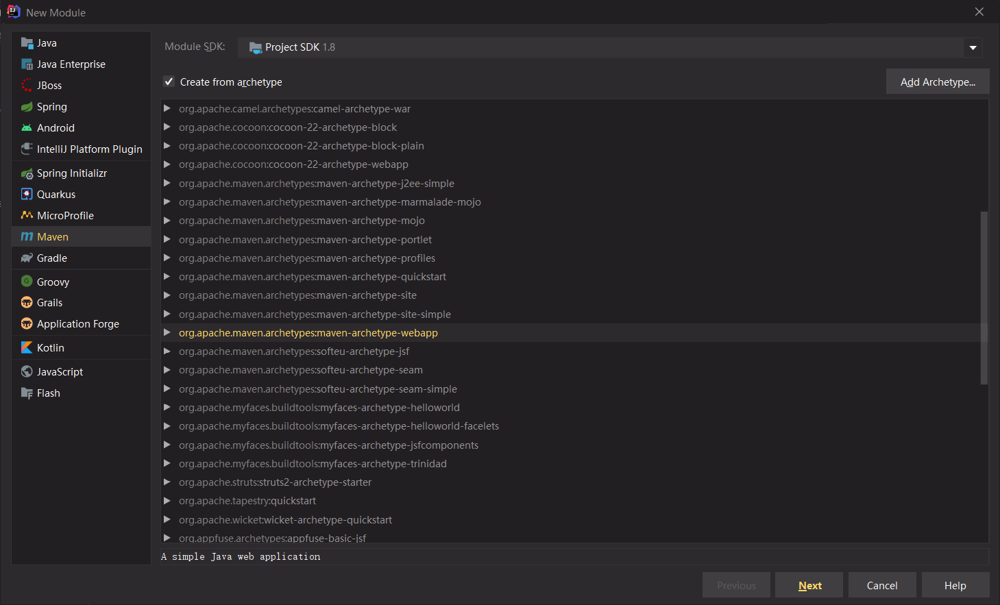
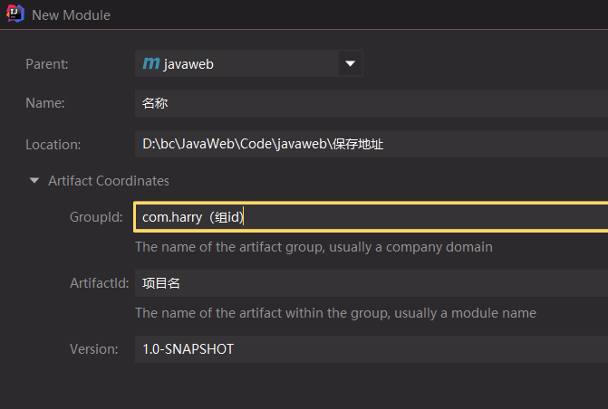
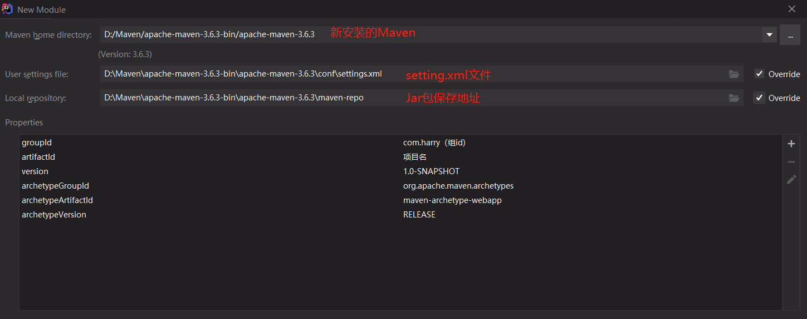
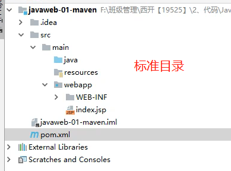
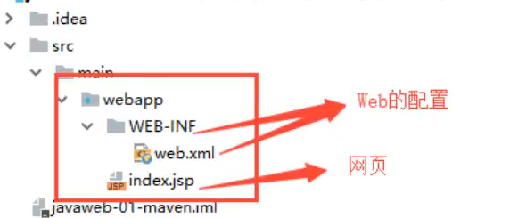
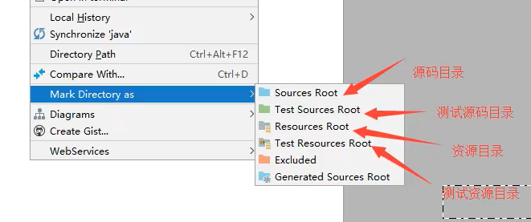
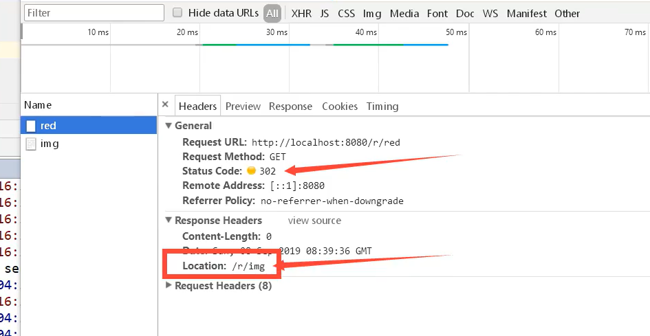

# Java Web

### 基本概念

- 一个web应用由多部分组成 （静态web，动态web）

B/S：浏览器和服务器

C/S：客户端和服务器

可以配置启动的端口号

1. tomcat的默认端口号为：8080
2. mysql：3306
3. http：80
4. https：443

 DNS服务器：存放全世界域名的地方

 HTTP（超文本传输协议）是一个简单的请求-响应协议，它通常运行在TCP之上。 

-  HTTP/1.0：客户端可以与web服务器连接后，只能获得一个web资源，断开连接
-  HTTP/1.1：客户端可以与web服务器连接后，可以获得多个web资源。

服务器 -- 响应 -- 客户端

```properties
百度
Cache-control : private		缓存控制
Connection : Keep-Alive		连接
Content-Encoding : gzip		编码
Content-Type : text/html	类型
```

响应体

```properties
Accept : 数据类型
Accept-Encoding : 编码格式GBK UTF-8 GB2312 IS08859-1(Java默认编码)
Accept-Language : 语言环境
Cache-control : 缓存控制
Connection : 请求完成是断开还是保持连接
HOST : 主机..../ .
Refresh : 多久刷新一次
Location : 网页重新定位
```

HTTP的响应状态码由5段组成： 

```properties
1xx 消息，一般是告诉客户端，请求已经收到了，正在处理。
2xx 处理成功，一般表示：请求收悉、我明白你要的、请求已受理、已经处理完成等信息。
3xx 重定向到其它地方。它让客户端再发起一个请求以完成整个处理。
4xx 处理发生错误，责任在客户端，如客户端的请求一个不存在的资源，客户端未被授权，禁止访问等。
5xx 处理发生错误，责任在服务端，如服务端抛出异常，路由出错，HTTP版本不支持等。
```


### 创建部署

Maven：项目架构管理工具

核心思想：约定大于配置

web.xml中配置URL地址时，首位“/”必须加，否则会启动组件失败

IEDA 的项目配置和 Web 部署：https://www.cnblogs.com/deng-cc/p/6416332.html

servlet：请求+响应，是一个服务

Session、Cookie：会话和缓存机制

JSP：html+java

IDEA中的Artifact，属于一种工具包


**创建一个Maven项目**














## Servlet

开发两步骤： 编写一个类，实现Servlet接口，把开发好的Java类部署到web服务器中。 

把实现了Servlet接口的Java程序叫做，Servlet 

Maven环境优化：① 修改web.xml为最新的；② 将maven的结构搭建完整

Servlet 类 -->  GenericServlet 类 -->  HttpServlet 类 --> 自己实现的类


### Mapping

```xml
<!--一个映射路径-->
<servlet>
    <servlet-name>error</servlet-name>
    <servlet-class>com.harry.servlet.ErrorServlet</servlet-class>
</servlet>
<servlet-mapping>
    <servlet-name>error</servlet-name>
    <url-pattern>/error</url-pattern>
</servlet-mapping>

<!--指定多个映射路径-->
	<url-pattern>/hello1</url-pattern>
	<url-pattern>/hello2</url-pattern>
	<url-pattern>/hello3</url-pattern>
<!--指定通用映射路径-->
	<url-pattern>/hello/*</url-pattern>
<!--默认请求路径-->
<!--优先级问题 指定了固有的映射路径优先级最高，如果找不到就会走默认的处理请求-->
	<url-pattern>/*</url-pattern>
<!--可以自定义映射后缀实现请求映射，但 * 前面不能加项目映射的路径(/hello/*.harry)-->
	<url-pattern>*.harry</url-pattern>
```


配置项目**默认进入的页面**

```xml
<!--web.xml文件-->
    <welcome-file-list>
        <welcome-file>index.jsp</welcome-file>
    </welcome-file-list>
```


### ServletContext对象

web容器启动的时候，它会为每个web程序都创建一个对应的ServletContext对象，它代表了 当前的web应用，整个服务中，ServletContext有且仅有一个，相当于单例模式

```java
//	      this.getInitParameter(0)      初始化参数
//        this.getServletConfig()       Servlet配置
//        this.getServletContext()      Servlet上下文
```

#### 1、数据共享

在servlet 1中保存的数据，可以在servlet 2中取到。（先运行servlet 2 取到的值为null）

```java
// this.getInitParameter(0)      初始化参数
// this.getServletConfig()       Servlet配置
// this.getServletContext()      Servlet上下文
// 整个服务中，ServletContext有且仅有一个，相当于单例模式

//Servlet 1
ServletContext context = this.getServletContext();
String userName = "Harry";
context.setAttribute("userName",userName);//将一个数据保存在ServletContext中

//Servlet 2
ServletContext context = this.getServletContext();
String name = (String)context.getAttribute("userName");
```

#### 2、获取初始化参数

```xml
<!--web.xml中配置一些web应用初始化参数-->
<context-param><!--环境参数-->
    <param-name>url</param-name>
    <param-value>jdbc:mysql://localhost:3306/</param-value>
</context-param>
```

```java
@Override
protected void doGet(HttpServletRequest req, HttpServletResponse resp) throws ServletException, IOException {
    ServletContext context = this.getServletContext();
    String url = context.getInitParameter("url");//获取初始化参数
    resp.getWriter().print(url);
}
```

#### 3、请求转发

```java
@Override
protected void doGet(HttpServletRequest req, HttpServletResponse resp) throws ServletException, IOException {
    ServletContext context = this.getServletContext();
    System.out.println("运行了demo04");
  	//请求调度程序
    RequestDispatcher requestDispatcher = context.getRequestDispatcher("/demo03");//转发的请求路径
    requestDispatcher.forward(req,resp);//调用forward实现请求转发
}
```

转发路径不会变化，状态为200

#### 4、读取资源文件

Peoperties

- 在java目录下新建properties
- 在resources目录下新建properties

发现：都被打包到了同一个路径下: classes，这个路径俗称为classpath

首先需要一个文件流

```properties
username=harry
password=123456
```

```java
@Override
    protected void doGet(HttpServletRequest req, HttpServletResponse resp) throws ServletException, IOException {
        //.getResourceAsStream 把资源变成一个流
        // 第一个/代表当前项目
        InputStream is = this.getServletContext().getResourceAsStream("/WEB-INF/classes/db.properties");
        Properties prop = new Properties();
        prop.load(is);
        String user = prop.getProperty("username");
        String pwd = prop.getProperty("password");

        resp.getWriter().print(user + ":" + pwd);
    }
```

```xml
<!--在pom.xml的build中配置resources，来防止资源导出失败的问题-->
<build>
    <resources>
        <resource>
            <directory>src/main/resources</directory>
            <includes>
                <include>**/*.properties</include>
                <include>**/*.xml</include>
            </includes>
        </resource>
        <resource><!--主要是java目录下的文件-->
            <directory>src/main/java</directory>
            <includes>
                <include>**/*.properties</include>
                <include>**/*.xml</include>
            </includes>
        </resource>
    </resources>
</build>
```


### HttpServletResponse

web服务器接收到客户端的http请求，会针对这个请求分别创建一个代表请求的Request对象，和一个代表响应的Response对象；

- 如果要获取客户端请求过来的参数：找HttpServletRequest
- 如果要给客户端响应一些信息：找HttpServletResponse

#### 1、简单分类

发送数据

```java
public ServletOutputStream getOutputStream() throws IOException;//多用于一般的
public PrintWriter getWriter() throws IOException;//多用于写中文，其他易造成字符丢失
```

发送响应头

```java
void setCharacterEncoding(String var1);
void setContentLength(int var1);
void setContentLengthLong(long var1);
void setContentType(String var1);
void setDateHeader(String var1, 1ong var2);
void addDateHeader(String var1, 1ong var2);
void setHeader(String var1, String var2);
void addHeader(String var1, String var2);
void setIntHeader(String var1, int var2);
void addIntHeader(String var1, int var2);
```

响应状态码

```java
public static final int SC_OK = 200;
public static final int SC_MULTIPLE_CHOICES = 300;
public static final int SC_BAD_REQUEST = 400;
public static final int SC_NOT_FOUND = 404;
public static final int SC_INTERNAL_SERVER_ERROR = 500;//等
```

#### 2、常见应用

1. 向浏览器输出消息
2. 下载文件

```java
@Override
protected void doGet(HttpServletRequest req, HttpServletResponse resp) throws ServletException, IOException {
    //1. 要获取下载文件的路径
    String realPath = "D:\\bc\\JavaWeb\\Kuang\\javaweb-02-servlet\\servlet-03-response\\src\\main\\resources\\图片2.jpg";
    System.out.println("下载文件的路径：" + realPath);
    //2. 下载的文件名是啥？
    String fileName = realPath.substring(realPath.lastIndexOf("\\") + 1);
    //3. 设置让浏览器能支持(Content-Disposition)下载所需的东西，中文文件名使用 URLEncoder.encode 编码，否则可能乱码
    resp.setHeader("Content-Disposition","attachment;filename=" + URLEncoder.encode(fileName,"UTF-8"));
    //4. 获取下载文件的输入流
    FileInputStream in = new FileInputStream(realPath);
    //5. 创建缓冲区
    int len = 0;
    byte[] buffer = new byte[1024];
    //6. 获取OutputStream对象
    ServletOutputStream out = resp.getOutputStream();
    //7. 将FileOutputStream流写入到buffer缓冲区，使用OutputStream将缓冲区中的数据输出到客户端
    while((len = in.read(buffer)) > 0){
        out.write(buffer,0,len);
    }

    in.close();
    out.close();
}
```

#### 3、验证码功能

- 前端实现
- 后端实现，需要用到Java的图片类，生成一个图片

```java
@Override
protected void doGet(HttpServletRequest req, HttpServletResponse resp) throws ServletException, IOException {
    //让浏览器3秒自动刷新一次
    resp.setHeader("refresh","0.5");

    //在内存中创建一个图片
    BufferedImage image = new BufferedImage(100, 20, BufferedImage.TYPE_INT_BGR);
    //得到图片
    Graphics2D g = (Graphics2D) image.getGraphics();//笔
    //设置图片的背景颜色
    g.setColor(Color.white);
    g.fillRect(0,0,100,30);
    //给图片写数据
    g.setColor(Color.BLUE);
    g.setFont(new Font(null,Font.BOLD,20));
    g.drawString(makeNum(),0,20);

    //告诉浏览器，该请求用浏览器的方式打开
    resp.setContentType("image/jpeg");
    //网站存在缓存，不让浏览器缓存
    resp.setDateHeader("expires",-1);
    resp.setHeader("Cache-Control","no-cache");
    resp.setHeader("Pragma","no-cache");

    //把图片写给浏览器
    ImageIO.write(image, "jpg", resp.getOutputStream());
}

//生成随机数
private String makeNum(){
    Random r = new Random();
    String num = r.nextInt(99999999) + "";
    StringBuilder sb = new StringBuilder();
    for (int i = 0; i < 8 - num.length(); i++) {//保证能够输出8位数字
        sb.append("0");
    }
    num = sb.toString() + num;
    return num;
}
```


#### 4、重定向

一个Web资源 B 收到客户端 A 的请求后，通知 A 去访问Web资源 C，该过程称为重定向。


常见场景：

- 用户登录

```java
void sendRedirect(String var1) throws IOException
```

测试：

```java
@Override
protected void doGet(HttpServletRequest req, HttpServletResponse resp) throws ServletException, IOException {
    //resp.setHeader("Location","./img");
    //resp.setStatus(HttpServletResponse.SC_MOVED_TEMPORARILY); <-- 常量值为302

    resp.sendRedirect("./img");//重定向
}
```




重定向和转发的区别?

相同点：页面都会实现跳转
不同点：请求转发的时候，url不会产生变化；307
			   重定向时候，url地址栏会发生变化；302

实践：

```jsp
<%--Jsp页面--%>
<%@ page language="java" contentType="text/html; charset=utf-8" pageEncoding="utf-8"%><%--该段代码，定义了web端的编码，避免乱码--%>
<html>
<body>
<%--这里提交的路径，需要寻找到项目的路径--%>
<%--${pageContext.request.contextPath} 代表当前的项目--%>
<form action="${pageContext.request.contextPath}/login" method="get">
    用户名：<input type="text" name="username"><br>
    密码：<input type="password" name="password"><br>
    <input type="submit">
</form>
</body>
</html>
```

```xml
<servlet>
  <servlet-name>RequestServlet</servlet-name>
  <servlet-class>com.harry.servlet.RequestServlet</servlet-class>
</servlet>
<servlet-mapping>
  <servlet-name>RequestServlet</servlet-name>
  <url-pattern>/login</url-pattern>
</servlet-mapping>
```

```java
@Override
protected void doGet(HttpServletRequest req, HttpServletResponse resp) throws ServletException, IOException {
  String userName = req.getParameter("username");
  String password = req.getParameter("password");
  System.out.println(userName+" : "+password);

  resp.sendRedirect("Success.jsp");
}
```


### HttpServletRequest

HttpServletRequest代表客户端的请求，用户通过Http协议访问服务器，Http请求中的所有信息会被封装到HttpServletRequest，通过这个HTTPServletRequest的方法，获取客户端的所有信息。

#### 1、获取前端传递的参数

```pro
req.getParameter()									//String
req.getParameterValues(String s)		//String[]
```

#### 2、请求转发

```jsp
<div>
    <%--以post的方式提交表单，提交到login请求--%>
    <form action="${pageContext.request.contextPath}/login" method="post">
        用户名：<input type="text" name="name"><br>
        密码：<input type="password" name="password"><br>
        爱好：
        <input type="checkbox" name="hobbies" value="女孩">女孩
        <input type="checkbox" name="hobbies" value="代码">代码
        <input type="checkbox" name="hobbies" value="吃">吃
        <input type="checkbox" name="hobbies" value="喝">喝
        <br>
        <input type="submit">
    </form>
</div>
```


```java
@Override
protected void doGet(HttpServletRequest req, HttpServletResponse resp) throws ServletException, IOException {
    req.setCharacterEncoding("utf-8");//处理接收到内容的编码格式
    resp.setCharacterEncoding("utf-8");

    String name = req.getParameter("name");
    String password = req.getParameter("password");
    String[] hobbies = req.getParameterValues("hobbies");

    System.out.println("=============================");
    System.out.println(name+" : "+password);
    System.out.println(Arrays.toString(hobbies));
    System.out.println("=============================");

    System.out.println(req.getContextPath());
    //通过请求转发
    //这里的'/'代表的是当前的Web应用
    req.getRequestDispatcher("/success.jsp").forward(req,resp);
}
```


## Cookie、Session

### 会话

会话：用户打开一个浏览器，点击了很多超链接，访问多个web资源，关闭浏览器，这个过程可以称之为会话；

有状态会话：一个同学来过教室，下次再来教室，我们会知道这个同学，曾经来过，称之为有状态会话；

怎么证明是苏大的学生？

- 发票 苏大给你发票
- 学校登记 苏大标记你来过了

一个网站，怎么证明你来过？

- 服务端给客户端一个 信件，客户端下次访问服务端带上信件就可以了； cookie
- 服务器登记你来过了，下次你来的时候我来匹配你； seesion


### 保存会话的两种技术

**cookie**

- 客户端技术 （响应，请求）

**session**

- 服务器技术，利用这个技术，可以保存用户的会话信息？ 可以把信息或者数据放在Session中

常见常见：网站登录之后，下次不用再登录了，第二次访问直接就上去了


### Cookie


1. 从请求中拿到cookie信息
2. 服务器响应给客户端cookie

```java
Cookie[] cookies = req.getCookies(); //获得Cookie
cookie.getName(); //获得cookie中的key
cookie.getValue(); //获得cookie中的vlaue
new Cookie("lastLoginTime", System.currentTimeMillis()+""); //新建一个cookie
cookie.setMaxAge(24*60*60); //设置cookie的有效期
resp.addCookie(cookie); //响应给客户端一个cookie
```

cookie：一般会保存在本地的 用户目录下 appdata；

一个网站cookie是否存在上限！聊聊细节问题

- 一个Cookie只能保存一个信息；
- 一个web站点可以给浏览器发送多个cookie，最多存放20个cookie；
- Cookie大小有限制4kb；
- 300个cookie浏览器上限

删除Cookie；

- 不设置有效期，关闭浏览器，自动失效；
- 设置有效期时间为 0 ；

编码解码：

```java
URLEncoder.encode("中文内容","utf-8")
URLDecoder.decode(cookie.getValue(),"UTF-8")
```


### Session（重点）


什么是Session：

- 服务器会给每一个用户（浏览器）创建一个Seesion对象；
- 一个Seesion独占一个浏览器，只要浏览器没有关闭，这个Session就存在；
- 用户登录之后，整个网站它都可以访问！–> 保存用户的信息；保存购物车的信息……
  …

Session和cookie的区别：

- Cookie是把用户的数据写给用户的浏览器，浏览器保存 （可以保存多个）
- Session把用户的数据写到用户独占Session中，服务器端保存 （保存重要的信息，减少服务器资源的浪费）
- Session对象服务器创建；

使用场景：

- 保存一个登录用户的信息；
- 购物车信息；
- 在整个网站中经常会使用的数据，我们将它保存在Session中；

使用Session：

```java
@Override
protected void doGet(HttpServletRequest req, HttpServletResponse resp) throws ServletException, IOException {

  //解决乱码问题
  req.setCharacterEncoding("UTF-8");
  resp.setCharacterEncoding("UTF-8");
  resp.setContentType("text/html;charset=utf-8");

  //得到Session
  HttpSession session = req.getSession();
  //给Session中存东西
  session.setAttribute("name",new Person("秦疆",1));
  //获取Session的ID
  String sessionId = session.getId();

  //判断Session是不是新创建
  if (session.isNew()){
    resp.getWriter().write("session创建成功,ID:"+sessionId);
  }else {
    resp.getWriter().write("session以及在服务器中存在了,ID:"+sessionId);
  }

  //Session创建的时候做了什么事情；
  //        Cookie cookie = new Cookie("JSESSIONID",sessionId);
  //        resp.addCookie(cookie);
}
```

```java
//得到Session
HttpSession session = req.getSession();

Person person = (Person) session.getAttribute("name");

System.out.println(person.toString());

HttpSession session = req.getSession();
session.removeAttribute("name");
//手动注销Session
session.invalidate();
```

**会话自动过期：web.xml配置**

```xml
<!--设置Session默认的失效时间-->
<session-config>
    <!--15分钟后Session自动失效，以分钟为单位-->
    <session-timeout>15</session-timeout>
</session-config>
```


## JSP

**Java Server Pages** ： Java服务器端页面，也和Servlet一样，用于动态Web的技术

最大的特点：

- 写JSP就像在写HTML
- 区别：
  - HTML只给用户提供静态的数据
  - JSP页面中可以嵌入JAVA代码，为用户提供动态数据；

### JSP原理

思路：JSP到底怎么执行的！

​	代码层面没有任何问题

​	服务器内部工作

​	tomcat中有一个work目录；

​	IDEA中使用Tomcat的会在IDEA的tomcat中生产一个work目录 


我电脑的地址：

C:\Users\Administrator.IntelliJIdea2018.1\system\tomcat\Unnamed_javaweb-session-cookie\work\Catalina\localhost\ROOT\org\apache\jsp

发现页面转变成了Java程序！


**浏览器向服务器发送请求，不管访问什么资源，其实都是在访问Servlet！**

JSP最终也会被转换成为一个Java类！

**JSP 本质上就是一个Servlet**

```java
//index_jsp.java文件中的方法
//初始化
public void _jspInit() {}
//销毁
public void _jspDestroy() {}
//JSPService
public void _jspService(HttpServletRequest request,HttpServletResponse response)
```

1. 判断请求
2. 内置一些对象

```java
final javax.servlet.jsp.PageContext pageContext;  //页面上下文
javax.servlet.http.HttpSession session = null;    //session
final javax.servlet.ServletContext application;   //applicationContext
final javax.servlet.ServletConfig config;         //config（配置）
javax.servlet.jsp.JspWriter out = null;           //out
final java.lang.Object page = this;               //page：当前
HttpServletRequest request                        //请求
HttpServletResponse response                      //响应
```

3. 输出页面前增加的代码

```java
response.setContentType("text/html");       //设置响应的页面类型
pageContext = _jspxFactory.getPageContext(this, request, response,null, true, 8192, true);
_jspx_page_context = pageContext;
application = pageContext.getServletContext();
config = pageContext.getServletConfig();
session = pageContext.getSession();
out = pageContext.getOut();
_jspx_out = out;
```

以上的这些个对象我们可以在JSP页面中直接使用！


在JSP页面中；

只要是 JAVA代码就会原封不动的输出；

如果是HTML代码，就会被转换为：

```java
out.write("<html>\r\n");
```

这样的格式，输出到前端！


