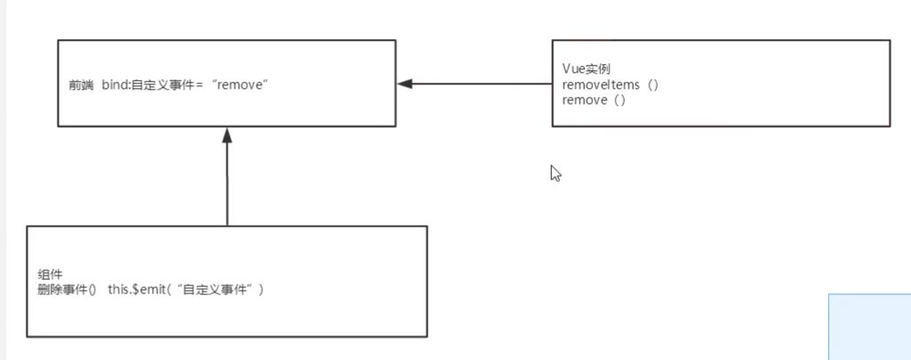

学习前所需掌握以下内容

1、逻辑

- 判断、循环

2、事件

- 浏览器事件：window、document
- Dom事件：增、删、遍历、修改节点元素内容

3、视图

- html、CSS（难点 ==> 使用BootStrap可视化工具）、js、jQuery

4、通信

- Ajax


# **简介**

**VUE 概述**
Vue (读音/vju/, 类似于view)是一套用于构建用户界面的渐进式框架，发布于2014年2月。与其它大型框架不同的是，Vue被设计为可以自底向上逐层应用。Vue的核心库只关注视图层（SOC： Separation of Concerns，关注点分离原则），不仅易于上手，还便于与第三方库（如: vue-router: 页面跳转，vue-resource: 网络通信，vuex:状态管理）或既有项目整合。

HTML + CSS + JS : 视图 ：给用户看，刷新后台给的数据

Vue-UI : ICE , Element UI


**JavaScript框架**
**jQuery:** 大家熟知的JavaScript框架，优点是简化了DOM操作，缺点是DOM操作太频繁,影响前端性能;在前端眼里使用它仅仅是为了兼容IE6、7、8;

**Angular:** Google收购的前端框架（采用MVVM框架： Model-View-ViewModel ），由一群Java程序员开发，其特点是将后台的MVC模式搬到了前端并增加了**模块化开发**的理念，与微软合作，采用TypeScript语法开发;对后台程序员友好，对前端程序员不太友好;最大的缺点是版本迭代不合理(如: 1代-> 2代，除了名字，基本就是两个东西;截止发表博客时已推出了Angular6)

**React:** Facebook出品，一款高性能的JS前端框架;特点是提出了新概念**[虚拟DOM]**用于减少真实DOM操作，在内存中模拟DOM操作，有效的提升了前端渲染效率；缺点是使用复杂，因为需要额外学习一门**[JSX]** 语言。

**Vue:** 一款渐进式JavaScript框架，所谓渐进式就是逐步实现新特性的意思，如实现模块化开发、路由、状态管理等新特性。其特点是综合了Angular (模块化)和React (虚拟DOM)的优点;

**Axios:** 前端通信框架;因为 Vue 的边界很明确，就是为了处理DOM,所以并不具备通信能力，此时就需要额外使用一个通信框架与服务器交互；当然也可以直接选择使用jQuery提供的AJAX通信功能;

**前端三大框架：Angular、React、Vue**


**U框架**

- **ElementUl：**饿了么前端开源 Vue UI组件库，基本涵盖后台所需的所有组件，文档详细，例子丰富（属于前端主流框架，选型时可考虑使用，主要特点是桌面端支持较多）。
- Ant-Design：阿里巴巴出品，基于React的Ul框架
- iview：基于 Vue.js 的 UI 组件库，主要服务于 PC 界面的中后台产品。
- Bootstrap: Twitter推出的一个用于前端开发的开源工具包
- AmazeUl：又叫“妹子UI”，一款 HTML5跨屏前端框架
- iview：一个强大的基于 Vue 的 UI库，有很多实用的基础组件比 elementui 的组件更丰富，主要服务于PC界面的中后台产品（属于前端主流框架，选型时可考虑使用，主要特点是移动端支持较多）。
- ICE：阿里巴巴团队基于React/Angular/Vue 的中后台应用解决方案（主要组件还是以React为主，截止2019年02月17日更新博客前对Vue 的支持还不太完善，目前尚处于观望阶段）。
- mpvue：美团开发的一个使用 vue.js 开发小程序的前端框架，自前支持**微信小程序、百度智能小程序，头条小程序**和**支付宝小程序**（完备的Vue开发体验，并且支持多平台的小程序开发，推荐使用）。


**JavaScript构建工具**

- Babel：JS 编译工具，主要用于浏览器不支持的 ES 新特性，比如用于编译 TypeScript
- WebPack：模块打包器，主要作用是打包、压缩、合并及按序加载


**NodeJS框架及管理工具**

- Express: NodeJS框架
- Koa: Express简化版
- NPM: 项目综合管理工具，类似于 Maven
- YARN: NPM 的替代方案，类似于 Maven 和 Gradle 的关系


# 第一个Vue程序

## **1、什么是MVVM**

```txt
MVVM (Model-View-ViewModel) 是一种软件架构设计模式，由微软WPF (用于替代WinForm，以前就是用这个技术开发桌面应用程序的)和Silverlight (类似于Java Applet,简单点说就是在浏览器上运行的WPF)的架构师Ken Cooper和Ted Peters 开发，是一种简化用户界面的事件驱动编程方式。由John Gossman (同样也是WPF和Silverlight的架构师)于2005年在他的博客上发表。
```

MVVM 源自于经典的MVC (ModI-View-Controller) 模式。MVVM的核心是ViewModel层，负责转换Model中的数据对象来让数据变得更容易管理和使用，其作用如下:

- 该层向上与视图层进行双向数据绑定
- 向下与Model层通过接口请求进行数据交互


## 2、为什么要使用MVVM

MVVM模式和MVC模式一样，主要目的是分离视图(View)和模型(Model),有几大好处：

- 低耦合:视图(View)可以独立于Model变化和修改,一个ViewModel可以绑定到不同的
- View上，当View变化的时候Model可以不变，当Model变化的时候View也可以不变。
- 可复用:你可以把一些视图逻辑放在一个ViewModel里面，让很多View重用这段视图逻辑。
- 独立开发:开发人员可以专注于业务逻辑和数据的开发(ViewModel),设计人员可以专注于页面设计。
- 可测试:界面素来是比较难于测试的，而现在测试可以针对ViewModel来写。


## 3、Vue 是 MVVM 模式的实现者

 ![[外链图片转存失败,源站可能有防盗链机制,建议将图片保存下来直接上传(img-n9t7FtSN-1595254922262)(D:\我\MyBlog\狂神说 VUE 笔记.assets\image-20200717181433248.png)]](https://img-blog.csdnimg.cn/20200720222311692.png?x-oss-process=image/watermark,type_ZmFuZ3poZW5naGVpdGk,shadow_10,text_aHR0cHM6Ly9ibG9nLmNzZG4ubmV0L0RERERlbmdf,size_16,color_FFFFFF,t_70) 


- Model : 模型层，在这里表示JavaScript对象

- View : 视图层,在这里表示DOM (HTML操作的元素)

- ViewModel : 连接视图和数据的中间件，Vue.js就是MVVM中的ViewModel层的实现者在MVVM架构中，是不允许数据和视图直接通信的，只能通过ViewModel来通信，而ViewModel就是定义了一个Observer观察者

- ViewModel 能够观察到数据的变化，并对视图对应的内容进行更新

- ViewModel 能够监听到视图的变化，并能够通知数据发生改变

```txt
至此，我们就明白了，Vue.js 就是一个MVVM的实现者，他的核心就是实现了DOM监听与数据绑定
```

 **Vue在线cdn:** 

```html
<script src="https://cdn.jsdelivr.net/npm/vue@2.5.21/dist/vue.min.js"></script>
```


# Vue基本语法

## v-bind

 现在数据和DOM已经被建立了关联，所有的东西都是响应式的。我们在控制台操作对象的属性，界面可以实时更新。

 我们可以使用`v-bind`来绑定元素属性，或者直接两个双括号{{message}}

```vue
<!DOCTYPE html>
<html lang="en">
<head>
    <meta charset="UTF-8">
    <title>Title</title>
</head>
<body>
<p>狂神说Java</p>

<!--view层 模板-->
<div id="app">
    <span v-bind:title="message">鼠标悬停几秒钟查看此处动态绑定的提示信息！</span>
</div>
</body>

<!--导入js-->
<script src="https://cdn.jsdelivr.net/npm/vue@2.5.21/dist/vue.min.js"></script>
<script>
    var vm = new Vue({
        el: "#app",
        data: {
            message: "hello,vue"
        }
    })
</script>
</html>
```


## v-if   v-else

```vue
<!DOCTYPE html>
<html lang="en">
<head>
   <meta charset="UTF-8">
   <title>Title</title>
</head>
<body>
<p>狂神说Java</p>

<!--view层 模板-->
<div id="app">
   <h1 v-if="type==='A'">A</h1>
   <h1 v-else-if="type==='B'">B</h1>
   <h1 v-else>C</h1>
</div>
</body>

<!--导入js-->
<script src="https://cdn.jsdelivr.net/npm/vue@2.5.21/dist/vue.min.js"></script>
<script>
   var vm = new Vue({
       el: "#app",
       data: {
           type: "A"
       }
   })
</script>
</html>
```


## v-for

```vue
<!DOCTYPE html>
<html lang="en">
<head>
    <meta charset="UTF-8">
    <title>Title</title>
</head>
<body>
<p>狂神说Java</p>

<!--view层 模板-->
<div id="app">
    <li v-for="item in items">
        姓名：{{item.name}}，年龄：{{item.age}}
    </li>
</div>
</body>

<!--导入js-->
<script src="https://cdn.jsdelivr.net/npm/vue@2.5.21/dist/vue.min.js"></script>
<script>
    var vm = new Vue({
        el: "#app",
        data: {
            items: [
                {name: "zhangsan", age: 12},
                {name: "lisi", age: 10},
                {name: "wangwu", age: 16}
            ]
        }
    })
</script>
</html>
```


## v-on 事件绑定

```vue
<!DOCTYPE html>
<html lang="en">
<head>
    <meta charset="UTF-8">
    <title>Title</title>
</head>
<body>
<p>狂神说Java</p>

<!--view层 模板-->
<div id="app">
    <button v-on:click="sayHi">Click Me</button>
</div>
</body>

<!--导入js-->
<script src="https://cdn.jsdelivr.net/npm/vue@2.5.21/dist/vue.min.js"></script>
<script>
    var vm = new Vue({
        el: "#app",
        data: {
            message: "你点我干嘛？"
        },
        methods: {
            //方法必须绑定在Vue的Methods对象中，v-on:事件
            sayHi: (function (event) {
                alert(this.message)
            })
        }
    })
</script>
</html>
```


# Vue双向绑定  v-model

**1、什么是双向绑定**

Vue.js是一个MVVM框架，即数据双向绑定,即当数据发生变化的时候,视图也就发生变化，当视图发生变化的时候，数据也会跟着同步变化。这也算是Vue.js的精髓之处了。

值得注意的是，我们所说的数据双向绑定，一定是对于UI控件来说的，非UI控件不会涉及到数据双向绑定。单向数据绑定是使用状态管理工具的前提。如果我们使用vuex，那么数据流也是单项的，这时就会和双向数据绑定有冲突。

**2、为什么要实现数据的双向绑定**

在Vue.js 中，如果使用vuex ，实际上数据还是单向的，之所以说是数据双向绑定，这是用的UI控件来说，对于我们处理表单，Vue.js的双向数据绑定用起来就特别舒服了。即两者并不互斥，在全局性数据流使用单项,方便跟踪;局部性数据流使用双向，简单易操作。

**3、在表单中使用双向数据绑定**

你可以用v-model指令在表单 \<input>、\<textarea> 及 \<select> 元素上创建双向数据绑定。它会根据控件类型自动选取正确的方法来更新元素。尽管有些神奇，但v-model本质上不过是语法糖。它负责监听户的输入事件以更新数据，并对一些极端场景进行一些特殊处理。


**注意：v-model会忽略所有元素的value、checked、selected特性的初始值而总是将Vue实例的数据作为数据来源，你应该通过JavaScript在组件的data选项中声明。**

```vue
<!DOCTYPE html>
<html lang="en">
<head>
    <meta charset="UTF-8">
    <title>Title</title>
</head>
<body>


<!--view层 模板-->
<div id="app">

    性别:
    <input type="radio" name="sex" value="男" v-model="harry">男
    <input type="radio" name="sex" value="女" v-model="harry">女
    <p>
        选中了谁: {{harry}}
    </p>

</div>

<div id="app2">
    下拉框：
    <select v-model="selected">
        <option value="" disabled>-请选择-</option>
        <option>A</option>
        <option>B</option>
        <option>C</option>
    </select>
    <p>value:{{selected}}</p>
</div>
</body>

<!--导入js-->
<script src="https://cdn.staticfile.org/vue/2.2.2/vue.min.js"></script>
<script>
    var vm = new Vue({
        el: "#app",
        data: {
            harry: ''
        }
    })
    var vm = new Vue({
        el: "#app2",
        data: {
            selected: ""
        }
    })
</script>
</html>
```


# Vue组件

组件是可复用的`Vue`实例，说白了就是一组可以重复使用的模板，跟JSTL的自定义标签、Thymeleaf的`th:fragment` 等框架有着异曲同工之妙。通常一个应用会以一棵嵌套的组件树的形式来组织： 

 ![[外链图片转存失败,源站可能有防盗链机制,建议将图片保存下来直接上传(img-oSJ7c1GT-1595254922264)(D:\我\MyBlog\狂神说 VUE 笔记.assets\image-20200718095216872.png)]](https://img-blog.csdnimg.cn/20200720222347392.png) 

```vue
<!DOCTYPE html>
<html lang="en">
<head>
    <meta charset="UTF-8">
    <title>Title</title>
</head>
<body>

<!--view层 模板-->
<div id="app">
    <!-- 把组件想象成一个函数，props为入参，template为要执行的方法，v-bind:xxxx=""就相当于参数赋值 -->
    <qinjiang v-for="item in items" v-bind:qin="item"></qinjiang>
</div>
</body>

<!--导入js-->
<script src="https://cdn.jsdelivr.net/npm/vue@2.5.21/dist/vue.min.js"></script>
<script>
    Vue.component("qinjiang",{
        props: ['qin'],
        template: '<li>{{qin}}</li>'
    })

    var vm = new Vue({
        el: "#app",
        data: {
            items: ['Java','Python','Php']
        }
    })
</script>
</html>
```

- v-for="item in items”：遍历 vue 实例中定义的名为 items 的数组，并创建同等数量的组件
- v-bind:qin="item"：将遍历的 item 项绑定到组件中 props 定义的名为 item 属性上；等号左边的 qin 为 props 定义的属性名，右边的为 item in items 中遍历的 item 项的值


# Axios通信

## 1、什么是Axios

Axios是一个开源的可以用在浏览器端和`NodeJS`的异步通信框架，她的主要作用就是实现`AJAX`异步通信，其功能特点如下:

- 从浏览器中创建XMLHttpRequests

- 从node.js创建http请求

- 支持Promise API [JS中链式编程]

- 拦截请求和响应

- 转换请求数据和响应数据

- 取消请求

- 自动转换JSON数据

- 客户端支持防御XSRF (跨站请求伪造)


GitHub: https://github.com/ axios/axios
中文文档: http://www.axios-js.com/

## 2、为什么要使用Axios

由于Vue.js是一个视图层框架且作者(尤雨溪) 严格准守SoC (关注度分离原则)，所以Vue.js并不包含Ajax的通信功能，为了解决通信问题，作者单独开发了一个名为vue-resource的插件，不过在进入2.0 版本以后停止了对该插件的维护并推荐了Axios 框架。少用jQuery，因为它操作Dom太频繁 !

模拟Json数据：

```json
{
  "name": "harry",
  "age": "18",
  "sex": "男",
  "url":"https://www.baidu.com",
  "address": {
    "street": "东环路",
    "city": "苏州",
    "country": "中国"
  },
  "links": [
    {
      "name": "bilibili",
      "url": "https://www.bilibili.com"
    },
    {
      "name": "baidu",
      "url": "https://www.baidu.com"
    },
    {
      "name": "cqh video",
      "url": "https://www.4399.com"
    }
  ]
}
```

  

```vue
<!DOCTYPE html>
<html lang="en">
<head>
    <meta charset="UTF-8">
    <title>Title</title>

    <!-- v-cloak：解决闪烁问题 -->
    <style>
        [v-cloak]{
            display: none;
        }
    </style>
</head>
<body>
<!--view层 模板-->
<div id="vue" v-cloak>
    <div>{{info.name}}</div>
    <a v-bind:href="info.url">点我进入</a>
</div>
</body>

<!--1.导入vue.js-->
<script src="https://cdn.jsdelivr.net/npm/vue@2.5.21/dist/vue.min.js"></script>
<!--导入axios-->
<script src="https://cdn.bootcdn.net/ajax/libs/axios/0.19.2/axios.min.js"></script>
<script>

    var vm = new Vue({
        el: "#vue",
        data: {
            items: ['Java','Python','Php']
        },
        //data:vm的属性
        //data():vm方法
        data(){
            return{
                //请求的返回参数,必须和json字符串一样
               info:{
                   name: null,
                   age: null,
                   sex: null,
                   url: null,
                   address: {
                       street: null,
                       city: null,
                       country: null
                   }
               }
            }
        },
        //钩子函数，链式编程，ES6新特性
        mounted(){
            axios.get("../data.json").then(res => (this.info=res.data))
        }
    })
</script>
</html>
```


## 3、Vue计算属性

计算属性的重点突出在`属性`两个字上(属性是名词)，首先它是个`属性`其次这个属性有`计算`的能力(计算是动词)，这里的计算就是个函数；简单点说，它就是一个能够将计算结果缓存起来的属性(将行为转化成了静态的属性)，仅此而已;可以想象为**缓存**！

```vue
<!DOCTYPE html>
<html lang="en">
<head>
    <meta charset="UTF-8">
    <title>Title</title>
</head>
<body>

<!--view层 模板-->
<div id="app">
    <div>currentTime1: {{currentTime1()}}</div>
    <div>currentTime2: {{currentTime2}}</div>
</div>
</body>

<!--导入js-->
<script src="https://cdn.jsdelivr.net/npm/vue@2.5.21/dist/vue.min.js"></script>
<script>
    var vm = new Vue({
        el: "#app",
        data: {
            message: "hello,world!"
        },
        methods: {
            currentTime1: function () {
                return Date.now(); // 返回一个时间戳
            }
        },
        computed: {
            //计算属性：methods，computed 方法名不能重名，重名字后，只会调用methods的方法
            currentTime2: function () {
                this.message;
                // 返回一个时间戳
                return Date.now();
            }
        }
    })
</script>
</html>
```

 **结论:**
 调用方法时，每次都需要进行计算，既然有计算过程则必定产生系统开销，那如果这个结果是不经常变化的呢?此时就可以考虑将这个结果缓存起来，采用计算属性可以很方便的做到这一点，**计算属性的主要特性就是为了将不经常变化的计算结果进行缓存，以节约我们的系统开销;** 


# 内容分发 slot

在Vue.js中我们使用 元素作为承载分发内容的出口，作者称其为插槽，可以应用在组合组件的场景中;

```vue
<!DOCTYPE html>
<html lang="en">
<head>
    <meta charset="UTF-8">
</head>
<body>
<div id="app">
    <todo>
        <todo-title slot="todo-title" v-bind:name="title"></todo-title>
        <todo-items slot="todo-items" v-for="item in todoItems" v-bind:item="item"></todo-items>
    </todo>
</div>

<!--1.导入vue.js-->
<script src="https://cdn.jsdelivr.net/npm/vue@2.5.21/dist/vue.min.js"></script>
<script>
    //slot 插槽 这个组件要定义在前面不然出不来数据
    Vue.component("todo", {
        template: 
        '<div>\
            <slot name="todo-title"></slot>\
            <ul>\
                <slot name="todo-items"></slot>\
            </ul>\
        <div>'
    });
    Vue.component("todo-title", {
        //属性
        props: ['name'],
        template: '<div>{{name}}</div>'
    });
    Vue.component("todo-items", {
        props: ['item'],
        template: '<li>{{item}}</li>'
    });
    let vm = new Vue({
        el: "#app",
        data: {
            //标题
            title: "图书馆系列图书",
            //列表
            todoItems: ['三国演义', '红楼梦', '西游记', '水浒传']
        }
    });
</script>
</body>
</html>
```


# 自定义事件内容分发

通过以上代码不难发现，数据项在Vue的实例中，但删除操作要在组件中完成，那么组件如何才能删除Vue实例中的数据呢?此时就涉及到参数传递与事件分发了，Vue为我们提供了自定义事件的功能很好的帮助我们解决了这个问题；

 使用 this.$emit (‘自定义事件名’,参数)



```vue
<!DOCTYPE html>
<html lang="en">
<head>
    <meta charset="UTF-8">
</head>
<body>
<div id="app">
    <todo>
        <todo-title slot="todo-title" v-bind:name="title"></todo-title>
        <todo-items slot="todo-items" v-for="(item,index) in todoItems" v-bind:item="item"
                    v-bind:index="index" v-on:remove="removeItems(index)"></todo-items>
    </todo>
</div>

<!--1.导入vue.js-->
<script src="https://cdn.jsdelivr.net/npm/vue@2.5.21/dist/vue.min.js"></script>
<script>
    //slot 插槽 这个组件要定义在前面不然出不来数据
    Vue.component("todo", {
        template: '<div>\
                <slot name="todo-title"></slot>\
                <ul>\
                <slot name="todo-items"></slot>\
                </ul>\
                <div>'
    });
    Vue.component("todo-title", {
        //属性
        props: ['name'],
        template: '<div>{{name}}</div>'
    });
    Vue.component("todo-items", {
        props: ['item','index'],
        template: '<li>{{index}}---{{item}} <button @click="remove">删除</button></li>',
        methods: {
            remove: function (index) {
                // this.$emit 自定义事件分发
                this.$emit('remove',index)
            }
        }
    });
    let vm = new Vue({
        el: "#app",
        data: {
            //标题
            title: "图书馆系列图书",
            //列表
            todoItems: ['三国演义', '红楼梦', '西游记', '水浒传']
        },
        methods: {
            removeItems: function (index) {
                console.log("删除了"+this.todoItems[index]+"OK");
                this.todoItems.splice(index,1);
            }
        }
    });
</script>
</body>
</html>
```


# 入门总结

常用的属性：

- v-if
- v-else-if
- v-else
- v-for
- v-on绑定事件，简写为 @
- v-model数据双向绑定
- v-bind给组件绑定参数，简写为 ：

组件化：

- 组合组件slot插槽
- 组件内部绑定事件需要使用到 `this.$emit("事件名",参数);`
- 计算属性的特色，缓存计算数据


# 第一个vue-cli

**1、什么是vue-cli**

 vue-cli 官方提供的一个脚手架,用于快速生成一个 vue 的项目模板;

 预先定义好的目录结构及基础代码，就好比咱们在创建 Maven 项目时可以选择创建一个骨架项目，这个骨架项目就是脚手架,我们的开发更加的快速;

 **主要功能：**

- 统一的目录结构
- 本地调试
- 热部署
- 单元测试
- 集成打包上线


**2、需要的环境**

Node.js : http://nodejs.cn/download/

安装就无脑下一步就好,安装在自己的环境目录下

Git : https://git-scm.com/downloads
镜像:https://npm.taobao.org/mirrors/git-for-windows/

**确认nodejs安装成功:**

- cmd 下输入 node -v，查看是否能够正确打印出版本号即可!
- cmd 下输入 npm-v，查看是否能够正确打印出版本号即可!

这个npm,就是一个软件包管理工具,就和linux下的apt软件安装差不多!

*npm* 是 JavaScript 世界的包管理工具,并且是 Node.js 平台的默认包管理工具。通过 *npm* 可以安装、共享、分发代码,管理项目依赖关系。

**安装 Node.js 淘宝镜像加速器（cnpm）**

这样子的话,下载会快很多~

```java
# -g 就是全局安装
npm install cnpm -g

# 若安装失败，则将源npm源换成淘宝镜像
# 因为npm安装插件是从国外服务器下载，受网络影响大
npm config set registry https://registry.npm.taobao.org

# 然后再执行
npm install cnpm -g
```

 安装的位置:C:\Users\Administrator\AppData\Roaming\npm 


**3、安装vue-cli**

```java
#在命令台输入
cnpm install vue-cli -g
#查看是否安装成功
vue list
```


**4、第一个 vue-cli 应用程序**

创建一个Vue项目,我们随便建立一个空的文件夹在电脑上。

我这里在D盘下新建一个目录D:\Project\vue-study;

创建一个基于 webpack 模板的 vue 应用程序

```java
# 这里的 myvue 是项目名称，可以根据自己的需求起名
vue init webpack myvue
```

 一路都选择no即可;

 初始化并运行

  ```java
cd myvue
npm install
npm run dev（Ctrl+c停止运行）
  ```

执行完成后,目录多了很多依赖 

 ![[外链图片转存失败,源站可能有防盗链机制,建议将图片保存下来直接上传(img-y4pwU8CT-1595254922314)(D:\我\MyBlog\狂神说 VUE 笔记.assets\image-20200719103326926.png)]](https://img-blog.csdnimg.cn/20200720222444717.png?x-oss-process=image/watermark,type_ZmFuZ3poZW5naGVpdGk,shadow_10,text_aHR0cHM6Ly9ibG9nLmNzZG4ubmV0L0RERERlbmdf,size_16,color_FFFFFF,t_70) 


# **Webpack**

WebPack 是一款**模块加载器兼打包工具**，它能把各种资源，如 JS、JSX、ES6、SASS、LESS、图片等**都作为模块来处理和使用。** 

```java
npm install webpack -g
npm install webpack-cli -g
```

 测试安装成功: 输入以下命令有版本号输出即为安装成功 

```java
webpack -v
webpack-cli -v
```


## 1、什么是Webpack

本质上，webpack是一个现代JavaScript应用程序的静态模块打包器(module bundler)。当webpack处理应用程序时，它会递归地构建一个依赖关系图(dependency graph),其中包含应用程序需要的每个模块，然后将所有这些模块打包成一个或多个bundle.

Webpack是当下最热门的前端资源模块化管理和打包工具，它可以将许多松散耦合的模块按照依赖和规则打包成符合生产环境部署的前端资源。还可以将按需加载的模块进行代码分离，等到实际需要时再异步加载。通过loader转换，任何形式的资源都可以当做模块，比如CommonsJS、AMD、ES6、 CSS、JSON、CoffeeScript、LESS等;

伴随着移动互联网的大潮，当今越来越多的网站已经从网页模式进化到了WebApp模式。它们运行在现代浏览器里，使用HTML5、CSS3、ES6 等新的技术来开发丰富的功能，网页已经不仅仅是完成浏览器的基本需求; WebApp通常是一个SPA (单页面应用) ，每一个视图通过异步的方式加载，这导致页面初始化和使用过程中会加载越来越多的JS代码，这给前端的开发流程和资源组织带来了巨大挑战。

前端开发和其他开发工作的主要区别，首先是前端基于多语言、多层次的编码和组织工作，其次前端产品的交付是基于浏览器的，这些资源是通过增量加载的方式运行到浏览器端，如何在开发环境组织好这些碎片化的代码和资源，并且保证他们在浏览器端快速、优雅的加载和更新，就需要一个模块化系统，这个理想中的模块化系统是前端工程师多年来一直探索的难题。


## 2、使用Webpack

1、先创建一个包 交由idea打开 会生成一个.idea文件 那么就说明该文件就交由idea负责

2、在idea中创建modules包，再创建hello.js,hello.js 暴露接口 相当于Java中的类

```js
//暴露一个方法
exports.sayHi = function () {
    document.write("<h1>狂神说ES6</h1>>")
}
```

3、 创建main.js 当作是js主入口 , main.js 请求hello.js 调用sayHi()方法 

```js
var hello = require("./hello");
hello.sayHi()
```

4、在主目录创建webpack.config.js , webpack.config.js 这个相当于webpack的配置文件

enrty请求main.js的文件

output是输出的位置和名字

```js
module.exports = {
    entry: './modules/main.js',
    output: {
        filename: './js/bundle.js'
    }
}
```

5、在idea命令台输入webpack命令（idea要设置管理员启动）

6、完成上述操作之后会在主目录生成一个dist文件 生成的js文件夹路径为/ dist/js/bundle.js

7、在主目录创建index.html 导入bundle.js
**index.html**

```html
<html lang="en">
<head>
    <meta charset="UTF-8">
    <title>Title</title>
    <script src="dist/js/bundle.js"></script>
</head>
<body>
</body>
</html>
```

  

**说明：**

```vue
# 参数 --watch 用于监听变化(热部署，实时打包，Ctrl+c退出)
webpack --watch
```


# **vue-router路由**

Vue Router是Vue.js官方的路由管理器（路径跳转）。它和Vue.js的核心深度集成，让构建单页面应用变得易如反掌。包含的功能有:

- 嵌套的路由/视图表

- 模块化的、基于组件的路由配置

- 路由参数、查询、通配符

- 基于Vue.js过渡系统的视图过渡效果

- 细粒度的导航控制

- 带有自动激活的CSS class的链接

- HTML5历史模式或hash模式，在IE9中自动降级

- 自定义的滚动条行为

## **1、安装**

基于第一个vue-cli进行测试学习;先查看node_modules中是否存在 vue-router
vue-router 是一个插件包，所以我们还是需要用 npm/cnpm 来进行安装的。打开命令行工具，进入你的项目目录，输入下面命令。

```vue
npm install vue-router --save-dev
```

安装完之后去`node_modules`路径看看是否有vue-router信息 有的话则表明安装成功。 


## **2、vue-router demo实例**

1. 将之前案例由vue-cli生成的案例用idea打开

2. 清理不用的东西 assert下的logo图片 component定义的helloworld组件 我们用自己定义的组件

3. 清理代码 以下为清理之后的代码 src下的App.vue 和main.js以及根目录的index.html
   这三个文件的关系是 index.html 调用main.js 调用App.vue

**index.html:**

```html
<!DOCTYPE html>
<html>
  <head>
    <meta charset="utf-8">
    <meta name="viewport" content="width=device-width,initial-scale=1.0">
    <title>myvue</title>
  </head>
  <body>
    <div id="app"></div>
    <!-- built files will be auto injected -->
  </body>
</html>
```

 **main.js:** 

```js
import Vue from 'vue'
import App from './App'
import router from './router' //自动扫描里面的路由配置

Vue.config.productionTip = false

new Vue({
  el: '#app',
  //配置路由
  router,
  components: { App },
  template: '<App/>'
})
```

 **App.vue:** 

```vue
<template>
  <div id="app">
    
    <h1>迪师傅</h1>

    <router-link to="/main">首页</router-link>
    <router-link to="/content">内容页</router-link>
    <router-link to="/kuang">Kuang</router-link>
    <router-view></router-view>

  </div>
</template>

<script>

export default {
  name: 'App',
  components: {
  }
}
</script>

<style>
#app {
  font-family: 'Avenir', Helvetica, Arial, sans-serif;
  -webkit-font-smoothing: antialiased;
  -moz-osx-font-smoothing: grayscale;
  text-align: center;
  color: #2c3e50;
  margin-top: 60px;
}
</style>
```

4、在components目录下创建一个自己的组件Content,Test,Main(这两个和Content内容一样的就不放示例代码了

 **Content.vue:** 

```vue
<template>
  <h1>内容</h1>
</template>

<script>
    export default {
        name: "Content"
    }
</script>

<style scoped>

</style>
```

 5、安装路由,在src目录下,新建一个文件夹 : router,专门存放路由 index.js(默认配置文件都是这个名字) 

```js
import Vue from "vue";
import VueRouter from "vue-router";
import Content from "../components/Content";
import Main from "../components/Main";
import Kuang from "../components/Kuang";

//安装路由
Vue.use(VueRouter);

//配置导出路由
export default new VueRouter({
  routes: [
    {
      //路由路径
      path: '/content',
      name: 'content',
      //跳转的组件
      component: Content
    },
    {
      //路由路径
      path: '/main',
      name: 'main',
      //跳转的组件
      component: Main
    },
    {
      //路由路径
      path: '/kuang',
      name: 'kuang',
      //跳转的组件
      component: Kuang
    }
  ]
})
```

6、在main.js中配置路由

**main.js:**

```js
import Vue from 'vue'
import App from './App'
import router from './router' //自动扫描里面的路由配置

Vue.config.productionTip = false

new Vue({
  el: '#app',
  //配置路由
  router,
  components: { App },
  template: '<App/>'
})
```

7、在App.vue中使用路由

**App.vue:**

```vue
<template>
  <div id="app">
    
    <h1>迪师傅</h1>

    <router-link to="/main">首页</router-link>
    <router-link to="/content">内容页</router-link>
    <router-link to="/kuang">Kuang</router-link>
    <router-view></router-view>

  </div>
</template>

<script>

export default {
  name: 'App',
  components: {
  }
}
</script>

<style>
#app {
  font-family: 'Avenir', Helvetica, Arial, sans-serif;
  -webkit-font-smoothing: antialiased;
  -moz-osx-font-smoothing: grayscale;
  text-align: center;
  color: #2c3e50;
  margin-top: 60px;
}
</style>
```

8、启动测试一下 ： npm run dev

9、项目结构图&运行效果图

  

  

# vue + ElementUI


