# HTML

HTML：Hyper Text Markup Language（超文本标记语言）

HTML 5 + CSS 3

W3C：World Wide Web Consortium（万维网联盟）

W3C标准包括：结构化标准语言（HTML、XML配置文件）、表现语言标准（CSS）、行为标准（DOM文档对象模型、ECMAScript）

### 标签

##### 基础标签

```html
<!--告诉浏览器，要使用什么规范-->
<!DOCTYPE html>
<html lang="en">

<!--网页头部-->
<head>
    <!--描述标签，用来描述网站的一些信息。（一般用来做SEO：Search Engine Optimization 搜索引擎优化）-->
    <meta charset="UTF-8">
    <meta name="keywords" content="关键词">
    <meta name="description" content="内容描述">
    <!--网页标签-->
    <title>Title</title>
</head>

<!--网页主体-->
<body>

    <!--标题标签-->
    <h1>一级标签</h1>
    <h2>二级标签</h2>
    <h3>三级标签</h3>
    <h4>四级标签</h4>
    <h5>五级标签</h5>
    <h6>六级标签</h6>

    <!--段落标签-->
    <p>1. 负责公司MES系统开发，系统维护等工作；</p>
    <p>2. 负责与业务部门沟通，讨论业务需求，编写设计文档；</p>

    <!--水平线标签-->
    <hr/>

    <!--换行标签-->
    1. 负责公司MES系统开发，系统维护等工作；<br/>
    2. 负责与业务部门沟通，讨论业务需求，编写设计文档；<br/>

    <!--粗体、斜体-->
    粗体：<strong>i love *</strong><br/>
    斜体：<em>i love *</em>

    <!--特殊符号（&+首字母 / 百度转义字符）-->
    空        格
    空&nbsp;&nbsp;&nbsp;格<br/>
    大于号&gt;<br/>
    小于号&lt;<br/>
    版权符号&copy;<br/>

</body>
</html>
```


##### 图片标签

常见图片格式：JPG、GIF、PNG、BMP...

```html
<body>
    <!--
    src：图片地址（相对路径、绝对路径）（../  --上一级目录）
    alt:图片未加载出显示的文字（必填）
    width 和 height 会等比缩放
    -->
    
</body>
```


##### 链接标签

页面间链接

```html
<body>
    <!--a标签
    herf：跳转到的页面（必填）
    target：表示窗口在哪里打开
        _blank：在新页面打开
        _self：在自己页面打开
    -->
    <a href="1.第一个html.html" target="_blank">第一个页面</a>
    <a href="https://baidu.com" target="_self">百度</a>
    <br/>

    <a href="https://baidu.com" title="图像超链接">
        
    </a>
</body>
```

锚链接

```html
<!--2.图像链接.html-->
<body>
    <a href="3.链接标签.html#down">跳转到3.链接标签.html页面底部</a>
</body>

<!--3.链接标签.html-->
<body>
    <!--使用name作为标记，实现锚链接（name：弃用的HTML属性）-->
    <a name="top">顶部</a>

    <p><a href="https://baidu.com" title="图像超链接">
        
    </a></p>
    <p><a href="https://baidu.com" title="图像超链接">
        
    </a></p>

    <!--锚链接
    1、需要一个锚标记
    2、跳转到标记
    -->
    <a href="#top">回到顶部</a>
    <a name="down">底部</a>
</body>
```

功能性链接

```html
<a href="mailto:1093876434@qq.com">邮箱链接：malito</a>
```


##### 块元素和行内元素

块元素：无论内容多少，独占一行（p、h1-h6 ...）

行内元素：内容撑开宽度，左右都是行内元素可以排在一行（a、strong、em ...）


##### 列表标签

```html
<!--有序列表-->
<ol>
    <li>java</li>
    <li>qw</li>
    <li>qwea</li>
</ol><hr>
<!--无序列表，用于导航、侧边栏等-->
<ul>
    <li>xzc</li>
    <li>dasd</li>
    <li>asd</li>
</ul>
<!--自定义列表，用于网页底部等-->
<dl><!--标签-->
    <dt>数字</dt><!--列表名称-->
        <dd>1</dd><!--列表内容-->
        <dd>2</dd>
    <dt>字母</dt>
        <dd>a</dd>
        <dd>b</dd>
</dl>
```


##### 表格标签

```html
<table border="20px"><!--表格标签-->
    <tr><!--行-->
        <!--colspan 跨列-->
        <td colspan="2">1-1</td><!--列-->
        <td rowspan="2">1-2</td>
    </tr>
    <tr>
        <td rowspan="2">2-1</td>
        <td>2-2</td>
    </tr>
    <tr>
        <td colspan="2">3-1</td>
    </tr>
</table>
```

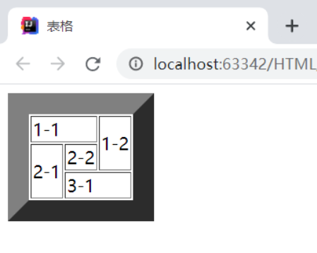

##### 媒体元素

```html
<!--视频
src：资源路径
controls：控制条
autoplay：自动播放（Chrome浏览器取消了自动播放）
-->
<video src="../resource/video/视频1.mp4" controls autoplay></video>

<!--音频-->
<audio src="../resource/audio/猴叫.mp3" controls></audio>
```

### 其他内容

##### 页面结构

header：标题头部区域的内容(用于页面或页面中的一块区域)

footer：标记脚部区域的内容(用于整个页面或页面的一块区域)

section：Web页面中的一块独立区域

article：独立的文章内容

aside：相关内容或应用（常用于侧边栏)

nav：导航类辅助内容

##### 内联框架

```html
<!--iframe 内联框架
src：地址
frameborder：帧边缘
w-h：宽度高度
-->
<iframe src="https://baidu.com" frameborder="0" height="500" width="700"></iframe>

<iframe src="" name="hello" height="500" width="700"></iframe>
<a href="4.列表.html" target="hello">内联框架</a>
```

##### 表单post、get提交

```html
<h1>注册</h1>
<!--form标签
action：表单提交位置，可以是网站，也可以是一个请求处理地址
method：提交方式（get/post）
    get中可在url地址中看到提交的信息，不安全，但高效
    post比较安全，可传输大文件
-->
<form action="1.第一个html.html" method="post">target
    <!--文本输入框：input type="text"-->
    <p>名字：<input type="text" name="username"></p>
    <!--密码框：input type="password"-->
    <p>密码：<input type="password" name="password"></p>

    <input type="submit">
    <input type="reset">
</form>
```

##### 表单

```html
<h1>注册</h1>
<form action="1.第一个html.html" method="get">
    <!--文本输入框（input中的name属性必须要加，提交起到键值对的键的作用）
    value="默认值"       默认值
    maxlength="8"       做多输入的字符
    size="30"           文本框长度
    -->
    <p>名字：<input type="text" name="username" value="admin" maxlength="8" size="30" readonly disable></p>
    <!--密码框：input type="password"-->
    <p>密码：<input type="password" name="password"/></p>

    <!--单选框标签
    value：单选框的值
    name：表示组-->
    <p>性别：
        <input type="radio" value="boy" name="sex"/>男
        <input type="radio" value="girl" name="sex"/>女
    </p>

    <!--多选框
    checked：默认勾选内容-->
    <p>爱好：
        <input type="checkbox" value="sleep" name="hobby">睡觉
        <input type="checkbox" value="code" name="hobby">代码
        <input type="checkbox" value="chat" name="hobby" checked>聊天
        <input type="checkbox" value="game" name="hobby">游戏
    </p>

    <!--按钮
    input type="button"     普通按钮
    input type="image"      图像按钮
    input type="submit"     提交按钮
    input type="reset"      重置-->
    <p>按钮：
        <input type="button" name="btn1" value="普通按钮">
        <input type="image" src="../resource/image/2.jpg">
    </p>
    <input type="submit">
    <input type="reset">

    <!--下拉框、列表框-->
    <p>下拉框：
        <select name="列表名称" id="city">
            <option value="sh">上海</option>
            <option value="sz">苏州</option>
            <option value="tj">天津</option>
            <option value="gz" selected>广州</option>
            <option value="zh">珠海</option>
            <option value="bj">北京</option>
        </select>
    </p>
    
    <!--文本框
    cols：初始列
    rows：初始行-->
    <p>文本框：
        <textarea name="textarea" cols="30" rows="10">默认文本内容</textarea><!--文本框的大小可通过右下角的标记拖拽-->
    </p>

    <!--文件域-->
    <p>文件提交：
        <input type="file" name="files">
    </p>

    <!--邮箱验证-->
    <p>邮箱：
        <input type="email" name="email"><!--有简单的验证，xxx@xx格式即可提交-->
    </p>

    <!--URL-->
    <p>URL：
        <input type="url" name="url">
    </p>

    <!--数字
    step：加减步长-->
    <p>商品数量：
        <input type="number" name="num" max="100" min="0" step="1">
    </p>

    <!--滑块-->
    <p>滑块：
        <input type="range" name="range" max="100" min="0" step="10">
    </p>

    <!--搜索-->
    <p>搜索：
        <input type="search" name="search">
    </p>

    <!--label：增强鼠标可用性-->
    <p>
        <label for="mark">点击文字选中搜索框</label>
        <input type="text" id="mark">
    </p>

</form>
```

##### 表单应用

```html
<!--hidden：隐藏-->
<p>密码：<input type="password" name="password" value="123456" hidden/></p>

<!--readonly：只读-->
<p>名字：<input type="text" name="username" value="admin" readonly></p>

<!--disabled：不可用-->
<p>名字：<input type="text" name="username" disable></p> 
```

##### 表单初级验证

```html
<!--placeholder：用户提示
	  required：非空判断-->
<p>提示消息：<input type="text" name="reminder" placeholder="请输入姓名" required></p>

<!--pattern：正则验证-->
<p>邮箱2：
    <input type="email" name="email" pattern="^\w+([-+.]\w+)*@\w+([-.]\w+)*\.\w+([-.]\w+)*$">
</p>
```


### 总结

```html
<!DOCTYPE html>
<html lang="en">

<head>
    <meta charset="UTF-8">
    <meta name="keywords" content="">
    <meta name="description" content="">
    <title>?</title>
</head>

<body>
    <h1>一级标签</h1>
    <p>1. 负责公司MES系统开发，系统维护等工作；</p>
    <p>2. 负责与业务部门沟通，讨论业务需求，编写设计文档；</p>
    <hr/>
    1. 负责公司MES系统开发，系统维护等工作；<br/>
    <strong>i love *</strong>
    <em>i love *</em>
    A&nbsp;&nbsp;&nbsp;B<br/>
    &gt;<br/>
    &lt;<br/>
    &copy;<br/>
	
    
    <a href="1.第一个html.html" target="_blank">第一个页面</a>
    <a href="https://baidu.com" target="_self">百度</a>
    <br/>

    <a href="https://baidu.com" title="">
        
    </a>
    
    <a href="666.html#down">3</a>
</body>
</html>

<!--666.html-->
<body>
    <a name="top">1</a>

    <p><a href="https://baidu.com" title="">
        
    </a></p>
    <p><a href="https://baidu.com" title="">
        
    </a></p>

    <a href="#top">2</a>
    <a name="down">2</a>
</body>

<a href="mailto:1093876434@qq.com">邮箱链接：malito</a>

<ol>
    <li>java</li>
    <li>qw</li>
</ol>
<ul>
    <li>xzc</li>
    <li>dasd</li>
</ul>
<dl>
    <dt>A</dt>
        <dd>1</dd>
        <dd>2</dd>
    <dt>B</dt>
        <dd>a</dd>
        <dd>b</dd>
</dl>

<table border="xx">
    <tr>
        <td colspan="2">1-1</td>
        <td rowspan="2">1-2</td>
    </tr>
    <tr>
        <td rowspan="2">2-1</td>
        <td>2-2</td>
    </tr>
    <tr>
        <td colspan="2">3-1</td>
    </tr>
</table>
<video src="../resource/video/视频1.mp4" controls autoplay></video>
<audio src="../resource/audio/猴叫.mp3" controls></audio>

header、footer、ection、article、aside、nav标签

<iframe src="https://baidu.com" frameborder="0" height="500" width="700"></iframe>
<iframe src="" name="hello" height="500" width="700"></iframe>
<a href="4.列表.html" target="hello">内联框架</a>

<form action="1.第一个html.html" method="get">
    <p>xx：<input type="text" name="username" value="admin" maxlength="8" size="30" readonly disable></p>
    <p>xx：<input type="password" name="password"/></p>
    <p>xx：<input type="radio" value="boy" name="sex"/>x
        <input type="radio" value="girl" name="sex"/>x</p>
    <p>xx：<input type="checkbox" value="sleep" name="hobby">睡觉
        <input type="checkbox" value="code" name="hobby">代码
        <input type="checkbox" value="chat" name="hobby" checked>聊天
        <input type="checkbox" value="game" name="hobby">游戏</p>
    <p>xx：<input type="button" name="btn1" value="x">
        <input type="image" src="../resource/image/2.jpg"></p>
    <input type="submit">
    <input type="reset">
    <p>xx：<select name="xx" id="city">
            <option value="sh">上海</option>
            <option value="sz">苏州</option>
            <option value="tj">天津</option>
            <option value="gz" selected>广州</option>
            <option value="zh">珠海</option>
            <option value="bj">北京</option>
        </select></p>
    <p>xx：<textarea name="textarea" cols="xx" rows="xx">xx</textarea></p>
    <p>xx：<input type="file" name="files"></p>
    <p>xx：<input type="email" name="email"></p>
    <p>xx：<input type="url" name="url"></p>
    <p>xx：<input type="number" name="num" max="100" min="0" step="  "></p>
    <p>xx：<input type="range" name="range" max="100" min="0" step="xx"></p>
    <p>xx：<input type="search" name="search"></p>
    <p><label for="mark">xx</label>
        <input type="text" id="mark"></p>
    <p>xx：<input type="password" name="password" value="xx" hidden/></p>
    <p>xx：<input type="text" name="username" value="xx" readonly></p>
    <p>xx：<input type="text" name="username" disable></p>
    <p>xx：<input type="text" name="reminder" placeholder="xx" required></p>
    <p>xx：<input type="email" name="email" pattern="^\w+([-+.]\w+)*@\w+([-.]\w+)*\.\w+([-.]\w+)*$"></p>
```


# CSS

CSS选择器（重点）、美化网页、盒子模型、浮动、定位、网页动画

菜鸟教程、W2CSchool

### CSS介绍

Cascading Style Sheet：层叠级样式表

CSS：表现（美化网页：字体、颜色、边距、高度、宽度、背景图片、网页定位、网页浮动...）

CSS2.0：DIV块+CSS，HTML与CSS结构分离的思想，网页变得简单，SEO
CSS2.1：浮动，定位
CSS3.0：圆角，阴影，动画... 浏览器兼容性

### 简单的样式

```html
<!DOCTYPE html>
<html lang="en">
<head>
    <meta charset="UTF-8">
    <title>Title</title>
<!--规范，<style>中可以编写CSS代码，每一个声明最好使用';'结尾
选择器{
    声明1;
    声明2;
}-->
  	<!--内部样式表-->
    <style> 
        h1{
            color: red;
        }
    </style>
</head>
<body>
<h1>标题</h1>
</body>
</html>
```

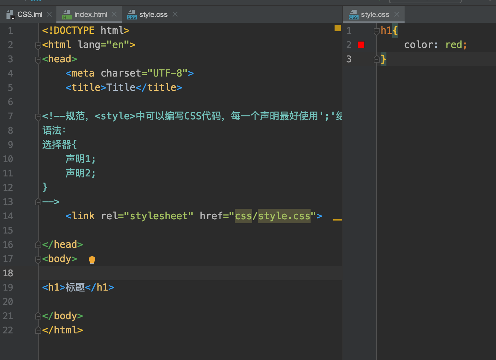

注：建议使用以上的外部样式表

### css优势

1、内容的表现分离
2、网页结构表现统一
3、样式丰富
4、建议使用独立于HTML的出售商文件
5、利用SEO，容易被搜索引擎收录！

行内元素

```html
<body>
<!--行内样式：在标签元素中，编写一个style属性，编写样式即可-->
<h1 style="color: red">AAA</h1>
</body>
```

优先级：就近原则（行内样式 > 内部样式 <==> 外部样式）

外部样式的两种写法：

- 链接式：

```html
<link rel="stylesheet" href="css/style.css">
```

- 导入式：

```html
<style><!--CSS2.0使用，先显示框架，再渲染-->
  	@import url("CSS/style.css");
</style>
```


### 选择器

作用：选择页面上的某一个后者某一类元素

##### 标签选择器

 选择一类标签
 格式： 标签 { }

```html
<head>
  <meta charset="UTF-8">
  <title>Title</title>
  <style>
    h1{
      color: orange;
      background: blue;
      border-radius: 10px;/*圆角 (边境-半径*/
    }
    h3{
      color: orange;
      background: blue;
      border-radius: 10px;
    }
    p{
      font-size: 80px;
    }
</style>
</head>
	<body>
	<h1>标签选择器</h1>
	<p>我爱学习</p>
	<h3>学习JAVA</h3>
</body>
```


##### 类选择器

 选择所有class一致的标签，跨标签

 格式： .类名{}

```html
<head>
    <meta charset="UTF-8">
    <title>Title</title>
    <style>
        /*类选择器的格式 .class的名称{}
            好处：可以多个标签归类，是同一个class，可以复用*/
        .demo1{
            color: blue;
        }
        .demo2{
            color: red;
        }
        .demo3{
            color: aqua;
        }
    </style>
</head>

<body>
  <h1 class = "demo1">类选择器：demo1</h1>
	<h1 class="demo2">类选择器：demo2</h1>
	<h1 class="demo3">类选择器：demo3</h1>
	<p class="demo3">p标签</p>
</body>
```


##### id 选择器

全局唯一

格式： #id名{}

```html
<head>
    <meta charset="UTF-8">
    <title>Title</title>
    <style>
        /*id选择器：id必须保证全局唯一
            #id名称{}
            不遵循就近原则，优先级是固定的
            id选择器 > class类选择器  >  标签选择器
        */
        #demo1{
            color: red;
        }
        .demo2{
            color: green;
        }
        #demo2{
            color: orange;
        }
        h1{
            color: blue;
        }
    </style>
</head>
<body>
    <h1 id="demo1" class="demo2">id选择器：demo1</h1>
    <h1 class="demo2" id = "demo2">id选择器：demo2</h1>
    <h1 class="demo2">id选择器：demo3</h1>
    <h1 >id选择器：demo4</h1>
    <h1>id选择器：demo5</h1>
</body>
```

优先级：id > class > 标签


##### 层次选择器

- 后代选择器：在某个元素的后面

```html
/*后代选择器*/
<style>
body p{
	background:red;
}
</style>
```

- 子选择器，一代

```html
/*子选择器*/
<style>
body>p{
	background:orange;
}
</style>
```

- 相邻的兄弟选择器 同辈

```html
/*相邻兄弟选择器：只选择一个，相邻（向下）*/
<style>
  p+p{/*选中p后面的p标签*/
    background: red
  }
</style>
<body>
	<p>p</p>
  <p>p</p>
  <p1>p1</p1>
  <ul >
      <li class="aa">
          <p>p</p>
          <p>p</p>
      </li>
  </ul>
  <p>p</p>
</body>

```

- 通用选择器

```html
<style>
/*通用兄弟选择器，当前选中元素的向下的所有兄弟元素*/
	.active~p{
	background:red;
}
</style>
<body>
	<p class="active">p1<p>
	<p>p2</p>
</body>
```


##### 结构伪类选择器

```html
<head>
    <meta charset="UTF-8">
    <title>Title</title>

    <style>
        ul li:first-child{/*ul的第一个子元素*/
            background: aqua;
        }
        ul li:last-child{/*ul的最后一个子元素*/
            background: blue;
        }
        /*选中p1：定位到父元素，选择当前的第一个元素*/
        p:nth-child(1){     /*注：若当前p元素是其父级元素的第一个元素，才会生效！！（按顺序选择）*/
            background: #badb27;
        }
        p:nth-of-type(2){/*选中父元素下的，第2个p元素（按类型选择）*/
            background: red;
        }
        a:hover{/* hover:鼠标移动到该区域才显示的属性 */
            background: green;
        }
    </style>
</head>
<body>
<!--<a href="">123</a>-->
    <p>p1</p>
    <p>p2</p>
    <p>p3</p>
    <h3>h3</h3>
    <ul>
        <li>1li1</li>
        <li>1li2</li>
        <li>1li3</li>
    </ul>
    <a href="www.baidu.com">百度</a>
</body>

```

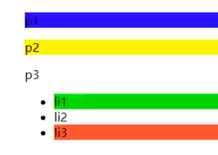


##### ☆：属性选择器（常用）

 id + class结合 

```html
<head>
    <meta charset="UTF-8">
    <title>Title</title>

    <style>
        .demo a{
            float: left;
            display: block;
            height: 50px;
            width: 50px;
            border-radius: 10px;
            background: aquamarine;
            text-align: center;
            color: gray;
            text-decoration: none;
            margin-right: 5px;
            /*line-height:50px;*/
            font: bold 20px/50px Arial;
        }
        /*属性名，属性名=属性值（正则）
         = 表示绝对等于
         *= 表示包含
         ^= 表示以...开头
         $= 表示以...结尾
         存在id属性的元素
            a[]{}
         */
        a[id]{/* a标签中存在id属性的元素 */
            background: yellow;
        }
        a[id=first]{/*id=first的元素*/
            background: green;
        }

        a[class*="links"]{/*class 中有links的元素*/
            background: bisque;
        }

        a[href^=http]{/*选中href中以http开头的元素*/
            background: aquamarine;
        }
        a[href$=pdf]{/*选中href中以pdf结尾的元素*/
            background: #837fff;
        }
    </style>
</head>
<body>
    <p class="demo">
        <a href="http:www.baidu.com" class="links item first" id="first">1</a>
        <a href="" class="links item active" target="_blank " title="test">2</a>
        <a href="images/123.html" class="links item">3</a>
        <a href="images/1.png" class="links item">4</a>
        <a href="images/1.jpg" class="links item">5</a>
        <a href="abc" class="links item">6</a>
        <a href="/a.pdf" class="links item">7</a>
        <a href="/abc.pdf" class="links item">8</a>
        <a href="abc.doc" class="links item">9</a>
        <a href="abcd.doc" class="links item last">10</a>
    </p>
</body>
```


## 


### 美化网页元素

##### 为什么要美化网页

1. 有效的传递页面信息
2. 美化网页，页面漂亮才能吸引客户
3. 凸显页面的主题
4. 提高用户的体验

**span标签**：重点要突出的字，使用span标签套起来

```html
<head>
    <meta charset="UTF-8">
    <title>Title</title>
    <style>
        #title1{
            font-size: 50px;
        }
    </style>
</head>
<body>
学习语言<span id="title1">JAVA</span>
</body>
```


##### 字体样式

- font-family：字体
- font-size：字体大小
- font-weight：字体粗细
- color：字体颜色

```html
<head>
    <meta charset="UTF-8">
    <title>Title</title>
    <style>
        body{
            font-family:"Arial Black",楷体;
            color: red;
        }
        h1{
            font-size: 50px;
        }
        .p1{
            font-weight: 600;
            color: gray;
        }
    </style>
</head>
<body>
<h1>标题</h1>
<p>正文11111</p>
<p class="p1">正文2222222</p>
<p>i love study java</p>
</body>
```

常用写法：

```html
<style>
    p{
        font-weight:bolder;/*也可以填px，但不能超过900,相当于bolder*/
        /*常用写法：*/
        font:oblique bolder 30px "楷体" ;
    }
</style>
```


##### 文本样式

1. 颜色–>color:rgb / rgba()
2. **文本对齐方式–>text-align：center**
3. **首行缩进–>text-indent：2em**
4. **行高–>line-height：300px；**
5. 下划线–>text-decoration

```html
text-decoration:underline/*下划线*/
text-decoration:line-through/*中划线*/
text-decoration:overline/*上划线*/
text-decoration:none/*超链接去下划线*/
```

图片、文字水平对齐

```html
<style>
    img, span{/*前者为后者参照物 a, b*/
        vertical-align: middle;
    }
</style>
------------------------------------------
<p>
    
    <span>人潮汹涌</span>
</p>
```


##### 文本，阴影和超链接伪类

```html
<style>
	a{/*超链接有默认的颜色*/
		text-decoration:none;
		color:#000000;
	}
	a:hover{/*鼠标悬浮的状态*/
		color:orange;
	}
	a:active{/*鼠标按住未释放的状态*/
		color:green
	}
	a:visited{/*点击之后的状态*/
		color:red
	}
	a:link{/*链接自未点击上去时候*/
    background: bisque;
  }
</style>
```


阴影

```html
/*	第一个参数：表示水平偏移
	第二个参数：表示垂直偏移
	第三个参数：表示模糊半径
	第四个参数：表示颜色
*/
text-shadow:5px 5px 5px 颜色
```


##### 列表

css

```css
#nav{
    width: 300px;
    background: antiquewhite;
}
.title{
    font-size: 18px;
    font-weight: bold;
    text-indent: 1em;/*缩进*/
    line-height: 35px;
    background: red;
}
/*ul li*/
/*
list-style:
    non 去掉实心圆
    circle 空心圆
    square 正方形
*/
/*ul{!*nav替换效果*!
    background: antiquewhite;
}*/
ul li{
    height: 30px;
    list-style: none;
    text-indent: 1em;
}
a{
    text-decoration: none;
    font-size: 14px;
    color: black;
}
a:hover{
    color: burlywood;
    text-decoration: underline;
}
```

html

```html
<!DOCTYPE html>
<html lang="en">
<head>
    <meta charset="UTF-8">
    <title>Title</title>
    <link href="CSS/style.css" rel="stylesheet" type="text/css">
</head>
<body>
<div id="nav">
    <h2 class="title">全部商品分类</h2>
    <ul>
        <li>
            <a href="#">图书</a>
            <a href="#">音像</a>
            <a href="#">数字商品</a>
        </li>
        <li>
            <a href="#">服饰鞋帽</a>
            <a href="#">个性化妆</a>
        </li>
    </ul>
</div>
</body>
</html>
```


##### 背景

1. 背景颜色：background
2. 背景图片

```html
background-image:url("");/*默认是全部平铺的*/
background-repeat:repeat-x/*水平平铺*/
background-repeat:repeat-y/*垂直平铺*/
background-repeat:no-repeat/*不平铺*/
```


 div标签：相当于一个容器，只是把单独的逻辑给放在div中，这样看起来更加的清晰， **div要独占一行** 。 

##### 渐变

渐变背景网址：https://www.grabient.com
径向渐变、圆形渐变 

```html
body{
	background-color: #4158D0;
	background-image: linear-gradient(43deg, #4158D0 0%, #C850C0 46%, #FFCC70 100%);
}
```


### 盒子模型

  

margin：外边距
padding：内边距
border：边框


##### 边框

border：粗细 样式 颜色

边框的粗细
边框的样式
边框的颜色


##### 外边距

妙用：居中
margin-left/right/top/bottom–>表示四边，可分别设置，也可以同时设置如下

```java
margin:0 0 0 0/*分别表示上、右、下、左；从上开始顺时针*/
/*例1：居中*/
margin:0 auto /*auto表示左右自动 注：需要指定当前容器宽度才可使其中元素居中*/
/*例2：*/
margin:4px/*表示上、右、下、左都为4px*/
/*例3*/
margin:10px 20px 30px/*表示上为10px，左右为20px，下为30px*/
```

盒子的计算方式：
margin+border+padding+内容的大小

总结：
body总有一个默认的外边距 margin:0
常见操作：初始化


##### 圆角边框----border-radius

```html
<style>
        div{
            width: 100px;
            height: 100px;
            border: 10px solid red;
            /*一个border-radius只管一个圆的1/4*/
            border-radius: 50px 20px 20px 30px;/*左上 右上 右下 左下 ,顺时针方向*/
        }
</style>
```


##### 盒子阴影

```html
box-shadow: 100px 10px 100px green; /*x轴 y轴 阴影模糊半径 颜色*/
```


### 浮动

##### 标准文档流

块级元素：独占一行 h1~h6 、p、div、 列表…
行内元素：不独占一行 span、a、img、strong

注： 行内元素可以包含在块级元素中，反之则不可以


##### display（重要）

1. block：块元素
2. inline：行内元素
3. inline-block：是块元素，但是可以内联，在一行

 这也是一种实现行内元素排列的方式，但是我们很多情况用float 

none：消失

```html
<!DOCTYPE html>
<html lang="en">
<head>
    <meta charset="UTF-8">
    <title>Title</title>
    <!--block 块元素
        inline 行内元素
        inline-block 是块元素，但是可以内联 ，在一行
    -->
    <style>
        div{
            width: 100px;
            height: 100px;
            border: 1px solid red;
            display: inline-block;
        }
        span{
            width: 100px;
            height: 100px;
            border: 1px solid red;
            display: inline-block;
        }
    </style>
</head>
<body>
<div>div块元素</div>
<span>span行内元素</span>
</body>
</html>
```


##### float：left/right左右浮动

 clear：both 


##### overflow及父级边框塌陷问题

clear：
right：右侧不允许有浮动元素
left：左侧不允许有浮动元素
both：两侧不允许有浮动元素
none：

解决塌陷问题方案：
方案一：增加父级元素的高度；
方案二：增加一个空的div标签，清除浮动

```html
<div class = "clear"></div>
<style>
	.clear{
		clear:both;
		margin:0;
		padding:0;
	}
</style>
```

方案三：在父级元素中增加一个overflow属性

```html
overflow:hidden/*隐藏超出部分*/
overflow：scoll/*滚动*/
```

 方案四：父类添加一个伪类:after 

```html
#father:after{
	content:'';
	display:block;
	clear:both;
}
```

**小结**：

浮动元素增加空div----> 简单、代码尽量避免空div
设置父元素的高度-----> 简单，但是元素假设有了固定的高度，可能就会超出范围
overflow----> 简单，下拉的一些场景避免使用
父类添加一个伪类:after（推荐）----> 写法稍微复杂，但是没有副作用，**推荐使用**


##### display与float对比

1. display：方向不可以控制
2. float：浮动起来的话会脱离标准文档流，所以要解决父级边框塌陷的问题。


### 定位

##### 相对定位

相对定位：**positon：relstive；**
相对于原来的位置，进行指定的偏移，相对定位的话，它仍然在标准文档流中！原来的位置会被保留 

```html
top:-20px;/*向上偏移20px*/
left:20px;/*向右偏移20px*/
bottom:10px;/*向上偏移10px*/
right:20px;/*向左偏移20px*/
```

代码：

```html
<!DOCTYPE html>
<html lang="en">
<head>
    <meta charset="UTF-8">
    <title>相对定位</title>
    <!--相对定位
            相对于自己原来的位置进行偏移
    -->
    <style>
        body{
            padding: 20px;
        }
        div{
            margin: 10px;
            padding: 5px;
            font-size: 12px;
            line-height: 25px;
        }
        #father{
            border: #ffa538 1px solid;
            padding: 0;
        }
        #first{
            border: #b3ff38 1px solid;
            background-color: #ffa538;
            position: relative;/*相对定位：上下左右*/
            top: -20px;/*向上偏移20px*/
            left: 20px;/*向右偏移20px*/
        }
        #second{
            border: #427b11 1px solid;
            background-color: #66c77f;
        }
        #third{
            background-color: #b3ff38;
            border: #38d7ff 1px solid;
            position: relative;
            bottom: 10px;/*向上偏移10px*/
        }
    </style>
</head>
<body>
<div id="father">
    <div id="first">第一个盒子</div>
    <div id="second">第二个盒子</div>
    <div id="third">第三个盒子</div>
</div>
</body>
</html>
```

 练习： 

  

 实现代码： 

```html
<style>
        #box{
            height: 300px;
            width: 300px;
            border: 2px red solid;
            padding: 10px;
        }
        a{
            height: 100px;
            width: 100px;
            background-color: #ee73b7;
            color: white;
            text-align: center;
            text-decoration: none;
            line-height: 100px;/*设置行距100px*/
            display: block;/*设置方块*/
        }
        a:hover{
            background: #4158D0;
        }
        .a2{
            position: relative;
            left: 200px;
            top: -100px;
        }
        .a4{
            position: relative;
            left: 200px;
            top: -100px;
        }
        .a5{
            position: relative;
            left: 100px;
            top: -300px;
        }
    </style>
</head>
<body>
<div id="box">
    <div class="a1"><a href="" >连接1</a></div>
    <div class="a2"><a href="" >连接2</a></div>
    <div class="a3"><a href="" >连接3</a></div>
    <div class="a4"><a href="" >连接4</a></div>
    <div class="a5"><a href="" >连接5</a></div>
</div>
</body>
```


##### 绝对定位-absolute和固定定位-fixed

 定位：基于xxx定位，上下左右~
1、没有父级元素定位的前提下，相对于浏览器定位
2、假设父级元素存在定位，我们通常会相对于父级元素进行偏移
3、在父级元素范围内移动
总结：相对一父级或浏览器的位置，进行指定的偏移，绝对定位的话，它不在标准文档流中，原来的位置不会被保留 

```html
<head>
    <meta charset="UTF-8">
    <title>Title</title>
    <style>
        body{
            height: 1000px;
        }
        div:nth-of-type(1){
            width: 100px;
            height: 100px;
            background-color: red;
            position: absolute;/*absolute 绝对定位*/
            right: 0;
            bottom: 0;
        }
        div:nth-of-type(2){
            width: 50px;
            height: 50px;
            background-color: #b3ff38;
            position: fixed;/*fixed 固定定位*/
            right: 0;
            bottom: 0;
        }
    </style>
</head>
<body>
<div>div1</div>
<div>div2</div>
</body>
```


##### z-index

  

图层-z-index：默认是0，最高无限~999

index.html代码：

```html
<!DOCTYPE html>
<html lang="en">
<head>
    <meta charset="UTF-8">
    <title>Title</title>
    <link rel="stylesheet" href="css/style.css" type="text/css">
    <style></style>
</head>
<body>
<div id="content">
    <ul>
        <li></li>
        <li class="tipText">学习微服务，找狂神</li>
        <li class="tipBg"></li>
        <li>时间：2099-01-01</li>
        <li>地点：月球一号基地</li>
    </ul>
</div>
</body>
</html>
```

 css代码： 
opacity: 0.5  背景透明度

```html
#content{
    width: 380px;
    padding: 0px;
    margin: 0px;
    overflow: hidden;
    font-size: 12px;
    line-height: 25px;
    border: 1px solid yellow;
}
ul,li{
    padding: 0px;
    margin: 0px;
    list-style: none;
}
/*父级元素相对定位*/
#content ul{
    position: relative;
}
.tipText,.tipBg{
    position: absolute;
    width: 380px;
    height: 25px;
    top:216px
}
.tipText{
    color: white;
    z-index: 999;
}
.tipBg{
    background: orange;
    opacity: 0.5;/*背景透明度 (所有浏览器都支持该属性)*/
    filter: alpha(opacity=50);/*IE8及更早版本支持该属性*/
}
```

### 动画及视野拓展

css做动画过于繁琐，已有很多工具间接性做出

百度搜索canvas动画、[卡巴斯基监控站](https://cybermap.kaspersky.com/cn)（仅作了解）


### CSS3  总结

  


# JavaScript

### 概述

##### 前端知识体系

想要成为真正的“互联网Java全栈工程师”还有很长的一段路要走，其中前端是绕不开的一门必修课。本阶段课程的主要目的就是带领Java后台程序员认识前端、了解前端、掌握前端，为实现成为“互联网Java全栈工程师”再向前迈进一步。


##### 前端三要素

- HTML（结构）：超文本标记语言（Hyper Text Markup Language），决定网页的结构和内容
- CSS（表现）：层叠样式表（Cascading Style Sheets），设定网页的表现样式。
- JavaScript（行为）：是一种弱类型脚本语言，其源码不需经过编译，而是由浏览器解释运行，用于控制网页的行为


##### 结构层（HTML）

太简单，略


##### 表现层（CSS）

CSS层叠样式表是一门标记语言，并不是编程语言，因此不可以自定义变量，不可以引用...

换句话说就是不具备任何语法支持，它主要缺陷如下：

- 语法不够强大，比如无法嵌套书写，导致模块化开发中需要书写很多重复的选择器；

- 没有变量和合理的样式复用机制，使得逻辑上相关的属性值必须以字面量的形式重复输出，导致难以维护；

  这就导致了我们在工作中无端增加了许多工作量。为了解决这个问题，前端开发人员会使用一种称之为【CSS预处理器】的工具,提供CSS缺失的样式层复用机制、减少冗余代码，提高样式代码的可维护性。大大的提高了前端在样式上的开发效率。


**什么是CSS预处理器**

CSS预处理器定义了一种新的语言，其基本思想是，用一种专门的编程语言，为CSS增加了一些编程的特性，将CSS作为目标生成文件，然后开发者就只需要使用这种语言进行CSS的编码工作。转化成通俗易懂的话来说就是“**用一种专门的编程语言，进行Web页面样式设计，再通过编译器转化为正常的CSS文件，以供项目使用**”。


**常用的CSS预处理器有哪些**

SASS：基于Ruby ，通过服务端处理，功能强大。解析效率高。需要学习Ruby语言，上手难度高于LESS。
LESS：基于NodeJS，通过客户端处理，使用简单。功能比SASS简单，解析效率也低于SASS，但在实际开发中足够了，所以如果我们后台人员如果需要的话，建议使用LESS。


##### 行为层（JavaScript）

JavaScript一门弱类型脚本语言，其源代码在发往客户端运行之前不需要经过编译，而是将文本格式的字符代码发送给浏览器，由浏览器解释运行。

**JavaScript框架**

- JQuery：大家熟知的JavaScript库，优点就是简化了DOM操作，缺点就是DOM操作太频繁，影响前端性能；在前端眼里使用它仅仅是为了兼容IE6，7，8；
- Angular：Google收购的前端框架，由一群Java程序员开发，其特点是将后台的MVC模式搬到了前端并增加了模块化开发的理念，与微软合作，采用了TypeScript语法开发；对后台程序员友好，对前端程序员不太友好；最大的缺点是版本迭代不合理（如1代–>2 代，除了名字，基本就是两个东西；截止发表博客时已推出了Angular6）
- React：Facebook 出品，一款高性能的JS前端框架；特点是提出了新概念 【虚拟DOM】用于减少真实 DOM 操作，在内存中模拟 DOM操作，有效的提升了前端渲染效率；缺点是使用复杂，因为需要额外学习一门【JSX】语言；
- Vue：一款渐进式 JavaScript 框架，所谓渐进式就是逐步实现新特性的意思，如实现模块化开发、路由、状态管理等新特性。其特点是综合了 Angular（模块化）和React(虚拟 DOM) 的优点；
- Axios：前端通信框架；因为 Vue 的边界很明确，就是为了处理 DOM，所以并不具备通信能力，此时就需要额外使用一个通信框架与服务器交互；当然也可以直接选择使用jQuery 提供的AJAX 通信功能；

**UI框架**

- Ant-Design：阿里巴巴出品，基于React的UI框架
- ElementUI、iview、ice：饿了么出品，基于Vue的UI框架
- BootStrap：Teitter推出的一个用于前端开发的开源工具包
- AmazeUI：又叫“妹子UI”，一款HTML5跨屏前端框架

**JavaScript构建工具**

- Babel：JS编译工具，主要用于浏览器不支持的ES新特性，比如用于编译TypeScript

- WebPack：模块打包器，主要作用就是打包、压缩、合并及按序加载
  **注：以上知识点已将WebApp开发所需技能全部梳理完毕**

  

##### 三端同一

**混合开发（Hybrid App）**
主要目的是实现一套代码三端统一（PC、Android：.apk、iOS：.ipa）并能够调用到设备底层硬件（如：传感器、GPS、摄像头等），打包方式主要有以下两种：

云打包：HBuild -> HBuildX，DCloud 出品；API Cloud
本地打包： Cordova（前身是 PhoneGap）

**微信小程序**
详见微信官网，这里就是介绍一个方便微信小程序UI开发的框架：WeUI


##### 什么是Javascript

**概述**

javaScript是一门世界上最流行的脚本语言
Java，JavaScript
10天
一个合格的后端人员，必须精通JavaScript

**历史**

见百度：  https://blog.csdn.net/kese7952/article/details/79357868

**ECMAScript**：可以理解为JavaScript的一个标准
最新版本已经到es6版本~
但是大部分浏览器还只停留在支持es5代码上！
开发环境–线上环境，版本不一致


### 快速入门

##### 引入JavaScript

 内部标签 

```html
<script> 
	alert("hello,world");<!--弹出框-->
</script>

```

外部引入

```html
 <!--外部引入
        注意：script必须成对出现-->
    <script src="js/hj.js"></script>

    <!--不用显示定义type，也默认就是javaScript-->
    <script type="text/javascript"></script>

```

##### 基本语法

```html
<!DOCTYPE html>
<html lang="en">
<head>
    <meta charset="UTF-8">
    <title>Title</title>

    <!--JavaScript严格区分大小写-->
    <script>
        // 1. 定义变量   变量类型 变量名 = 变量值
        var score = 1 ;
        //alert(num)
        // 2. 条件控制

        if (score > 60 && score < 70){
            alert("60~70");
        }else if(score > 70 && score < 80){
            alert("70~80");
        }else{
            alert("other")
        }
        
        //console.log(sorce) 在浏览器控制台打印变量 等同于System.out.println();
    </script>
</head>
<body>

</body>
</html>

```

浏览器调试须知：

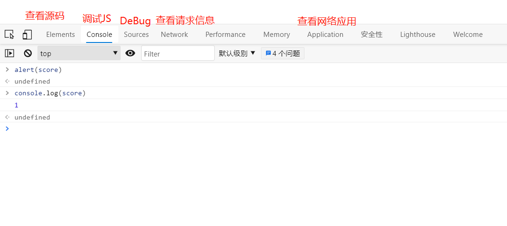


##### 数据类型

 数值，文本，图形，音频，视频 

 **变量**

```javascript
var a
```

 **number**
js不区分小树和整数，Number 

```javascript
123//整数123
123.1//浮点数123.1
1.123e3//科学计数法
-99//负数
NaN	//not a number
Infinity // 表示无限大
```

**字符串**
‘abc’ “abc”

**布尔值**
true，false

**逻辑运算**

&& 两个都为真，结果为真
|| 一个为真，结果为真
! 	真即假，假即真

 **比较运算符** ----重要！ 

= 
== 等于（类型不一样，值一样，也会判断为true） 1=="1" 
=== 绝对等于（类型一样，值一样，结果为true） 

这是一个JS的缺陷，坚持不要使用 == 比较
须知：

- NaN === NaN，这个与所有的数值都不相等，包括自己

- 只能通过**isNaN（NaN）**来判断这个数是否是NaN

  

 **浮点数问题** 

 console.log((1/3) === (1-2/3))  ==> flase

 尽量避免使用浮点数进行运算，存在精度问题！ 

 console.log(Math.abs(1/3-(1-2/3))<0.00000001) ==> flase


 **null 和 undefined** 

- null 空
- undefined 未定义


 **数组**
Java的数组必须是相同类型的对象~，JS中不需要这样 

```javascript
//保证代码的可读性，尽量使用[]
var arr = [1,2,3,4,5,'hello',null,true];
//第二种定义方法
new Array(1,2,3,4,5,'hello');
```

 取数字下标：如果越界了，就会 报undefined 


 **对象**
对象是大括号，数组是中括号 

```javascript
// Person person = new Person(1,2,3,4,5);
var person = {
	name:'Tom',
	age:3,
	tags:['js','java','web','...']
}
```

 取对象值 

```javascript
person.name
> "Tom"
person.age
> 3
```


##### 严格检查格式

  

```html
<!DOCTYPE html>
<html lang="en">
<head>
    <meta charset="UTF-8">
    <title>Title</title>
    <!--
    前提：IDEA需要设置支持ES6语法
        'use strict';严格检查模式，预防JavaScript的随意性导致产生的一些问题
        必须写在JavaScript的第一行！
        局部变量建议都使用let去定义~
    -->
    <script>
        'use strict';
        //局部变量
         let i=1
        //ES6 let
    </script>
</head>
<body>

</body>
</html>
```


### 数据类型

##### 字符串

1、正常字符串我们使用 单引号，或者双引号包裹
2、注意转义字符 \ 

```html
\'
\n		换行
\t		Tab
\u4e2d    \u##### Unicode字符

\x41	//A Ascall字符
```

3、多行字符串编写 

```javascript
//tab 上面 esc下面
var msg =`hello
        world
        你好呀
        nihao`
```

 4、模板字符串 

```javascript
//tab 上面 esc下面
let name = 'Tom';
var msg = `你好，${name}`
```

5、字符串长度 

```javascript
str.length
```

6、字符串的可变性，不可变 

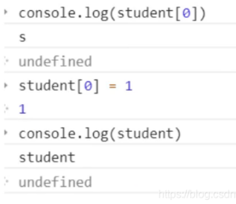

 7、大小写转换 

```javascript
//注意，这里是方法，不是属性了
student.toUpperCase();
student.toLowerCase();
```

8、student.indexOf(‘t’)   //获取 ‘t’ 的索引位置

9、substring，从0开始 

```javascript
student.substring(1)//从第一个字符串截取到最后一个字符串
student.substring(1,3)//[1,3)
```

##### 数组

 Array可以包含任意的数据类型 

```javascript
var arr = [1,2,3,4,5,6];//通过下标取值和赋值
arr[0] = 0
```

 **1、长度** 

 ```javascript
arr.length
 ```

 注意：假如给arr.lennth赋值，数组大小就会发生变化~，如果赋值过小，元素就会丢失 

 **2、indexOf**，通过元素获得下标索引 

```javascript
arr.indexOf(2)
1
```

 字符串的"1"和数字 1 是不同的 

 **3、slice（）**截取Array的一部分，返回的一个新数组，类似于String中substring 

 **4、push()，pop()尾部** 

```javascript
push：压入到尾部
pop：弹出尾部的一个元素
```

 **5、unshift(),shift() 头部** 

```javascript
unshift：压入到头部
shift：弹出头部的一个元素
```

 6、排序sort() 

```javascript
(3)["B","C","A"]
arr.sort()
(3)["A","B","C"]
```

 7、元素反转reverse() 

```javascript
(3)["A","B","C"]
arr.reverse()
(3)["C","B","A"]
```

 **8、concat()**  数组拼接

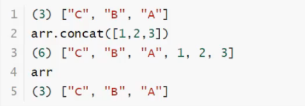

注意：concat()并没有修改数组，只是会返回一个新的数组

9、连接符join
打印拼接数组，使用特定的字符串连接

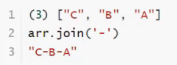

 10、多维数组 

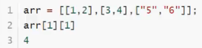

 数组：存储数据（如何存，如何取，方法都可以自己实现！） 


##### 对象

 若干个键值对 

```javascript
var 对象名 = {
	属性名：属性值，
	属性名：属性值，
	属性名：属性值
}
//定义了一个person对象，它有四个属性
var person = {
	name:"Tom",
	age:3,
	email:"123456798@QQ.com",
	score:66
}
```

 Js中对象，{…}表示一个对象，键值对描述属性xxx：xxx，多个属性之间用逗号隔开，最后一个属性不加逗号！
JavaScript中的所有的键都是字符串，值是任意对象！
1、对象赋值 

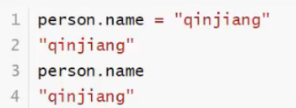

 2、使用一个不存在的对象属性，不会报错！undefined 

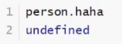

 3、动态的删减属性，通过delete删除对象的属性 

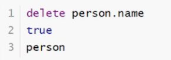

 4、动态的添加，直接给新的属性添加值即可 

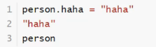

 5、判断属性值是否在这个对象中！xxx in xxx 

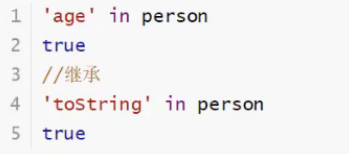

 6、判断一个属性是否是这个对象自身拥有的 hasOwnProperty() 

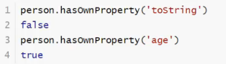


##### 流程控制

 if判断 

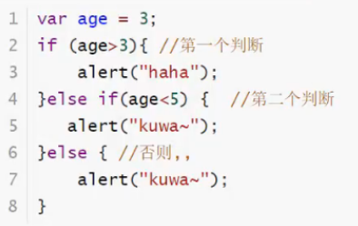

 while循环，避免程序死循环 

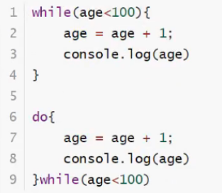

 for循环 

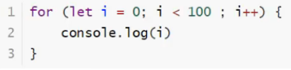

 forEach循环  ( ES5.1特性 )

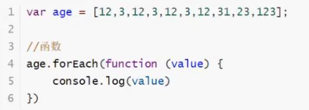

 for …in-------下标 

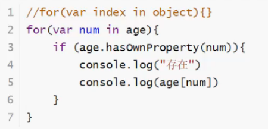

for of

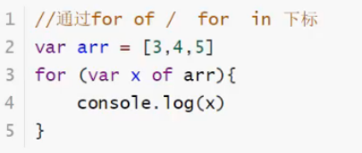


##### Map和Set

 ES6的新特性~ 

 Map 

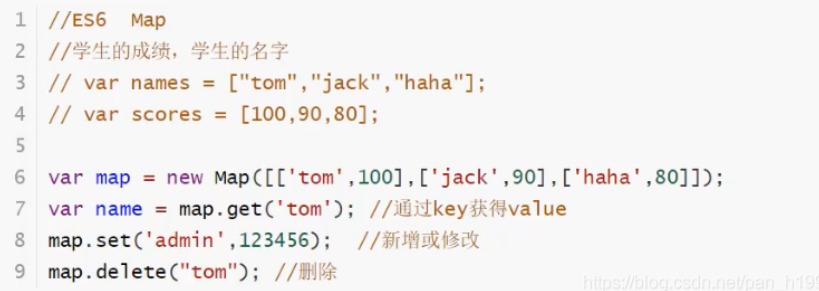

 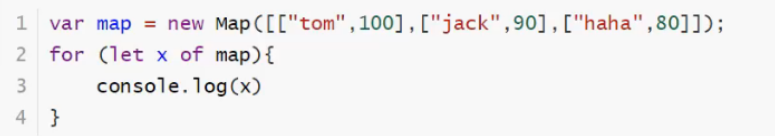

Set：**无序、不重复**的集合 

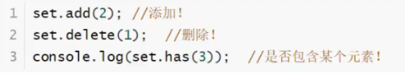

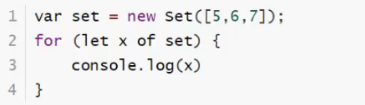

##### iterator

 es6新特性 

 作业：使用iterator来遍历迭代我们Map，Set！


### 函数

##### 定义函数

 方式一 ： 绝对值函数 

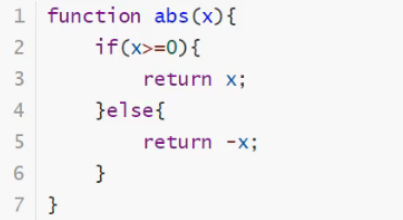

 一旦执行到return代表函数结束，返回结果！
如果没有执行return，函数执行完也会返回结果，结果就是undefined 

 方式二 

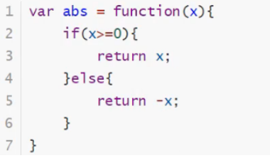

 function(x){…}这是一个匿名函数。但是可以吧结果赋值给abs，通过abs就可以调用函数！
方式一和方式二等价！ 

 调用函数 

```javascript
abs(10)//10
abs(-10) //10
```

参数问题：javaScript可以传任意个参数，也可以不传递参数~
参数进来是否存在问题？
假设不存在参数，如何规避？ 

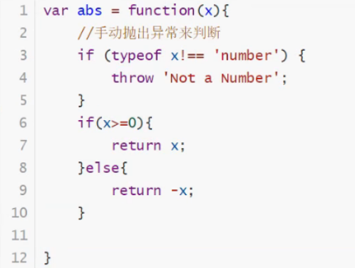


**arguments**：一个JS免费赠送的关键字；
代表，传递进来的所有参数，是一个数组！ 

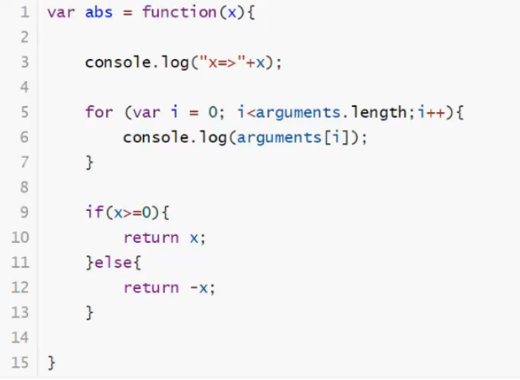

 问题：arguments包含所有的参数，我们有时候想使用多余的参数来进行附加操作。需要排除已有参数~ 

```javascript
rest
```

 以前： 

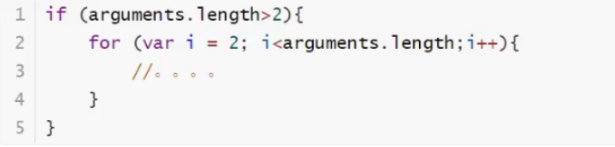

 **ES6引入的新特性**，获取除了已经定义的参数之外的所有参数~… 

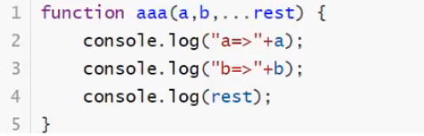

 rest参数只能写在最后面，必须用…标识。 


##### 变量的作用域

在javascript中，var定义变量实际是有作用于的。
假设在函数体重声明，则在函数体外不可以使用~（闭包）

 

如果两个函数使用了相同的变量名，只要在函数内部就不冲突

  

内部函数可以访问外部函数的成员，反之则不行

  

假设，内部函数变量和外部函数变量，重名！

  

假设在JavaScript中，函数查找变量从自身函数开始~， 由“内”向“外”查找，假设外部存在这个同名的函数变量，则内部函数会屏蔽外部函数的变量。

提升变量的作用域

  

结果：x undefined
说明：js执行引擎，自动提升了y的声明，但是不会提升变量y的赋值；

  

这个是在javascript建立之初就存在的特性。 养成规范：所有 的变量定义都放在函数的头部，不要乱放，便于代码维护；

  


全局变量

  

全局对象window

  

alert() 这个函数本身也是一个window的变量；

  

javascript实际上只有一个全局作用域，任何变量（函数也可以视为变量），假设没有在函数作用范围内找到，就会向外查找，如果在全局作用域都没有找到，就会报错 Refrence

> **规范**

由于我们的所有变量都会绑定到window上，如果不同的js文件，使用了相同的全局变量，就会产生冲突—>如何减少这样的冲突？

  

把自己的代码全部放入自己定义的唯一空间名字中，降低全局命名冲突问题~
jQuery中就是使用的该方法：jQuery.name，简便写法：$()

**局部作用域**

  

ES6的**let关键字**，解决了局部作用域冲突的问题！

  

建议大家都用let去定义局部作用域的变量；

**常量**  **const**

在ES6之前，怎么定义常量：只有用全部大写字母命名的变量就是常量；建议不要修改这样的值。

  

在ES6引入了常量关键字 **const**

  


##### 方法

> 定义方法

方法就是把函数放在对象的里面，对象只有两个东西：属性和方法


this.代表什么？拆开上main的代码看看

this是无法指向的，是默认指向调用它的那个对象的；

> apply

在js中可以控制this指向（主动调用）


### 内部对象

>  标准对象 

  


##### Date

**基本使用**

  

 转换 

  

##### JSON

JSON是什么

  

在javascript中，一切皆为对象，任何 js 支持的类型都可以用JSON表示
格式

- 对象都用{}
- 数组都用[]
- 所有的键值对 都是用key:value

JSON字符串和js对象转化

  

很多人搞不清楚，JSON和JS对象的区别

  


##### AJAX

- 原生的js写法 xhr异步请求
- jQuery封装好的方法$(#name).ajax("")
- axios请求


### 面向对象编程

> 原型对象

javascript、java、c#------面向对象；但是javascript有些区别！

- 类：模板
- 对象：具体实例

在javascript中，需要大家转换一下思维方式！
原型：

   

> class集继承


class关键字，是在ES6引入的
1、定义一个类、属性、方法

  

2、继承


```html
<script>
	//ES6之后========================
	//定义一个学生的类
	class Student{
		constructor(name){
			this.name = name;
		}
		hello(){
			alert('hello');
		}
	}

	class XiaoStudent extends Student{
		constructor(name,grade){
			super(name);
			this.grade = grade;
		}
		myGrade(){
			alert('我是一名小学生');
		}
	}

	var xiaoming = new Student("xiaoming");
	var xiaohong = new XiaoStudent("xiaohong",1);
</script>
```
 本质：查看对象原型 

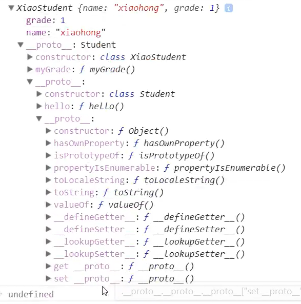

> 原型链

_ proto _:

  


### 操作BOM对象（重点）

> 浏览器介绍

javascript和浏览器关系？
BOM：浏览器对象模型

- IE6~11
- Chrome
- Safari
- FireFox
- Opera

三方

- QQ浏览器
- 360浏览器

> window

window代表浏览器窗口

  

>
> Navigator（不建议使用）

Navigator封装了浏览器的信息

  

大多数时候，我们不会使用navigator对象，因为会被认为修改!
不建议使用这些属性来判断和编写代码

> screen

代表屏幕尺寸

  

> location(重要)

location代表当前页面的URL信息

  

>
> document（内容DOM）

document代表当前的页面，HTML DOM文档树

  

获取具体的文档树节点

  

获取cookie

  

劫持cookie原理
www.taobao.com

  

服务器端可以设置cookie为httpOnly(只读)

> history（不建议使用 ）

history代表浏览器的历史记录

  


### 操作DOM对象（重点）

DOM：文档对象模型

> 核心

浏览器网页就是一个Dom树形结构！

- 更新：更新Dom节点
- 遍历Dom节点：得到Dom节点
- 删除：删除一个Dom节点
- 添加：添加一个新的节点

要操作一个Dom节点，就必须要先获得这个Dom节点

> 获得Dom节点

  

这是原生代码，之后我们尽量都使用jQuery();

> **更新节点**

操作文本

  

```html
id1.innerText='456'//操作文本内容
id1.innerHTML='<strong>123</strong>' //可以解析HTML文本标签
```

操作js

  


> **删除节点**

删除节点的步骤：先获取父节点，再通过父节点删除自己

  

注意：删除多个节点的时候，children是在时刻变化的，删除节点的时候一定要注意。


> **插入节点**

我们获得了某个Dom节点，假设这个dom节点是空的，我们通过innerHTML就可以增加一个元素了，但是这个Dom节点已经存在元素了，我们就不能这么干了！会产生覆盖

追加

  

  

>  创建一个新的标签 

```html
<script>
	var js = document.getElementById('js');//已经存在的节点
    var list = document.getElementById('list');
    //通过JS创建一个新的节点
    var newP = document.creatElement('p');//创建一个p标签
    newP.id = 'newP';
    newP.innerText = 'Hello,Kuangshen';
    //创建一个标签节点 （通过这个标签属性，可以设置任意的值）
    var myScript = document.creatElement('script');
    myScript.setAttribute('type','text/javascript');
    
    //可以创建一个style标签
    var myStyle = document.creatElement('style');//创建了一个空style标签
    myStyle.setAttribute('type','text/css');
    myStyle.innerHTML = 'body{background-color:chartreuse;}';//设置标签内容
    
    document.getElementByTagName('head')[0].appendChild(myStyle);//将标签放入head中
</script>
```

>  insertBefore 

```javascript
var ee = document.getElementById('ee');
var js = document.getElementById('js');
var list = document.getElementById('list');
//要包含的节点（targetNode的父节点）.insertBefore(newNode,targetNode)
list.insertBefore(js,ee);
```


### 操作表单

> 表单是什么？form-----DOM树

- 文本框----text
- 下拉框----select
- 单选框----radio
- 多选框----checkbox
- 隐藏域----hidden
- 密码框----password
- …

表单的目的提交信息

> 获得要提交的信息

```html
<body>
    <form action = "post">
        <p>
            <span>用户名：</span><input type="text" id = "username" />
        </p>
        <!--多选框的值就是定义好的value-->
        <p>
            <span>性别：</span>
            <input type = "radio" name = "sex" value = "man" id = "boy"/>男
           	<input type = "radio" name = "sex" value = "woman" id = "girl"/>女
        </p>
    </form>
    <script>
    	var input_text = document.getElementById("username");
        var boy_radio = document.getElementById("boy");
        var girl_radio = document.getElementById("girl");
        //得到输入框的值
        input_text.value 
        //修改输入框的值
        input_text.value  = "value";
        
        //对于单选框，多选框等等固定的值，boy_radio.value只能取到当前的值
        boy_radio.checked;//查看返回的结果，是否为true，如果为true，则被选中。
        girl_radio.checked = true;//赋值=
    </script>
</body>
```
>
> 提交表单。md5加密密码，表单优化


```html
<!DOCTYPE html>
<html lang = "en">
    <head>
        <meta charset = "UTF-8">
        <title>Title</title>
        <!--MD5加密工具类-->
        <script src = "https://cdn.bootcss.com/blueimp-md5/2.10.0/js/md5.min.js">
        	
        </script>
    </head>
    <body>
        <!--表达绑定提交事件
			οnsubmit= 绑定一个提交检测的函数，true，false
			将这个结果返回给表单，使用onsubmit接收
		-->
        <form action = "https://www.baidu.com" method = "post" onsubmit = "return aaa()">
            <p>
            	<span>用户名：</span><input type="text" id = "username" name = "username"/>
        	</p>
            <p>
            	<span>密码：</span><input type="password" id = "password" />
        	</p>
            <input type = "hidden" id = "md5-password" name = "password"> 
            
            <!--绑定事件 onclick 被点击-->
            <button type = "submit">提交</button>
        </form>
        
        <script>
        	function aaa(){
                alert(1);
                var username = document.getElementById("username");
                var pwd = document.getElementById("password");
                var md5pwd = document.getElementById("md5-password");
                //pwd.value = md5(pwd,value);
                md5pwd.value = md5(pwd.value);
                //可以校验判断表单内容，true就是通过提交，false就是阻止提交
                return false;
            }
        </script>
    </body>
</html>
```


### jQuery

javaScript和jQuery的关系？

jQuery库，里面存在大量的JavaScript函数

> 获取jQuery

  

搜索：jQuery官网CDN

**使用公式：$(selector).action()** （选择器 + 事件）

```html
<!DOCTYPE html>
<html lang = "en">
    <head>
        <meta charset = "UTF-8">
        <title>Title</title>
<!--    <script src="https://code.jquery.com/jquery-3.6.0.min.js"></script>-->
        <script src="lib/jquery-3.4.1.js"></script>
    </head>
    <body>
        <a href="" id = "test-jquery">点我</a>
        <script>
            //选择器就是css选择器
            $('#test-jquery').click(function(){
                alert('hello,jQuery!');
            });
        </script>
    </body>
</html>
```

>  选择器 

```javascript
//原生js，选择器少，麻烦不好记
//标签
document.getElementByTagName();
//id
document.getElementById();
//class
document.getElementByClassName();

//jQuery css中的选择器它全部都能用！
$('p').click();//标签选择器
$('#id1').click();//id选择器
$('.class1').click;//class选择器
```

 文档工具站：http://jquery.cuishifeng.cn/ 

>  事件 

 鼠标事件、键盘事件，其他事件 

```javascript
mousedown()(jQuery)----按下
mouseenter()(jQuery)
mouseleave()(jQuery)
mousemove()(jQuery)----移动
mouseout()(jQuery)
mouseover()(jQuery)
mouseup()(jQuery)
```

```html
<!DOCTYPE html>
<html lang = "en">
    <head>
        <meta charset = "UTF-8">
        <title>Title</title>
        <script src="lib/jquery-3.4.1.js"></script>
        <style>
            #divMove{
                width:500px;
                height:500px;
                border:1px solid red;
            }
        </style>
    </head>
    <body>
        <!--要求：获取鼠标当前的一个坐标-->
        mouse：<span id = "mouseMove"></span>
        <div id = "divMove">
            在这里移动鼠标试试
        </div>
        <script>
        	//当网页元素加载完毕之后，响应事件
            //$(document).ready(function(){})
            $(function(){
                $('#divMove').mousemove(function(e){
                    $('#mouseMove').text('x:'+e.pageX+"y:"+e.pageY)
                })
            });
        </script>
    </body>
</html>
```

>  操作DOM 

 节点文本操作 

```javascript
$('#test-ul li[name=python]').text();//获得值
$('#test-ul li[name=python]').text('设置值');//设置值
$('#test-ul').html();//获得值
$('#test-ul').html('<strong>123</strong>');//设置值
```

 CSS的操作 

```javascript
$('#test-ul li[name=python]').css({"color":"red","background":"yellow"});
```

 元素的显示和隐藏，：本质display:none 

```javascript
$('#test-ul li[name=python]').show();
$('#test-ul li[name=python]').hide();
```

 娱乐测试 

```javascript
$(window).width()
$(window).height()
$('#test-ul li[name=python]').toggle();
```

 未来ajax()； 

```javascript
$('#form').ajax()

$.ajax({url:"test.html",context:document.body,success:function(){
	$(this).addClass("done");
}})
```

> 小技巧

1、如何巩固JS（看jQuery源码，看游戏源码！）

2、巩固HTML、CSS（扒网站，全部down下来，然后对应修改看效果~）


# 结尾


JS 教程： https://www.liaoxuefeng.com/wiki/1022910821149312

jQuery API文档：https://jquery.cuishifeng.cn/

前端组件

- Element ui
- Layui
- Ant Design

框架

- Vue
- Node.js


